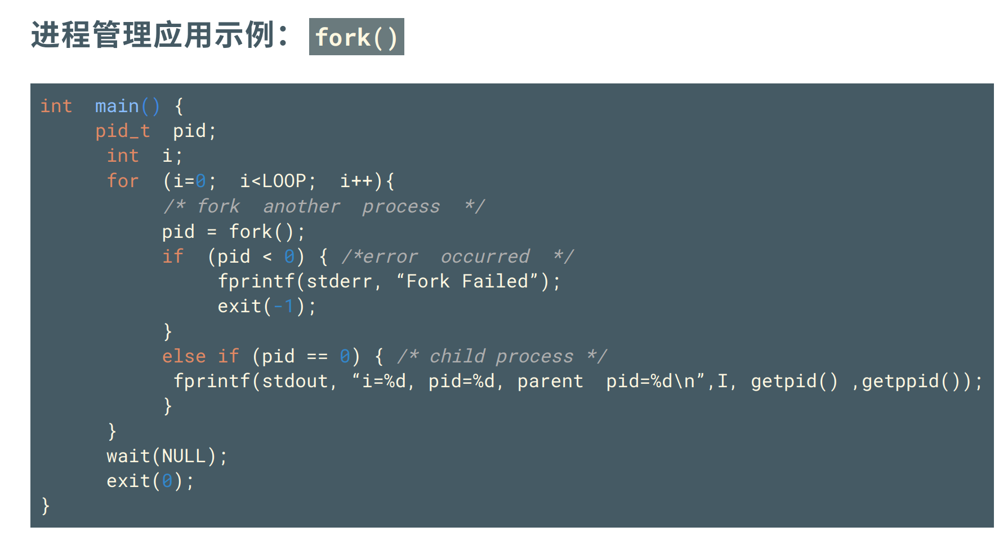
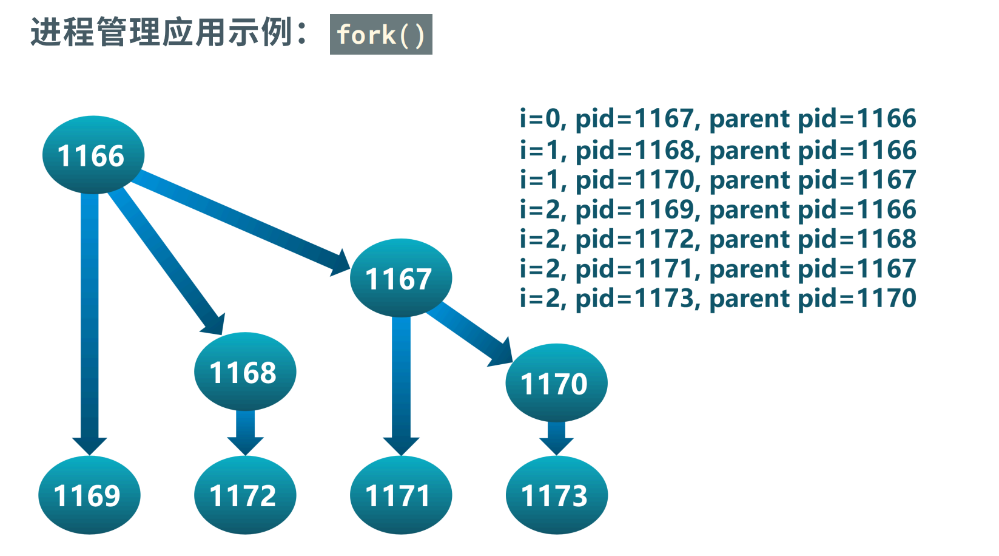
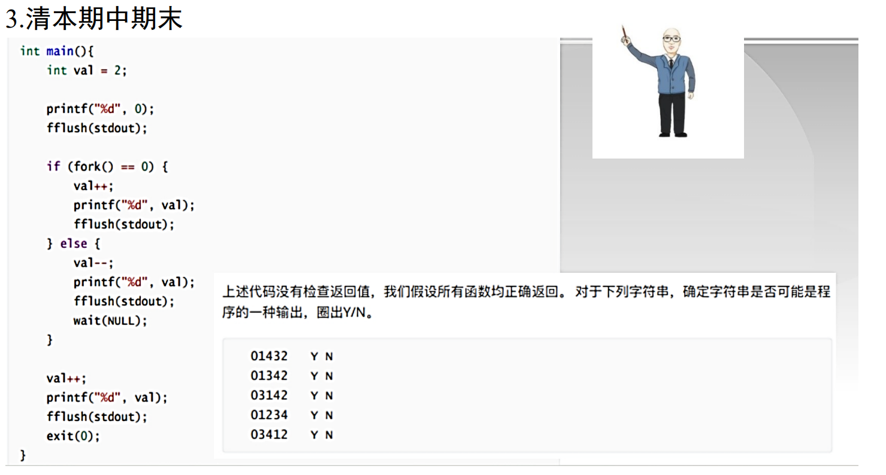

## 计算总进程数





除了画调用树，怎么算这种代码执行后的总进程个数？

以下以`n`记`LOOP`

观察这个调用树，有`n`轮(`n`个时刻)或者说树有 $n$ 层，看每轮新生成的节点数 $f(t)$。

|   |   |   |   |   |
| - | - | - | - | - |
| $t$ | 0 | 1 | 2 | 3 |
| $f(t)$ | 1 | 1 | 2 | 4 |

在 $t$ 时刻生成的节点数等于上面的所有节点的个数之和，即：

$$
f(n) = \sum_{i=0}^{n - 1}f(i)
$$

我们要求的是 $f(n)$ 的前缀和 $S(n)$，

$$
S_{n} - S_{n - 1} = S_{n - 1}, \ S(0) = 1
$$

所以 $$S_n = 2^n$$

## 父子进程执行流程



第一个打印的一定是 $0$，只看后面就行，

父进程先后打印 $1 \rightarrow 2$ ，子进程先后打印 $3 \rightarrow 4$ 。别忘了还有个`wait()`，子进程结束后父进程才能打印剩下的 $2$ ，所以还有条边是 $4 \rightarrow 2$ 。

```
3    1
↓    ↓
4  → 2
```

符合这个拓扑序的就行。

答案为：01342、03142、03412