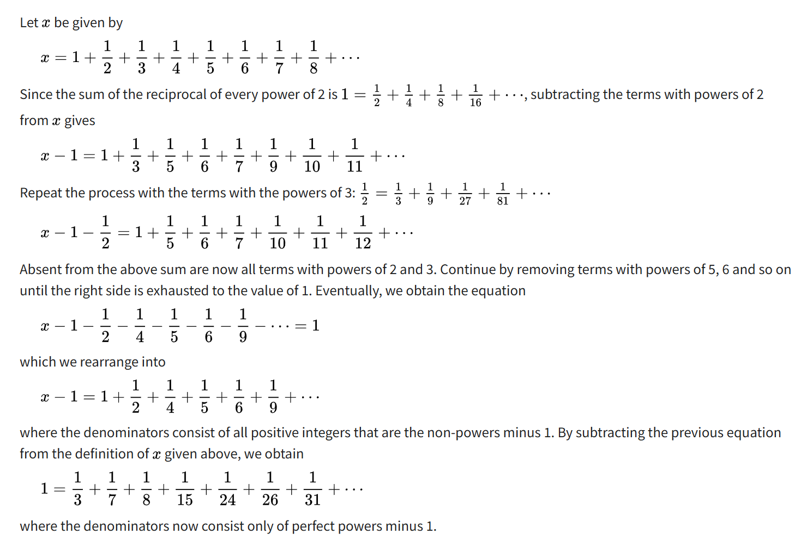

01.Introduction.pdf P44

[Goldbach–Euler theorem](https://en.wikipedia.org/wiki/Goldbach%E2%80%93Euler_theorem):

**结论**：所有 1 / (完美幂 - 1) 之和为1，完美幂是 $a^b (a \ge 2, b \ge 2 且均为整数)$ 形式的数。

证明如上，只解释一个点。

> where the denominators consist of all positive integers that are the non-powers minus 1.

$x - 1 - \frac{1}{2} - \frac{1}{4} - \frac{1}{5} - \frac{1}{6} - \frac{1}{9} = 1$

为什么左边这些分母刚好是 所有非完美幂 - 1 ？

首先，$\sum\limits_{k=1}^{\infty} \frac{1}{a^k} = \frac{1}{a - 1}$，观察 a 的取值方法，2, 3, 5, 6，这个有点像筛法，4不需要选是因为 4 的幂一定是 2 的幂。2，3 是 非完美幂，然后筛法会把所有 非完美幂的数a 选出来，$\frac{1}{a}$的所有幂次能把 x的定义式 右侧的所有分数消得只剩 1，而$\frac{1}{a}$的所有幂次之和为$\frac{1}{a - 1}$，所以左边的分母恰为 所有非完美幂 - 1。