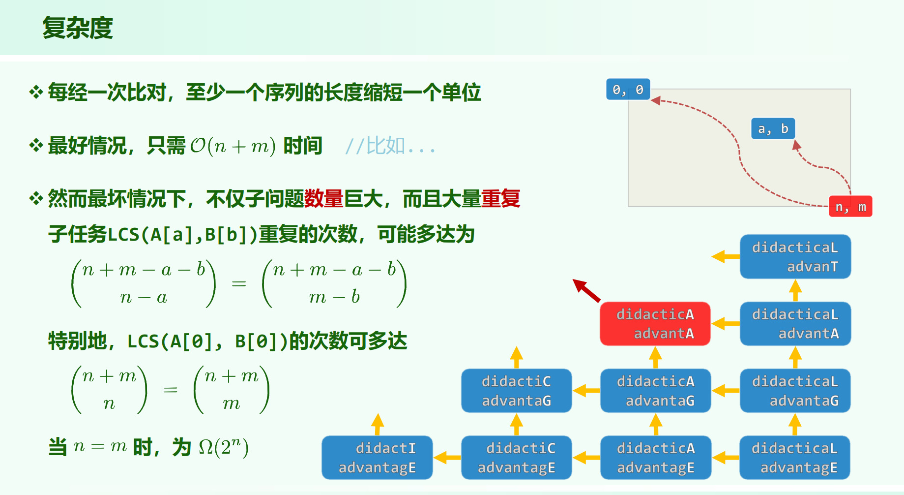
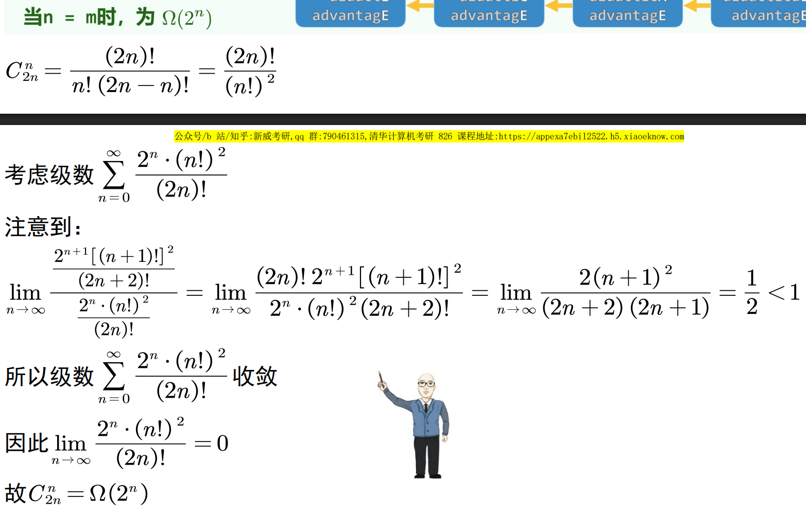

# 纯暴力(无记忆化)的LCS时间复杂度估计

01.Introduction.pdf P90

纯暴力(无记忆化)的话，最坏情况下(每次产生两个子问题)，时间复杂度递推关系为

$f(m, n) = f(m - 1, n) + f(m, n - 1)$

由于没有记忆化，总时间复杂度并非状态数。

这棵二维的递归树，其中一个点被产生的次数为多少？

$(a, b)$ 点被产生的最大次数为从 $(m - 1, n - 1)$ 走到 $(a, b)$ 的方案数：

$\binom{n + m - a - b}{n - a}$

（总步数为横向 n - a 纵向 m - b ，然后选 n - a 步横向。注意不能是 $2^{n + m - a - b}$ ， 这样无视了横纵向总步数的限制，比如会认为可以 n + m - a - b 全横着走）

仅仅考虑点 $(0, 0)$ 被产生的次数，为：

$\binom{n + m}{n}$

考虑 $n = m$ 的情况，于是仅计算点 $(0, 0)$ 的总时间就有 $\Omega(2^n)$

$\binom{n + m}{n} = \Omega(2^n)$ 的证明见新威补充ppt：

---

总的时间复杂度应该是：

$
\sum \limits_{(i, j) \in [0, m) \times [0, n)} \binom{n + m - i - j}{n - i}
$

---

# 代码

正确的dp代码见 [LCS.cpp](./LCS.cpp)

列出所有最长公共子串的代码见 [LCS_all_sequence.cpp](./LCS_all_sequence.cpp)