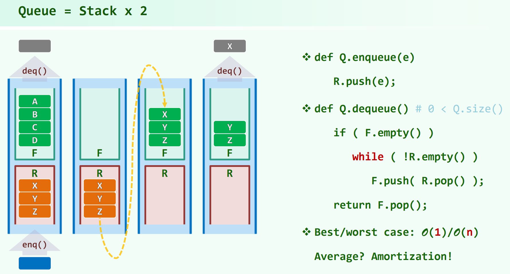
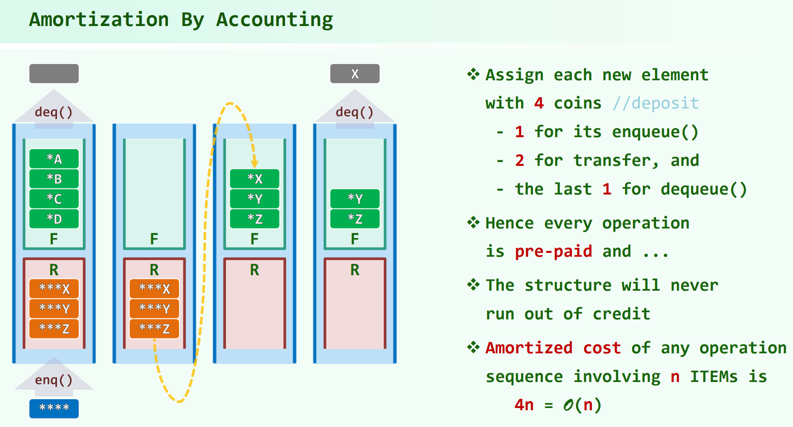
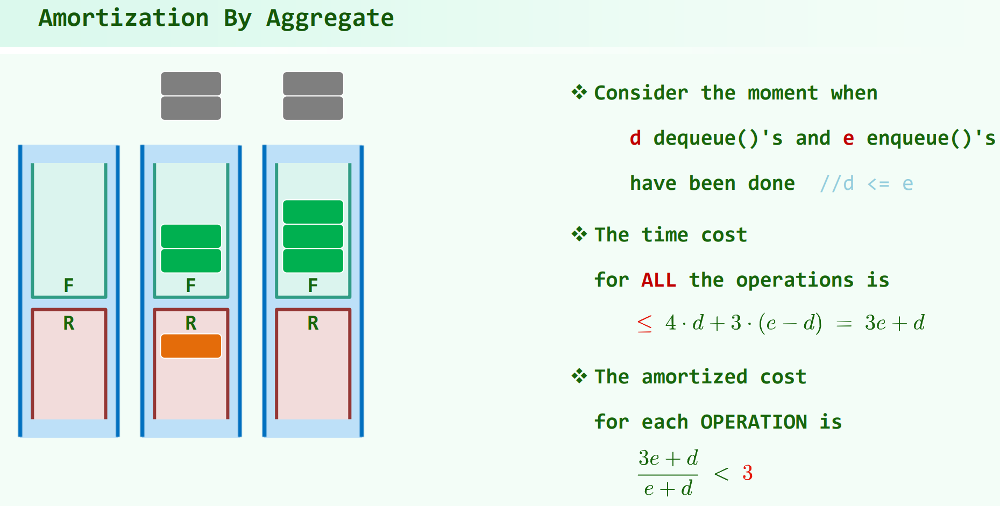
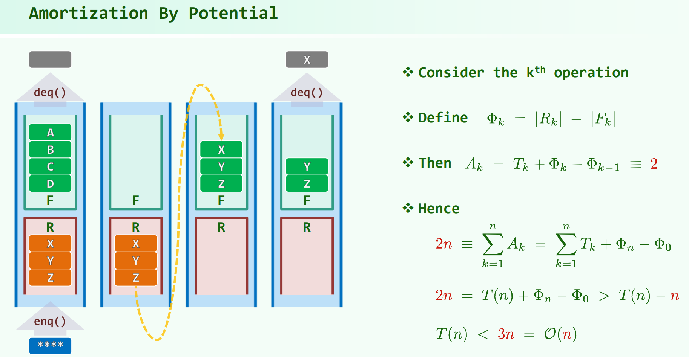

## Steap 与 Queap

* 04.Stack + Queue.pdf P93

* 习题解析[10-19]、[10-20]

Stack / Queue + Heap，让栈和队列能`getMax()`

思路为：一个普通的栈/队列，加上记录前缀max

### Steap

栈 + getMax

左为栈底，右为栈顶：`[...>`，原栈为S，用P记录前缀max，这里P只需要是个stack就行了。

`pop/push`时，对`S`进行操作，同时，由于增加/减少元素都在右侧尾部，所以对P中间的位置 $i$，其前缀是没有变化的，对P的维护只需 $O(1)$ 时间，以`push`一个元素为例，只需：`P[last] = max(P[last - 1], S[last])` 即可完成P的维护。

优化：将 P 中的相邻相等元素压缩记 $cnt$。能优化空间，时间复杂度不变。

`push/pop` $O(1)$ ，`getMax` $O(1)$

### Queap

队列 + getMax

左为队尾，右为队首，同样P记录前缀max，这个P要访问中间，得是个vector/list。

若Q元素出队，则P也只需出队；

但是若Q元素入队，则P的所有元素的前缀都变了，所有位置的前缀max都要重新算。遍历过程当发现某个位置的前缀max没变，循环可以提前退出，但是最坏情况下`enqueue`仍需要 $O(n)$ 时间，且若按单调增加的顺序enqueue元素，最坏情况会持续发生。

造成这种差别的原因在于，`enqueue`之后，所有位置的前缀都发生了变化。

优化：同理，将 P 中的相邻相等元素压缩记 $cnt$。能优化空间，且`enqueue`的均摊时间复杂度能降到 $O(1)$ 。证明：

考虑 $n$ 次 enqueue 操作，单次 enqueue 的开销可能很高，但是，P 中被迭代的元素必然随即被删除并压缩入某个前驱。$n$ 次 enqueue 最多产生 $n$ 个元素，所以迭代的元素总个数只有 $O(n)$ 个，分摊下来每次`enqueue`只有 $O(1)$ 。

`dequeue` $O(1)$ ，`enqueue` 最坏 $O(n)$，分摊$O(1)$ ，`getMax` $O(1)$

## 双栈当队 与 双队当栈

这个东西和双队当栈都没什么用，不如直接实现，只是硬给了约束要求去实现。

主要看均摊分析的分析方法，其中一种是势能分析法。

### 双栈当队

* [LeetCode232. 用栈实现队列](https://leetcode.cn/problems/implement-queue-using-stacks/)

`enqueue`的时间复杂度为 $O(1)$

最坏情况下`dequeue`会是 $O(n)$ ，但是分摊时间复杂度为 $O(1)$ ，证明：

解释一下方法3这个势能分析法：

> [oiwiki 均摊复杂度](https://oi-wiki.org/basic/amortized-analysis/)

定义势能函数 $ \Phi_{k} = |R_k| - |F_k| $ ，为栈大小的差值。

于是，均摊成本 $A_k = T_k + \Phi_{k} - \Phi_{k - 1}$ ， $T_k$ 为第 $k$ 次操作的实际代价。

注意这里的分析技巧，某步的 $T_k$ 可能很大，不好分析，但是 $T_k$ 加上了 $\Phi_{k} - \Phi_{k - 1}$，某步的 $T_k$ 大，势能函数的定义就会使得 $\Phi_{k} - \Phi_{k - 1}$ 负得多。于是 $A_k \equiv 2$，是常数。这样，就把时大时小的 $T_k$ 给平均成了 $O(1)$ 的 $A_k$ 。（$T_k$ 时大时小，不知道平均值，算不了总代价，但是通过构造能知道 $A_k$ 是 $O(1)$）

于是，$\sum A_k = \sum T_k + \Phi_{k} - \Phi_{0}$，而 $\sum A_k = 2n，\Phi_{k} = O(n)$，故 $\sum T_k = O(n)$。

$n$ 次操作的总时间复杂度 $\sum T_k = O(n)$ ，于是分摊到每次为 $O(1)$

### 双队当栈

* [LeetCode225. 用队列实现栈](https://leetcode.cn/problems/implement-stack-using-queues/)

双队当栈，会发现把两个栈首尾相接怎么都仍是先进先出，所以不能用双栈当队的思路。

一个元素x入队后，要让其先出，必须将其前面的元素都弄到x的后面去，所以需要把前面的元素出队后重新入队。这个过程可以借助第二个队列，不过实际单用一个队列就可以完成了，第二个队列实际是不必要的。

`push`的时间复杂度 $O(n)$ ，均摊也是 $O(n)$ 级别的

`pop`的时间复杂度 $O(1)$