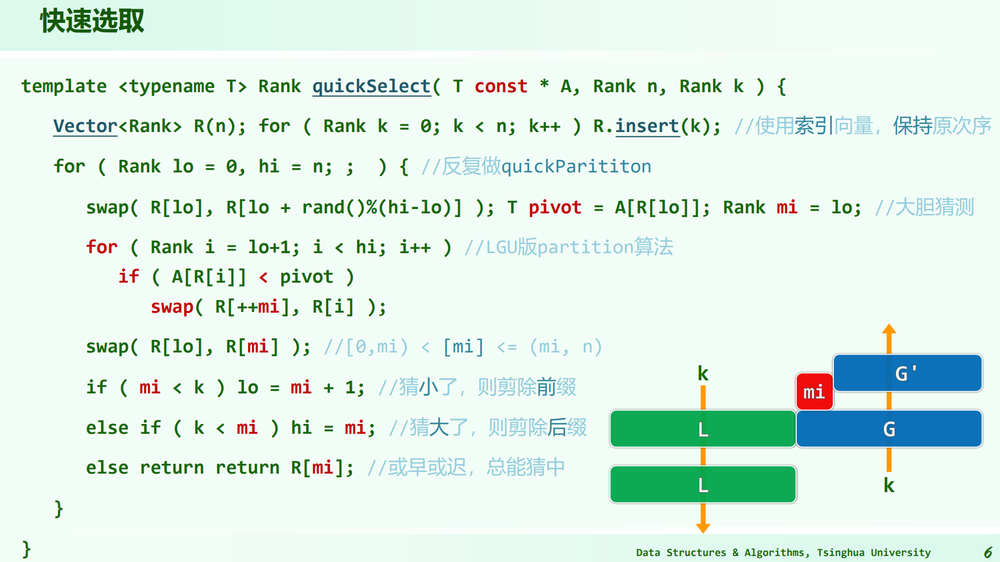
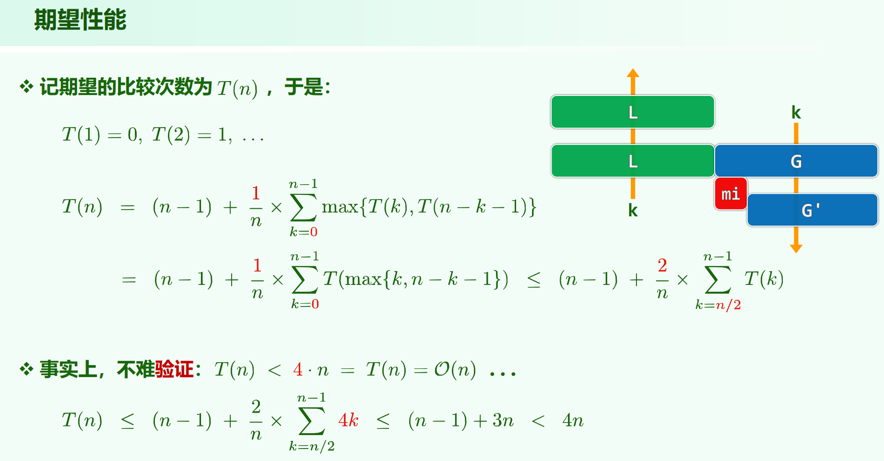

* 14.Sorting + Selection.pdf P59

用的是 partition，或者叫快速选取



coding-practice仓有代码，这里也贴上：

```java
// C++可以直接用 std::nth_element()
public int kSelect(int[] nums, int k) {
    int lo = 0, hi = nums.length - 1;
    while (lo < hi) {
        int i = lo, j = hi;
        int pivot = nums[lo];
        while (i < j) {
            while (i < j && nums[j] > pivot) j--;
            if (i < j) nums[i++] = nums[j];
            while (i < j && nums[i] < pivot) i++;
            if (i < j) nums[j--] = nums[i];
        }
        nums[i] = pivot;
        if (i == k) return nums[i];
        else if (i > k) hi = i - 1;
        else lo = i + 1;
    }
    return nums[lo];
}
```

这里主要看怎么证明的这个算法的期望时间复杂度为 $O(n)$


