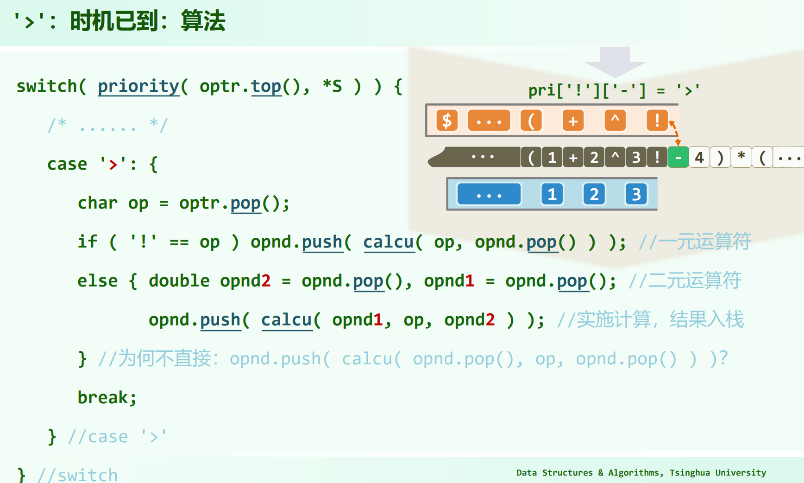

> 04.Stack + Queue.pdf P40
>
> 教材 P95
>
> 习题解析[4-10]
>
> 习题解析[4-11]
>
> 习题解析[4-12]

## 运算符优先级


pri[i][j] 为 栈顶运算符 比 当前运算符 的结果。

`case '>'`代表栈顶优先级更高，`case '<'`代表当前优先级更高。

`case '~'`是脱括号或者最后的`\0`的匹配，教材中是用`'='`标记的。

`case ' '`是表达式合法的情况下不可能发生的情况，如果发生，直接返回错误。

## 中缀表达式求值的基本逻辑

> 教材 P95

有一个运算符栈`optr`，一个运算数栈`opnd`。

运算符栈内待运算的运算符需看到一个待入的优先级比它低的才能放心开始算，**算的是运算符栈栈顶那个**。

大致的逻辑在于：

首先，根据[运算符栈的相邻单调性](#运算符栈的相邻单调性)，有: peek - 1 < peek，于是:

$ peek - 1 < peek \ \&\& \ peek > cur $

**能开算的运算符栈peek其实是一个局部的优先级极大值**，所以，有点像括号匹配的思路，由内而外，找到局部极大值，局部最大值确实是先算的，所以可以算。

## 运算符优先级表的一些特点

同一个符号的优先级对比体现了结合性。例如`[+][+]`是`>`，是因为`+`是左结合的，要先算左边。[习题解析[4-10]]()：上面的运算符优先级表，`^`是左结合的，但这不对，会把 $3^{3^3}$ 认为是 $9^3$ ，实际一般理解这个式子应当是右结合，为 $3^9$ 。所以，要把 `[^][^]` 从 `>` 改成 `<` ，`^` 就是右结合的了。

像`+`和`*`，`[+][*]`是`<`，则`[*][+]`对应是`>`；但是`(`则是个例外，`(`的行和列都全是`<`或者`' '`。这是因为，以`+`举例：若是`+(`，则`+`不能先算，必须先等括号里的完成，所以`[+][(]`为`<`；若是`(a+`，则显然这个`(`不能运算，其要等到`)`才会脱括号处理，所以`[(][+]`为`<`。

`\0`的优先级较低，自行体会，抓住开算的运算符为**局部极大值**即可理解。

应该是可以不引入`\0`的，其主要是为了处理边界情况 optr 为空，以及最后操作符栈中还有剩余东西的情况，可以不引入`\0`，单独判断。

`)`不会入栈，其会导致栈中剩下的还没算的`()`内的运算符运算直到`(`脱括号。

## 运算符栈的相邻单调性

[习题解析[4-11]]()：运算符栈中的每一运算符的优先级相对于其直接后继(如果存在)都要(严格地)更高。也就是说是**相邻严格单增的**。

这可以归纳证明，栈底为`\0`，第一个运算符入栈时满足；开始归纳，若 cur < peek，则 peek 会出栈，所以运算符栈会保持相邻单增性。

但是整体却并不是这样，**并不是运算符栈中的所有运算符都构成一个单调序列**，左括号`(`相当于将优先级复位了。运算符栈中不是一个全序。

## 代码 4.7 的鲁棒性

[习题解析4-12](): 教材P95的代码，对于一些非法表达式也能正常运行并给出结果。

(似乎一个合法的表达式，尾部再补个操作数，代码4.7都会正常退出)

## 代码 4.7 的实参计算问题



为何不直接：`opnd.push(calcu(opnd.pop(), op, opnd.pop()))`？

C++里函数实参的求值顺序是未定义的，所以两个`opnd.pop()`先计算哪个实参不确定，1 - 2 和 2 - 1 结果不同，可能会出错。必须明确调用顺序。

## 逆波兰表达式RPN的求值


## 中缀表达式到后缀表达式

教材P95 代码4.7，对一个中缀表达式既求出了值，append的位置又转化出了逆波兰表达式。

**中缀表达式和后缀表达式中操作数的顺序是完全相同的，RPN中的操作数就是原来的顺序。**

教材P98 / 04.Stack + Queue.pdf P61 还有个加括号法把中缀表达式转成后缀表达式的，加足够多的括号靠括号确定计算顺序，然后以运算符替换右括号，清除左括号。这个加括号真手动去加会很繁琐，所以真按这个步骤来没什么用。但是对于一些简单的表达式，从左到右遍历中缀表达式，遇到操作数直接append，然后把操作符右移到恰当的计算位置，这种思路对于简单的中缀表达式可以简便地看出RPN，比用栈模拟的方式简单。例如：

`(A+B)*(C-D)/(E-F*G)` -> `A B + C D - * E F G * - /`

`(1+2×3!)/(4×5-7)` -> `1 2 3 ! × + 4 5 × 7 - /`

既然代码4.7求出了值为什么还需要append出逆波兰表达式？

求出的逆波兰表达式给出了对待定输入的简单计算过程，可以多次使用。

```cpp
int func(int a, int b, int c) {
    return a + (b * c);
}

# 可以看到编译器生成的汇编的计算过程就是RPN的计算过程

movl	%ecx, 16(%rbp)
movl	%edx, 24(%rbp)
movl	%r8d, 32(%rbp)
movl	24(%rbp), %eax
imull	32(%rbp), %eax
movl	16(%rbp), %edx
addl	%edx, %eax
```

## 一些题目

1. 习题解析[4-9] (严格按代码4.7过程计算中缀表达式，只是计算结果的话可以人直接算)

2. 习题解析[4-12] (非法中缀表达式仍可运行)

3. 04.Stack + Queue.pdf P59

    

    (逆波兰表达式求值)

4. 教材P98 (一个可用的中缀转RPN的例子)

    **中缀转RPN的过程，读取中缀表达式，一遇到操作数就立马append到RPN串中，操作数栈具体是多少不用管，只需关心操作符栈的出栈append。**