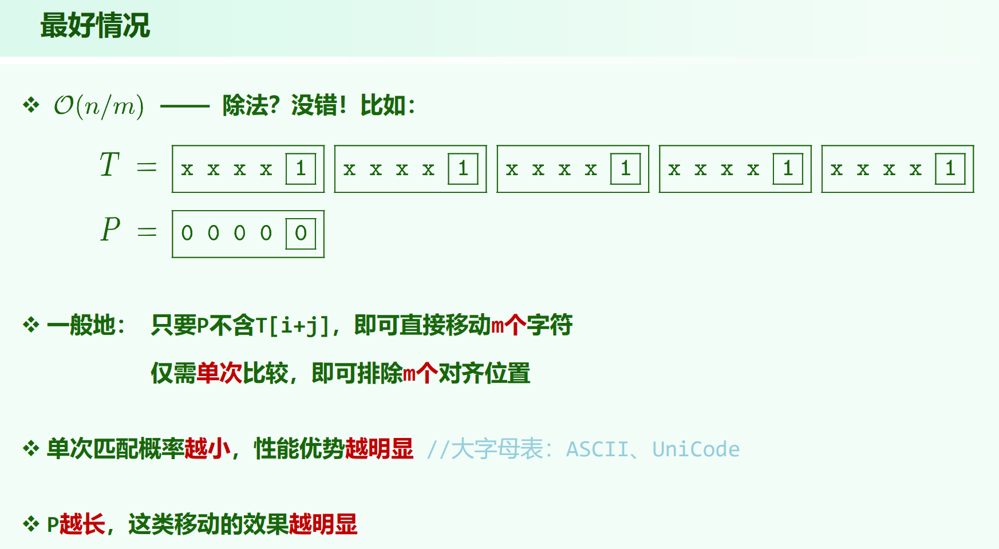
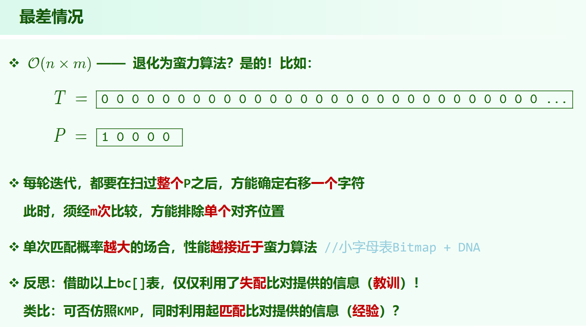
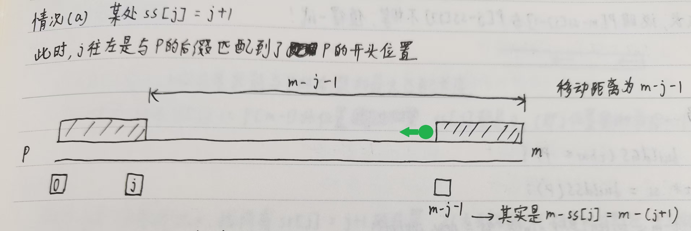
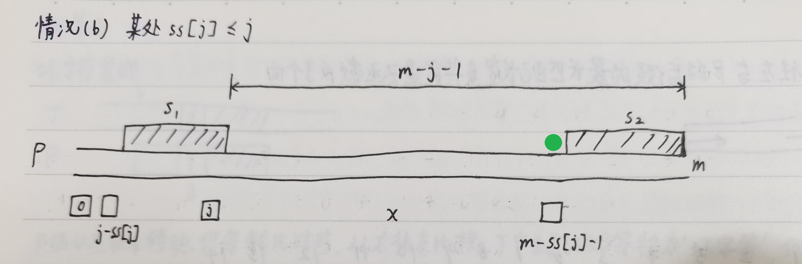
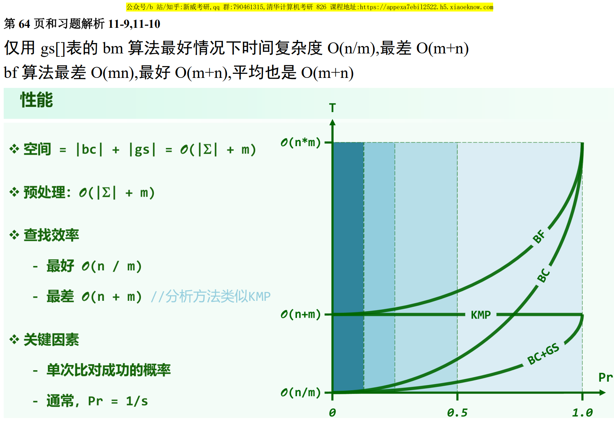

结合coding-practice仓的代码和纸质笔记本上的内容看

## KMP

时间复杂度 $O(n + m)$

## Boyer-Moore

### 坏字符bc策略

### 好后缀gs策略

$gs[i]$ 的含义是，$P$ 串在 $i$ 位置失配后，该**移动的距离**。为了不错过匹配可能，$gs[i]$ 应该**越小越好**。（注意与 $KMP$ 对比）

这里只梳理一下如何手工算 $gs$ 表，代码见 coding-practice 仓，一些解释见纸质笔记。

---

**首先算 $ss$ 表:**

$ss$ 表是[Z函数](https://oi-wiki.org/string/z-func/)反了个方向，变成从右往左的版本，**$ss[i]$ 为 $i$ 往左与 $p$ 的后缀的最长匹配长度**，手工算很容易。

只需注意 $ss[m-1]$ 定义为 $m$ ，而[oiwiki](https://oi-wiki.org/string/z-func/)里把 $z[0]$ 定义为 $0$ 。

此外，手工算 $ss$ 表时，只要 $p[i] \ne p[m-1]$ ，那么 $ss[i]$ 一定为 $0$ 。一般的例子会有不少位置为 $0$ 。

**对于计算 $gs$ 表:**

首先将 $gs$ 表全填为 $m$ ；或者也可以不填，处理完 情况(a) 和 情况(b) 后，把空缺的位置填上 $m$ 。

先记住一件事，有多个潜在的尝试，为了不错过匹配可能，$gs[i]$ 应该越**小**越好，也就是说，多次写同一个 $gs[i]$ 时，该与旧值取 $min$ 。

**情况$(a)$**: 某个 $ss[j]$ 向左匹配满了(左边没剩的)，$ss[j] = j + 1$

对于这种情况，我们可以得到什么信息？

对于 $i \in [0, m - j - 1)$ 内的 $i$ ，当在 $i$ 位置失配时，我们都可以让 $s_1$ 移动到与 $s_2$ 重合。即**对于绿点和绿点左侧的所有位置** $i \in [0, m - j - 1)$，都更新 $gs[i] = min(gs[i], m - j - 1)$ 。

手工处理情况$(a)$的$ss$值时从左往右或从右往左遍历都可以（从右往左好一点），只是要注意多次更新同一个 $gs$ 表位置时，由于要取移动距离的最小值，**值更小才修改**。（实际代码不用取 $min$ ，只需从右往左处理情况(a)的 $ss[j]$，结合一个双指针的技巧将这里的时间复杂度压到 $O(m)$。

$ss[m - 1] = m$ ，一定会是情况(a) ，但是其一定不会产生更新。

**情况$(b)$**: 某个 $ss[j]$ 向左匹配未满(左边还剩)，$ss[j] \le j$

对于这种情况，我们只能知道当在 $m - ss[j] - 1$ 位置失配时 (只有这一个位置)，可以让 $s_1$ 移动到与 $s_2$ 重合。即**对于绿点位置** $m - ss[j] - 1$ ，更新 $gs[m - ss[j] - 1] = min(gs[i], m - j - 1)$ 。

情况(b)要从左往右处理，更进一步地说，由于更新的位置 $m - ss[j] - 1$ 只与 $ss$ 表的值有关，所以，**只需关心 $ss$ 表情况(b)的每种取值的最右边那个位置**，这样的 $m - j - 1$ 就是最小的，对这种位置执行 $gs[m - ss[j] - 1] = m - j - 1$ 即可。

一个小特点：若 $p[m - 2] \ne p[m - 1]$ ，则 $ss[m - 1] = 0$ ，一定会有 $gs[m - 1] = 1$ 。直观来说就是若 $p[m - 2] \ne p[m - 1]$ ，则在 $m - 1$ 位置失配，下一步只能移动 $1$ ，把 $p[m - 2]$ 移过来比对。如果尾部有一段相等的话能移动更长。

还有个细节，情况$(a)$ 和 情况$(b)$ 虽然各自都向 $gs$ 表写入了最小的移动距离，但是有没有可能 情况$(b)$ 的最小移动距离更大，覆盖了 情况$(a)$ 写入的更小的值？

不会，如果发生 情况$(a)$ 和 情况$(b)$ 都写同一个 $gs$ 位置，这是上图中的 $s_1$(前缀) 和 $s'_1$(中部) 都与 $s_2$(后缀) 匹配的情况，此时情况$(b)$的 $m - j - 1$ 一定更小。

---

总结 情况$(a)$ 和 情况$(b)$ :

**移动距离公式都是 $m - j - 1$，其实就是 $j$ 移到 $m - 1$ 位置的距离。**

**情况(a)是 $gs[0, m - j - 1) = m - j - 1$**

**情况(b)是 $gs[m - ss[j] - 1] = m - j - 1$**

---

# 时间复杂度

这里的“最好情况下的时间复杂度”，是指最坏情况下的最好时间复杂度，即最坏情况的下界。