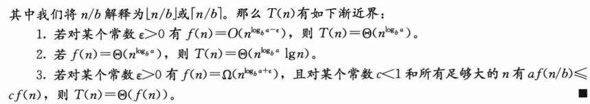

主定理的证明具体见 《算法导论》 4.6

出发点为：

这里 $a^{log_b{n}} = n^{log_b{a}}$ 是用了对数的互换[性质](https://zh.wikipedia.org/wiki/%E5%AF%B9%E6%95%B0):

$M^{log_\alpha{N}} = N^{log_\alpha{M}}$

证明完整过程见算法导论，

这里只记用到的一个点，如何证明

$log^k{n} + log^k{(n / b)} + log^k{(n / b^2)} + ... + log^k{(n / b^{log_bn})} = \theta(logn * log^kn)$

证明来自字母哥[jdhrjksjxjiieisiwoisiwhs](https://www.xiaohongshu.com/user/profile/64b4c8ab000000001c028a15)认识的研友[往复随安](https://www.xiaohongshu.com/user/profile/671ccf6a000000001d030074)

原式 

$I = \sum \limits_{i=0}^{log_bn} log^k{(n / b^i)}$

$= \sum \limits_{i=0}^{log_bn} (logn - ilogb)^k$

$logn = logblog_b{n}$ (关键步骤，用对数的链式性质 $log_\gamma\beta log_\beta\alpha = log_\gamma\alpha$ 弄出来一个logb，这样就能把logb提出来)

$I = \sum \limits_{i=0}^{log_bn} (logblog_b{n} - ilogb)^k$

$= log^k{b}\sum \limits_{i=0}^{log_bn} (log_b{n} - i)^k$

记 $m = log_b{n}$

$= log^k{b}\sum \limits_{i=0}^m (m - i)^k$

$= log^k{b}\sum \limits_{i=0}^m i^k$

$\approx log^k{b}\int_0^m{x^k}dx$

$= log^k{b} * m^{k+1} / (k + 1)$ （**这步需要 $k \ne -1$**）

$= \theta(log_b^{k+1}n) = \theta(log^{k+1}n)$

当 $k = -1$ 时，

$log^{-1}{n} + log^{-1}{(n / b)} + log^{-1}{(n / b^2)} + ... + log^{-1}{(n / b^{log_b{n}})}$

$= \sum \limits_{i = 0}^{log_b{n}} \frac{1}{logn - ilogb}$

$= \sum \limits_{i = 0}^{log_b{n}} \frac{1}{logb * log_b{n} - ilogb}$

$= \frac{1}{logb} \sum \limits_{i = 0}^{log_b{n}} \frac{1}{log_b{n} - i}$

$= \frac{1}{logb} * log(log_b{n}) = \theta(loglogn)$

这么一看，用上面 $T(n) = \theta(n^{log_b{a}}) + \sum \limits_{j = 0}^{(log_{b}{n}) - 1}a^jf(n / b^j)$ 的出发点式子来分析：

$T(n) = aT(n / b) + f(n)$，且 $f(n) = \theta (n^{log_b{a}} * log^k{n})$ 的情况，结论应当是：

$$
T(n) = 
\begin{cases}
\theta(n^{log_b{a}}), k < -1 \\

\theta(n^{log_b{a}}loglogn), k = -1 \\

\theta(n^{log_b{a}} * log^{k+1}n), k \gt -1
\end{cases}
$$

## 主定理情况3的正规条件(Regularity Condition)

主定理：

解释一下主定理情况3的这个 $af(\frac{n}{b}) \le cf(n)$ 的正规条件，有这个条件，

$\sum \limits_{j = 0}^{(log_{b}{n}) - 1}a^jf(n / b^j)$ 可以放大成 $c^jf(n)，c < 1$ ，则 $\sum \limits_{j = 0}^{(log_{b}{n}) - 1}a^jf(n / b^j) \le \sum \limits_{j = 0}^{(log_{b}{n}) - 1} c^jf(n) = \Theta(f(n))$，所以 $T(n) = n^{log_b{a}} + \Theta(f(n)) = \Theta(f(n))$ 。

例如：$T(n) = 2\,T(\frac{n}{2}) + 2^n$，则 $f(n) = 2^n$ ， $2 \cdot 2^{n/2} \le c \cdot 2^n \ (c取\frac{1}{2})$ ，满足正规条件，可以用主定理情况3得出 $T(n) = \Theta(2^n)$。

## 主定理的推广形式

主定理要求每个子问题的规模相等，都是 $f(\frac{n}{b})$ ，而 [Akra-Bazzi 定理](https://blog.csdn.net/hyjiesix/article/details/125095862) 可以求解子问题规模不同，即递推式为：

$$
T(x) = \sum_{i=1}^k a_i \, T(b_i x + h_i(x)) + f(x)
$$

形式的时间复杂度。