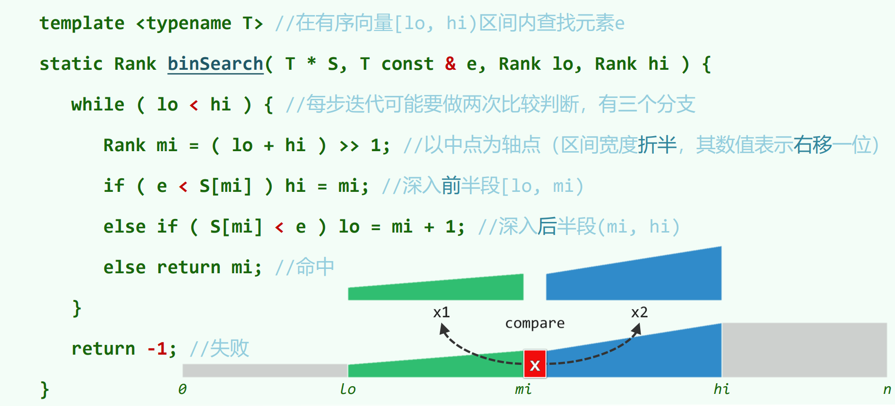
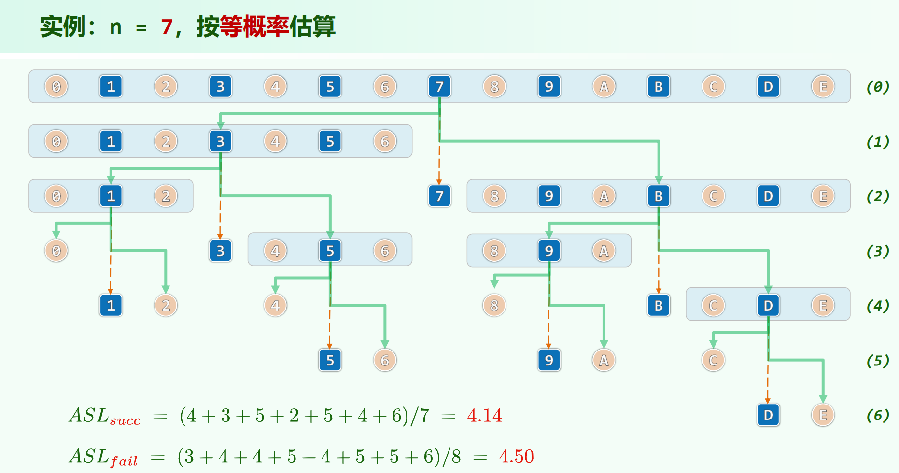
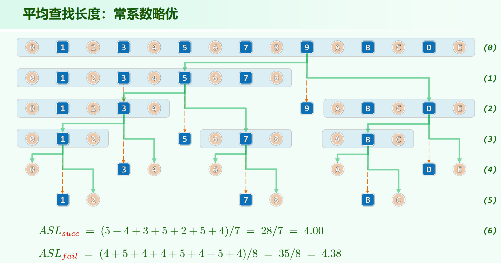
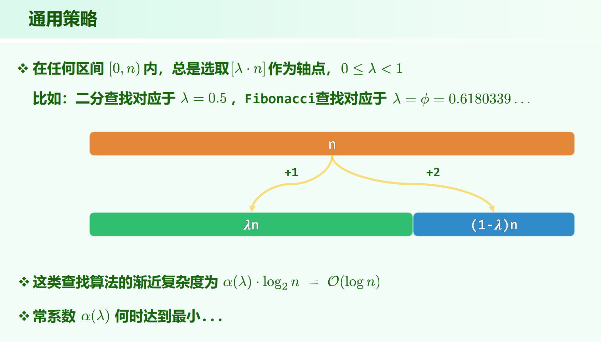
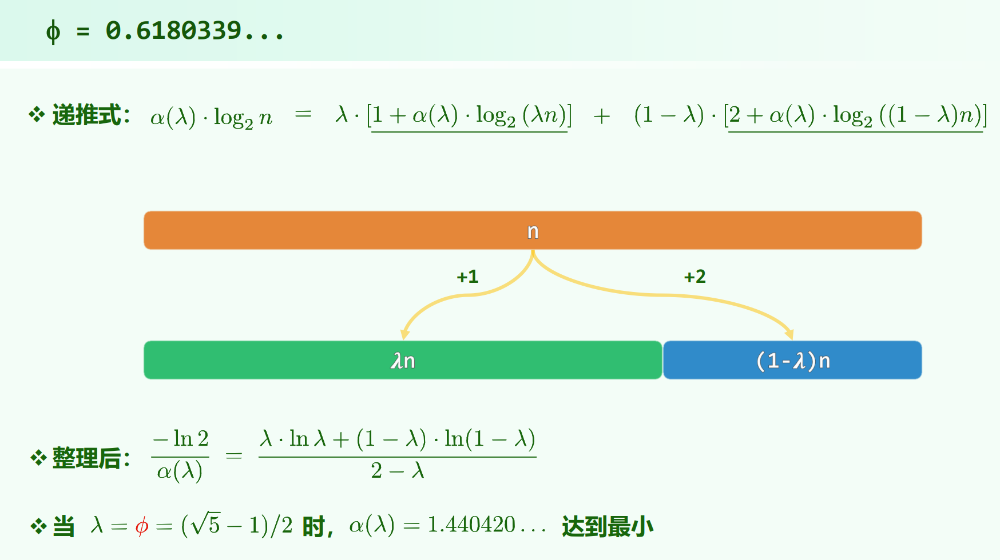

# 二分查找的平均查找长度

* 02.Vector.pdf P45

* 教材 2.6.5、2.6.6

* 习题解析[2-20]

## 二分查找（版本A）

版本A为非searchLast版本，即为：



**[TODO]**: 教材 2.6.5、2.6.6，习题解析[2-20]中有详细归纳分析平均查找长度。

### 实例计算



注意，上面的代码是左闭右开区间 $[lo, hi)$，如果向量长度为偶数，$mi = (lo + hi) / 2$ ， $mi$ 会是上中位数位置。

**怎么看比较次数？**

二分查找里的比较次数（查找长度），看上面的代码。

* 如果要往左递归子向量(e < S[mi])，要比较 $1$ 次。

* 如果要往右递归子向量(S[mi] < e)，要比较 $2$ 次。

    (上面 e < S[mi] 为false，然后 S[mi] < e 为true，比较了 $2$ 次)

* 如果在当前位置命中元素，要比较 $2$ 次。

    (e < S[mi] 为false 且 S[mi] < e 为false。)

注意后两种情况都是 $2$ 次。

用图来看：

* 走左侧绿色的边，需要 $1$ 次。

* 走右侧绿色的边，需要 $2$ 次。

* 在一个内部点处安定下来，需要 $2$ 次；若在外部点处安定下来，外部点处不需要查找长度。

以上面 n = 7 的查找树为例：

1 是真实的点，走到 1 需要 2 条向左边，1 次定点，查找长度为 $1 + 1 + 2 = 4$ 。

0 是虚拟的点，代表比 1 小，走到 0 需要 3 条向左边，虚拟的点定点不需要开销，查找长度为 $1 + 1 + 1 = 3$ 。

其它点同理。

## fib查找
往左需要1次，往右需要2次，让二分不是均匀二分，而是左侧重，往左的概率大，能得到更小的比较次数。

若有 $n = fib(k) - 1$ ，取 $mi = fib(k - 1) - 1$ ，前后子向量长度分别为 $fib(k - 1) - 1 、 fib(k - 2) - 1$ 。


### 实例计算

计算查找长度的方式与均分的情况相同，只是树是左倾的：



### 分割点
前后部分应该取何种比例方式分割？

可以不太严谨地假设 $f(n) = \alpha(\lambda)log_2{n}$ ，即 $\lambda$ 的选择影响常系数。

如何让 $\alpha(\lambda)$ 最小？

**写递推式**，落入左右部分的概率分别为 $\lambda$ 和 $1 - \lambda$ ，于是：

$\alpha(\lambda)log_2{n} = \lambda[1 + \alpha(\lambda)log_2{(\lambda n)}] + (1 - \lambda)[2 + \alpha(\lambda)log_2{((1 - \lambda) n)}]$

整理后得到：

$\frac{-ln2}{\alpha(\lambda)} = \frac{\lambda ln\lambda + (1 - \lambda)ln(1 - \lambda)}{2 - \lambda}$

右边求导之后是：

$\frac{2ln\lambda - ln(1 - \lambda)}{(2 - \lambda)^2}$

(不想手动算的话可以用[这个](https://zs.symbolab.com/solver/derivative-calculator)网站)

所以，$\lambda$ 取 $\frac{\sqrt{5} - 1}{2}$ 时，$f(n)$ 最小。





而对斐波拉契数列，$fib(n) = \frac{1}{\sqrt{5}}[(\frac{1 + \sqrt{5}}{2})^n - (\frac{1 - \sqrt{5}}{2})^n]$

后项/前项的极限为黄金分割比 $\frac{1 + \sqrt{5}}{2}$ ，而上面 $\frac{\lambda}{1 - \lambda} = \frac{\frac{\sqrt{5} - 1}{2}}{1 - \frac{\sqrt{5} - 1}{2}} = \frac{\sqrt{5} + 1}{2}$ 也是黄金分割比。所以**fib查找的分割方式是最优的**。

这个方法，有点神奇，写了下递推式，就无中生有可以做了。

## 二分查找（版本B/C）
即为常见的searchLast/searchFirst的写法。

只有两种分支情况，往左/往右走都只需 $1$ 次比较，相当于以 $+1$ 的开销进入左子向量/右子向量。

# 平均查找长度(Average Search Length)结论
二分查找版本A:

$ASL_{succ} = O(1.50 \cdot logn)$

$ASL_{fail} = O(1.50 \cdot logn)$

fib查找：

$ASL_{succ} = O(1.44 \cdot logn)$

$ASL_{fail} = O(1.38 \cdot logn)$ （存疑）

二分查找版本B/C:

$ASL_{succ} = O(1.00 \cdot logn)$

$ASL_{fail} = O(1.00 \cdot logn)$

---

这里 $ASL_{fail} = O(1.38 \cdot logn)$ 的结论来自习题解析[2-20]，但是这个结论应该有问题。

首先，有结论：

**对于fib查找和二分查找版本A，都有：总失败查找长度 = 总成功查找长度 + n**。

以fib查找为例，归纳证明，树为：

```
     2
 +1 / \ +2
  T1   T2  
```

用根节点 $o$ 粘左右子树，共有 $n = fib(k) - 1$ 个节点，

左子树有 $fib(k - 1) - 1$ 个节点，$fib(k - 1)$ 个外部节点。左子树的 $\Delta(总失败长度 - 总成功长度) = 1$

对右子树， $\Delta(总失败长度 - 总成功长度) = 2$

对根节点，$\Delta(总失败长度 - 总成功长度) = -2$

于是，总的 $\Delta(总失败长度 - 总成功长度) = 1$

于是粘完后，$总失败长度 - 总成功长度 = (n - 1) + 1 = n$

这个结论，**无论二分划分的轴点在哪里都能归纳证明成立**。

所以习题解析[2-20]就不对，$总失败长度 = 总成功长度 + n$，所以 $平均失败长度 = 平均成功长度 + 1$，$平均失败长度 \sim 平均成功长度$，二者常系数应该相同。应该是习题解析[2-20]的放缩过头了。