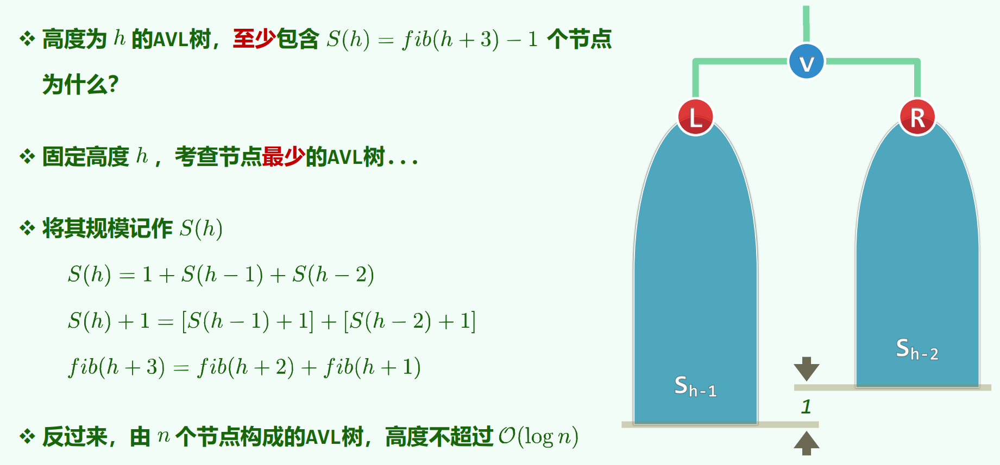
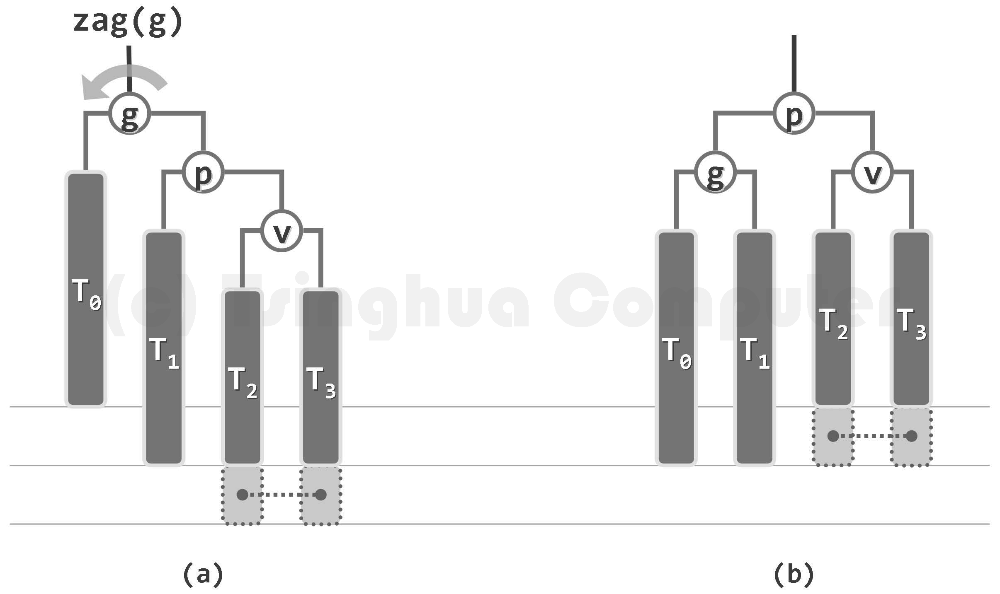
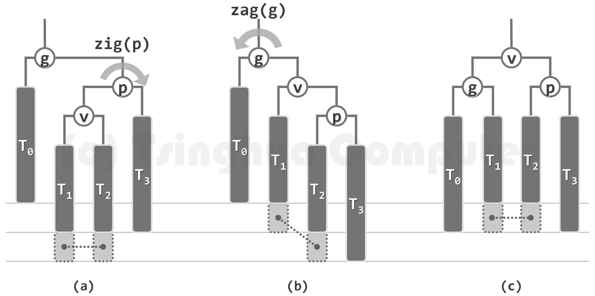
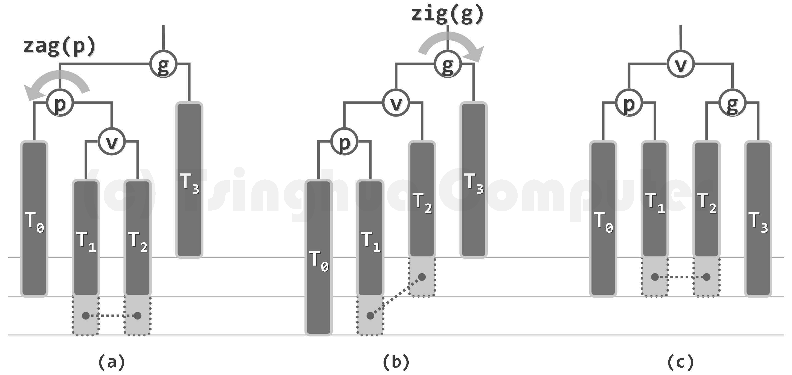
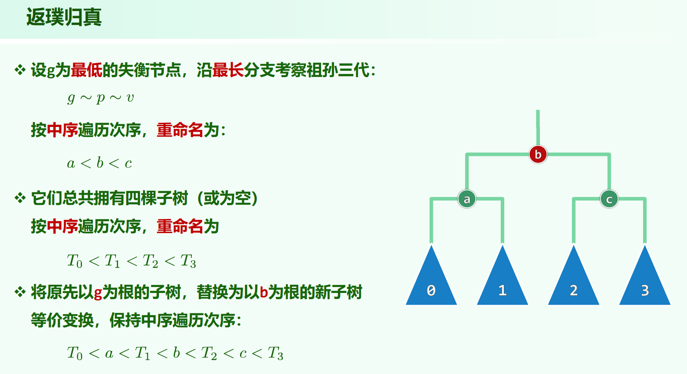

* 06.Binary Search Trees.pdf P34

* 全书插图邓老师[官网](https://dsa.cs.tsinghua.edu.cn/~deng/ds/dsacpp/)有

## fib-avl

给定高度下，最瘦的avl树



## 插入

插入：从祖父(指父节点的父节点)开始，每个祖先都有可能失衡，且可能同时失衡。

插入的单旋调整:



插入的双旋调整:



（在T2/T3、T1/T2下面插入了一个节点，虚线相连的节点恰存在一个）

无论单旋或双旋，经局部调整之后，不仅 $g$ 能恢复平衡，而且局部子树的高度也会复原。因此，AVL树中插入新节点后，仅需不超过两次旋转，即可使整树恢复平衡。

## 删除

删除：从父亲开始，每个祖先都有可能失衡，但同一时刻至多一个。

删除的单旋调整:


删除的双旋调整:



（在T3中删除了一个节点，虚线相连的节点至少存在其一，虚框节点可有可无）

对于删除，调整后 $g$ 高度可能降低。失衡可能传播，但在过程中的任一时刻，最多只有一个失衡的节点。

## $g, p, v$ 的选择

$g$ 为操作位置向上找找到的最靠下的失衡节点，$p$, $v$ 为两次 `tallerChild`，若 $p$ 的两个子树高度相同，必须优先选同侧孩子为 $v$。

这也是为什么两个双旋的图中，$v$ 的兄弟 T3 / T0 下面没有一个虚框。如果有，则`tallerChild`的选取规则一定会选同侧，最后选出来是单旋的情况。

为什么必须选同侧？

若 $v$ 与其兄弟高度相同时不选同侧，而是选异侧的 $v$的兄弟 变成双旋。则以删除的双旋情况为例，这样 T0 下面就还有个节点。虚线相连的节点至少存在其一，则若 T1 下面没有，T0 下面现在又加个节点，双旋之后 $p$ 是不平衡的。插入的双旋情况同理分析。

所以，高度相同时**必须**优先选同侧变成单旋，否则会错误。

## connect34



找到 $g, p, v$ 之后，按中序遍历相同，把 $g, p, v$ 重构成

```
  b
 / \
a   c
```

的样子，T0 ~ T3 的左右顺序不变。这样，节点+子树的中序遍历在onnect34前后就能保持一致。（教材P201代码7.14）

有个性质，$g$ 不可能最后在中间，因为 $p$ 和 $v$ 都在其同侧，$g$ 不可能当 $b$ 。