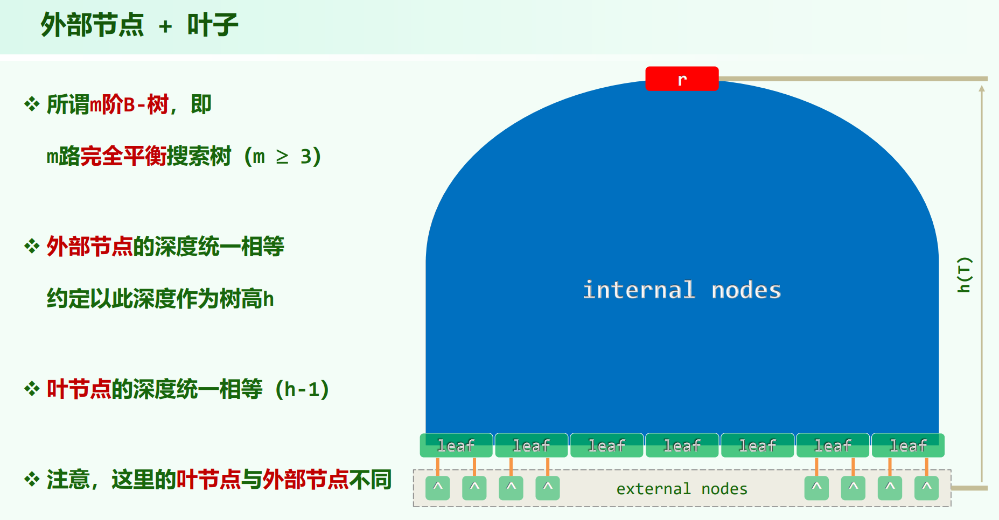
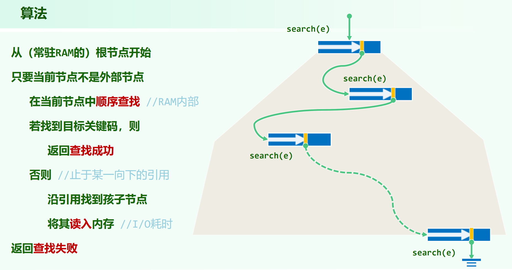

* 08.Advanved Search Trees.pdf P43

**B树的高度要算外部节点，叶节点是指外部节点上一层的节点**，B树的特性，叶节点都会在 h - 1 深度的位置。

外部节点相对的就是内部节点，所以内部节点包含叶节点。

## 节点关键码与分支数

每个内部节点有 $n$ 个关键码，$n + 1$ 个分支。对于m阶B树，需要满足：

内部节点：$n + 1 \le m$

反过来，分支数也不能太少

根：$n + 1 \ge 2$，也就是根特殊，最少可以只有 $1$ 个关键码

根以外的内部节点：$n + 1 \ge \lceil m / 2 \rceil$

m阶B-树也称 $(\lceil m / 2 \rceil, m)$-树（这两个数字是内部节点分支数，根要例外，根分支数可以小到 $2$ ，$1$ 个关键码）。

## B树的I/O

**根节点默认在内存。**

## B树高度

记 $N$ 个关键码的 $m$ 阶B-树的高度为 $h$，则有：

$$
log_m(N + 1) \le h \le 1 + log_{\lceil \frac{m}{2} \rceil}\frac{N + 1}{2}
$$

证明：

每层关键码取最少，也即分支数最少，以使树最高，每层节点数为：

$n_0 = 1$

$n_1 = 2$

$n_2 = 2 \times \lceil \frac{m}{2} \rceil$

$n_3 = 2 \times \lceil \frac{m}{2} \rceil^2$

$...$

$n_h = 2 \times \lceil \frac{m}{2} \rceil^{h - 1}$

第 $h$ 层为外部节点，对应查找失败的情况，**外部节点数 = 关键码数 + 1**，所以 $N + 1 \ge 2 \times \lceil \frac{m}{2} \rceil^{h - 1}$ ，得到 $h$ 上界。

关键在于要用**外部节点数 = 关键码数 + 1**，所以要分析外部节点数，而非去分析每层关键码数(分析这个会很麻烦)。

每层关键码取最多，也即分支数最多，以使树最矮，每层节点数为：

$n_0 = 1$

$n_1 = m$

$...$

$n_h = m^h$

同理，第 $h$ 层为外部节点，$N + 1 \le m^h$ ，所以 $log_m{(N + 1)} \le h$

---

B树的高度为 $\Theta(log_m{N})$ 。

## 插入

除根以外，每个内部节点关键码个数范围 $[\lceil \frac{m}{2} \rceil - 1, m - 1]$ 。

插入一定会插到叶节点里。

若插入后关键码太多($m$ 个)上溢，则要进行分裂，选下标为 $s = \lfloor \frac{m}{2} \rfloor$ 处的关键码(正中(奇数)或正中偏右(偶数))，将 $k_s$ 上升一层到父节点中，以分裂所得的两个节点为 $k_s$ 的左右孩子(左右孩子的关键码数一定会是合法的)。

上溢可能向上**传播**，若上溢传播到根节点，则被提升的关键码自成一个节点，成为新树根。这是B树长高的唯一可能。

## 删除

除根以外，每个内部节点关键码个数范围 $[\lceil \frac{m}{2} \rceil - 1, m - 1]$ 。

B树的非叶节点的内部节点一定是多分支的，不可能存在单分支的情况。

若删除的关键码所在节点非叶节点，则关键码的直接后继一定在叶节点中(若不在叶节点中，则继续走左分支能找到更小的)。将其与直接后继交换，**在叶节点上删除**。

删除之后可能关键码太少($\lceil \frac{m}{2} \rceil - 2$ 个)下溢，

1. 若下溢节点没有兄弟，则说明其一定为根节点，根节点的关键码最少可以只有 $1$ 个，若这还下溢了，说明根节点变空了，要选儿子为新根或者B树已为空树。（在教材P224代码里这是递归基，会先判断当前节点是否下溢，是否为根，代码上不会真正遇到需要处理左右孩子都为空的情况）

2. 若下溢节点有兄弟，看其关键码数够不够借，

    2.1 若左/右兄弟之一的关键码数 $\ge \lceil \frac{m}{2} \rceil$ 个（够借）。

    用兄弟右/左边缘的那个关键码 $x$，和父节点中的对应关键码 $y$ 做一次旋转，$y$ 进来补下溢，$x$ 上去接替 $y$。这样满足了搜索树的顺序性，下溢修复**完毕**。

    2.2 若左右兄弟都不够借。

    则左右兄弟或不存在，或其关键码数为 $\lceil \frac{m}{2} \rceil - 1$ ，但至少有一个兄弟。通过父节点中对应的节点，将下溢节点与兄弟粘接。新生成的节点关键码数为 $2 \cdot \lceil \frac{m}{2} \rceil - 2$ ，一定合法。由于父节点少了一个节点，下溢可能向上**传播**，若传播到根，则根节点要废弃，选儿子为新根。这是B树变矮的唯一可能。

## 例子

插入：08.Advanved Search Trees.pdf P63

删除：08.Advanved Search Trees.pdf P73