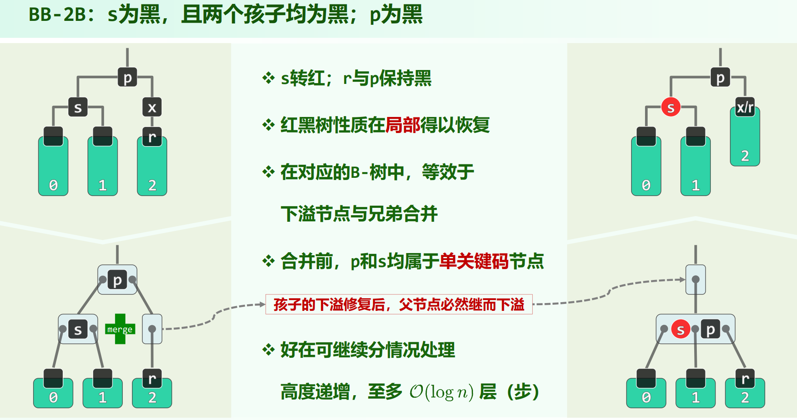
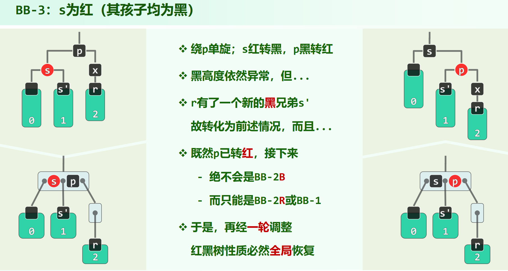

* 08.Advanved Search Trees.pdf P80

## 动机

注意以上是在说**拓扑结构的变化量**，不是时间复杂度。

红黑树的 insert / remove，拓扑结构变化只会有 $O(1)$ 次，但是颜色变化可达 $O(n)$ 次。

## 定义

1. 树根必为黑色

2. 外部节点视为黑色

3. 红节点的孩子和父亲都必须是黑色

    只需保证红节点的孩子是黑色，就可以保证红节点的父亲是黑色了

4. 从根到任意外部节点的路径，经过的黑节点数目都必须相同

* 黑深度：往上走到根(**不包括自己**)的黑节点数目。

    （书上黑深度的定义与ppt上有些许不同，这里的是ppt上的定义）

* 黑高度：从子树根往下走到外部节点（包括子树根，不计数外部节点）的黑节点数目。

    （也就是说黑高度实际没把外部节点当作真实存在，没计数它，本来外部节点也只是nullptr）

全树的黑高度为根节点的黑高度，也就是说全树的黑高度是计数任意一条路径上的黑节点数，但不包括外部节点。

注意以上定义实际是在数黑节点数，和边无关。

## 红黑树 与 (2,4)-树 的对应关系

每个黑节点的左右孩子若为红（反过来，红节点的父亲一定存在且为黑），则将其收到黑节点中，这样，红黑树表面上不会有红节点，**每个节点中都恰有一个黑节点作为核心，可能有红节点作为陪衬**。由于黑高度都相等，所以叶子节点也都在同一层。

也就是说，红黑树可以变换为$4$阶B树，对于$4$阶B树，也可以视节点内的关键码数将关键码染红下放，变换为红黑树。

注意，**在B树节点里谁红谁黑是确定的，谁是父节点谁黑，其它为红**，有3个关键码的话一定是中间那个黑。

## 红黑树的高度

记包含 $n$ 个内部节点的红黑树的高度为 $h$ ，则有：

$$
log_2(n + 1) \le h \le 2 \cdot log_2(n + 1)
$$

红黑树的高度也是 $O(logn)$

左边的 $log_2(n + 1)$ 显然，是按最平衡的二叉搜索树来算的，不可能比这低。不过由于红黑树的高度要算外部节点，所以n = 1时高度为1，n = 3时高度为2，n = 2^k - 1时高度为k，所以高度是 $\lceil log_2(n + 1) \rceil$ ，如果是完全二叉树的话高度该是 $\lceil log_2(n + 1) \rceil - 1 = \lfloor log_{2}n \rfloor$。

右边的 $2 \cdot log_2(n + 1)$ ：

红黑树的高度要算外部节点，所以树高 = 最多红节点的路径上的黑红节点数相加。

考虑红黑树的红高度 $R$ 与黑高度 $B$ ，红节点最多与黑节点一样多（黑红黑红...），所以 $R \le B$ ，$h = R + B \le 2 \cdot B $ 。把红节点都收到黑节点里，红黑树的黑高度转化成了对于4阶B树的高度，于是：

$$
h \le 2 \cdot B = 2 \cdot (1 + log_2\frac{n + 1}{2}) = 2 \cdot log_2(n + 1)
$$

## 插入

插入的节点都是以红色插入

插入的节点 $x$ 若为根，说明红黑树为空，直接把根 $x$ 染成黑色即可（实际教材P231代码并不需要单独处理这种情况，节点插入之后`solveDoubleRed(x)`，如果`x`是根的话直接染黑并`height++`即完毕）

否则：

插入的 $x$ 为**红**色，其父亲必存在，

* 若为黑，则插入完毕

* 若为红，要进行**双红修正**

双红修正看 (插入点)$x$ 的 $uncle$ 颜色，牵涉到的节点为插入节点 $x$，以及 $x$ 上区域的三个节点 $p, g, u$ 。

**双红修正：**

### $RR-1$：$u$ 为黑

$$\Downarrow$$

如果是刚插入那次的话 $u$ 是外部节点，但是 $u$ 也可能不是外部节点，因为 $RR-2$ 可能向上传播出现双红，向上传播之后如果双红是 $RR-1$ 的情况的话 $u$ 就不是外部节点。

用等价的B树来看，$RR-1$ 相当于B树节点里有 $3$ 个关键码，但是黑的不在正中间。那么将中间的节点变成黑色，旁边两个变成红色，再连回红黑树子树原本的父节点就行了。

这等价于 $\{x, p, g\}$ 去做 **1次connect34 + 2次染色**（$g$一定由黑边红，因为其一定当不了 $b$ ，然后当 $b$ 的那个节点由红变黑）。

由于 $RR-1$ 四棵子树的根节点一定都为黑（$u$ 为黑是因为这里是我们的讨论情况），调整后的子树根为黑，子树黑高度也不变，$a$ 和 $c$ 也不会构成新的双红。调整**随即完成**。

### $RR-2$：$u$ 为红

$$\Downarrow$$

转成对应B树，把红后代收进黑节点，可以看到是关键码太多，节点上溢了。因此，把 $g$ 升上去，注意 $g$ 升上去，子节点 $\{p, x\} \ \{u\}$ 中的核心必须染黑，为了维持黑高度不变，这说明**升上去的节点 $g$ 要染红**，下面的两个节点中的关键码谁染黑也是确定的，谁是父亲谁是核心，谁是核心谁染黑，所以一定是 $p$ 和 $u$ 变黑。

注意这里红黑树与B树的对应关系的微妙差别，B树代码里是固定选下标为 $s = \lfloor \frac{m}{2} \rfloor$ 处的关键码。但是上图的对称情况，如 $\textcolor{red}{u} {g} \textcolor{red}{p} \textcolor{red}{x}$ ，由于 $g$ 原本就是红黑树中最祖先的那个节点，所以在B树中不能是选中间偏右的 $p$ 上去，不然在对应的红黑树中要调树结构，**还是要选 $g$ 上去**。

**$RR-2$ 其实就是 $g$(黑) 与 $g$的儿子层(2红) 颜色互换一下。只需 $3$ 次染色，不会调整结构。**

$RR-2$ 调整之后，子树性质满足，黑高度不变，但是由于子树根 $g$ 变红了，双红可能向上传播（正如同B树分裂会向上传播）。传播从 $x$ 到 $g$ 上升两层。新出现的双红可能是 $RR-1$，也可能是 $RR-2$，递归判断处理。若处理传播到了根（一次$RR-2$处理完后发现 $g$ 为根），则直接将根染黑即可处理完毕，红黑树的黑高度增加 $1$ 。

### 双红修正总结

* $u$ 为黑 $\Rightarrow$ $RR-1$ ，$\{x, p, g\}$ 去做 **1次connect34 + 2次染色**。调整完毕。

* $u$ 为红 $\Rightarrow$ $RR-2$ ，交换 $g$(黑) 与 $g$的儿子层(2红) 颜色。可能再次双红，但必上升两层到 $g$ 。

### 双红修正状态机

## 删除

删除比插入要复杂很多，B树也是这样。

首先，删除要先按BST的删除步骤，把要删除的关键码换到单分支节点上，以下直接从完成了这步开始讨论。

以下出现的`x`表示要删除的位置，`r`表示要删除位置的儿子(可能为外部节点nullptr)，`x/r`表示`r`已经接替了`x`的原位置。

如果`x`和`r`其一为红，则另外一个一定为黑，二者一黑一红，只要把接替者`r`染成黑的，黑高度就会不变，删除操作随即完成：

如果`x`和`r`都为黑，则删除`x`会导致`x/r`处的黑高度少了 $1$，需要进行**双黑修正**。

`solveDoubleBlack(Node* r)`(教材P238)的含义是，`r`是当前的处理位置，由于双黑的删除，导致子树`r`的黑高度缺了 $1$ ，要通过双黑修正处理这个问题。

以下邓老师ppt中都是先把`x`和`r`写上了，没有上来就是`x/r`，这一部分原因是为了更好地看清另一侧的黑高度，比如BB-2R，由于删除之前左边黑高度至少为2，所以`s`一定不是外部节点nullptr，给`s`染红不会有问题。此外，代码上会有一个问题，由于`r`可能是外部节点nullptr，所以如果一开始就把节点`x`删了，通过`r`可能无法找parent，这个的解决办法之一是调整完后再把`x`删掉。之所以提这个问题是因为，用[可视化网站](https://www.cs.usfca.edu/~galles/visualization/RedBlack.html)去试BB-3，如果`r`是nullptr，并立刻删除`x`，以`r`接替，一单旋容易找不到原本的处理位置`r`在哪里了，因为分辨不清是哪个nullptr。BB-1、BB-2R、BB-2B 都没有这个问题，前两者调一次之后就完毕了，BB-2B是因为调整之后处理位置会上升一层到`p`认得出来。只有BB-3有这个问题，不过手工做的话应该还好，给那个nullptr标记一下。

双黑修正先明确处理位置`r`，牵涉到的节点为处理位置`r`，以及 `r` 左区域的兄侄父`stp` (1 + 2 + 1)个节点，要先后看 `s`, `t`, `p` 是否为红色。

`s`(sibling，也是 r 的 uncle) 为红，落到 $BB-3$

`t`有红，落到 $BB-1$

`p`为红，落到 $BB-2R$

落到$BB-2B$

确定了要做哪种双黑调整操作后就简单了。

双黑，删除`x`，相当于对应B树中`x`所在节点**下溢**，接下来即为**双黑修正**去处理子树`x/r`缺少的 $1$ 黑高度：

### `s`为黑，`s`有红孩子`t` —— $BB-1$

如果`s`有两个红孩子，选哪个为`t`都可以，这里不像AVL树那样如果不优先选成同侧可能导致错误。

这种情况相当于B树下溢后兄弟够借的情况，$\{p, s, t\}$ 去做 **1次connect34 + 3次染色**，**`b`去继承子树根`p`的原颜色，`a`、`c`都染成黑色**。**调整随即完成**。

这里与 $RR-1$ 不同，虽然也是 connect34 ，但是要染 $3$ 次色，有可能出现例如`p`原本就是黑色，现在也染成黑色的情况，但是加个判断不如直接就赋值。

### `s`为黑，`s`无红孩子，`p`为红 —— $BB-2R$

这种情况相当于B树下溢后兄弟不够借，从父亲那里借个节点粘接，借下来的节点为红（父节点一定不会下溢）。

问题来了：`s`黑 和 `p`红 粘在一起，就这样就好了吗？

要交换下二者颜色。把降下来的节点`p`染黑，于是`s`就变红（这里和 $RR-2$ 升上去的 $g$ 变红是一致的升红降黑原则）。如果选择`s`黑`p`红，那么`s`应当是`p`的父亲，还要去调结构。

**$BB-2R$ 其实就是把 `s` 和 `p` 的颜色互换一下，变成`s`红`p`黑**。**调整随即完成**。

由于此情况`s`无红孩子，所以`s`变红不会导致双红。

### `s`为黑，`s`无红孩子，`p`为黑 —— $BB-2B$

这种情况相当于B树下溢后兄弟不够借，从父亲那里借个节点粘接，借下来的节点为黑（由于`s`为黑，父节点里没有其它关键码，一定下溢）。

`p`移下来后和 $BB-2R$ 的下移原则一样，其该为黑色（`p`原本也是黑色），`s`要变红。

**$BB-2B$ 其实就是把`s`变红**。但**必将再次双黑，但将上升一层**（这里说的必将再次双黑并不是说`p`的parent一定为黑，而是子树`p`的黑高度缺了 $1$ ，就好像`p`接替了一个被删的黑节点一样。）。这种情况双黑会**向上传播**，如果传播到根，整树的黑高度降低 $1$ 。

只能是 $BB-2B$ 使红黑树的黑高度变低，且由于只有 $BB-2B$ 能进 $BB-2B$ ，整树黑高度降低 $1$ 的情况一定是一路 $BB-2B$ 到根。

$BB-2B$ 其实是：$p, s, t$ 全是黑的，根本没有红节点可供操作以弥补缺 $1$ 的黑高度，所以只能尽力而为，把`s`变黑，让`p`的左右子树黑高度相等，`p`的黑高度则缺了 $1$ ，然后下一步`solveDoubleBlack(p)`。

### `s`为红 —— $BB-3$

这种情况相当于B树下溢后兄弟不够借，从父亲那里借个节点粘接，借下来的节点为黑（由于`s`为红，父节点里还有个`s`，一定不会下溢）。但是**这里和 $BB-2B$ 里的升红降黑原则不一样**了，降下来的节点`p`是要染红的，父节点里剩下的`s`染黑。

$BB-3$ 等价于 $s, p$ 在 $p$ 处**单旋**，并如同 $BB-2R$ 一样**交换`s`, `p`颜色**。这种情况要调整的位置仍在`x`处，但是情况变成了 $BB-1$ 或 $BB-2R$ 。

### 双黑修正总结

只要 $\{p, s, t\}$ 有红的，都可以操作修复黑高度，不会发生向上传播的情况。

* $s$ 红 $\Rightarrow$ $BB-3$ ，$p$ 处单旋，交换 $s$, $p$ 颜色，一定会转为 $BB-1$ 或 $BB-2R$ 。

* $s$ 黑

    + $s$ 有红孩子 $\Rightarrow$ $BB-1$ ，$\{p, s, t\}$ 去做 **1次connect34 + 3次染色**，**`b`去继承子树根`p`的原颜色，`a`、`c`都染成黑色**。调整完毕。

    + $s$ 无红孩子

        - $p$ 为红 $\Rightarrow$ $BB-2R$ ，交换 $s$, $p$ 颜色。调整完毕。

        - $p$ 为黑 $\Rightarrow$ $BB-2B$ ，把 $s$ 变红。一定继续双黑，上升一层到 $p$ 。

### 双黑修正状态机

