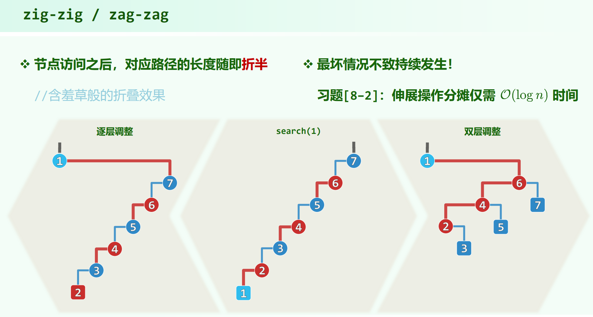

* 08.Advanved Search Trees.pdf P1

## 伸展树

将刚被访问的节点，转移至根。

这里不像AVL树一样有失衡的概念，不是从失衡节点 $g$ 找 $p$, $v$ 。而是刚被访问过的节点为 $v$ ，父和祖父为 $p$ 和 $g$ 。

## 逐层伸展


通过单层伸展把 $v$ 转上去。

### 逐层伸展的问题

对于伸展树，按单调顺序插入节点，一定会得到一个单链。然后再按单调顺序访问一遍，可以看到，每次树高只减了 $1$ ，整个过程开销为 $O(n^2)$ ，分摊时间复杂度 $O(n)$


## 双层伸展

### zig-zag / zag-zig

与AVL树的双旋一样


### zig-zig / zag-zag

第一步与AVL的单旋一样，在 $\pmb{g}$ 处单旋一次，然后还要再旋一次，把 $v$ 转上去。也就是说和 zig-zag / zag-zig 一样要旋 $2$ 次。


注意这个图里下面的行才是伸展树的双层旋转，上面的行是$v$做了两次逐层旋转。

用单链来看，采用双层伸展，`search(1)`之后原本到 1 的那条路径长度减半了，不再是单层伸展下长度只减 1 。能避免分摊复杂度为 $O(n)$ 。

[习题解析[8−2]](): 伸展操作分摊仅需 $O(logn)$ 时间



zig-zag / zag-zig 对单链是怎样的作用？

```
  6
 /
1
 \     search(3)     3
  5    -------->   /   \
 /                1     6
2                  \    / 
 \                  2  5 
  4                   /
 /                   4
3  
```

对这种折线形单链，3的同列都是比自己小的（往下单增），右边那列都是比自己大的（往上单增），`search(3)`之后其分列3的左右子树。由此可以理解这种情况 zig-zag / zag-zig 也能把路径长度减半。

（不过这种折线形单链怎么操作出来好像不太好说，1 2 3单靠insert是操作不出来这种折线形单链的，最后一个肯定是insert(3)，但是 1 2 3 和 2 1 3的结果都不是这种折线形单链。也就是说虽然合法，但是至少单靠insert是操作不出来这种结构的。不过 insert {2 4 1 3}、{4 2 1 3}， delete 4 可以得到 3 lc 1 rc 2 ；insert {2 3 1 4}、{2 4 3 1}、{3 2 1 4}、{3 4 2 1}、{4 2 3 1}、{4 3 2 1}， delete 4 可以得到 1 rc 3 lc 2 的折线形单链。）

### 补充上面

和研友[~](https://space.bilibili.com/430969578)聊天，他突然想了这么一种方式：交替插新的最大/最小值，这样能生成这种折线形单链。

以下称：从 $1 \sim n$ 中间开始往两边，对称地交替选取并插入SplayTree 为 min / max 交替插。这么叫是因为每次选出来的值交替地为新的 min / max，即 ... max min max min ...

具体来说：

1. 若有偶数个关键码，例如 1 2 3 4 5 6 7 8 ，按 4 5 3 6 2 7 1 8 / 5 4 6 3 7 2 8 1 的顺序插，一定会出来边从上到下为 左右左右...左 / 右左右左...右 形式的**单链**（以下称为**完美交替**）。第一条边往左还是往右看最后插入的值就知道根了。

2. 若有奇数个关键码，也一定为**单链**，但是：

    * 如果 n = 3，一定得到左孩子单链 / 右孩子单链

    * 如果 n > 3，结果虽仍是单链，但边一定不是完美的 左右左右 / 右左右左 方式，其会是这样的，以 5 4 6 3 7 2 8 1 9 为例（对称选择情况类似）：n - 1 为偶数，所以这类例子会先形成 右左右左 形单链，然后插 n 。树根现在为 1 ，边第一步向右，然后向左，这第一个折点就是当前树中的最大值，n 先插在其右孩子，然后旋上去，这个过程是：

      
    
      也就是说 n > 3 为奇数的情况会先有 $4$ 条边反常，然后才是完美交替。

现在说怎么严格证明case1：n = 2, 4 是符合的，然后对更大的 n ，其可由 case2.2 插入一个 min / max 得到，以上图为例，该在上图的基础上插入一个 0 ，去转一下就知道会变成完美交替。也就是说 n 为奇数 和 n 为偶数 的情况可以交替往前证明。

这里还挺特别，插入 0 之后 0 往上是个 四节点的单方向单链，1 甚至还有右子树，但是转完还是单链。

再看教材P207图8.6，先依次插入 1 ~ n ，然后 Splay::search(1)，能保持为单链的 n 最大就为 4 。关于这种左孩子单链，BST::search(1) 的结果规律，看这两个图就能get到了：

<div align="center">   </div>

以上采取的是直观的插入法（见[伸展树的插入](#伸展树的插入)），如果采取教材P210的优化插入法，不一定会形成单链。例如 3 4 2 5 1 6 ，使用教材上的优化插法，插入e前会先search(e)，**将最后被访问的节点提升到根，然后在根位置直接操作插**，3 search(3) 4 search(3) 2 search(4) 5 search(2) 1 search(5) 6 ，出来的结果不是单链。

把这个结论记得简洁一点：**交替地往SplayTree中插入一个新的最大/最小值，一定会形成单链**。

注意必须是交替的 ... max min max min ... 。不能是 ... max max min ... 啥的，例如 3 4 5 6 2 1 结果不是单链；也不能说 1 ~ n 从两边往中间选，例如 1 6 2 5 3 4 ，这样是 min max mid mid ... ，结果也不是单链。

### zig / zag

最后可能需要一次单层旋转


## 伸展树的插入

直观方法是先把节点按二叉搜索树的逻辑`BST::search()`插入进去，再伸展到根。

但是找节点位置也可以调用`Splay::search()`，所以：

教材P210 的实现方式是在第一步的search过程中用_hot记录直接前驱/直接后继，然后把直接前驱/直接后继伸展到根（即调用`Splay::search()`，会把最后被访问的节点转到根），然后把待插入节点直接接到根上。


这两种实现得到的树根虽然都是 $v$ ，但是得到的树的结构可能不同。用[可视化网站](https://www.cs.usfca.edu/~galles/visualization/SplayTree.html)来看（可视化网站上用的是直观方法，调成一步步演示可以看出来）：

1. 先插入 1 2 3 4 5 6 得到一条单链，然后 Splay::search(1)，等价于直观实现的 insert(1)

2. 先插入 2 3 4 5 6 得到一条单链，然后 Splay::search(2)，再把 1 接到根上，等价于教材中的伸展树插入实现

可以看到结果两棵树有区别。

## 伸展树的删除

直观方法是先调用BST标准的删除算法，再将_hot伸展至根。

教材P211 的实现方式是先`Splay::search()`，这样待删除节点就是树根，然后摘除目标节点，用目标节点的直接后继做根（双分支的情况，如果节点是单分支，直接删除根，然后用子树顶替就好）。


## 综合评价


## 对伸展树做势能分析

> 习题解析[8-2] 
>
> 08.Advanved Search Trees.pdf P25
>
> [双栈当队用到了势能分析法](../Steap与Queap%20双栈当队与双队当栈/README.md#双栈当队)

可以用势能分析法严格证明：**伸展树所有基本操作接口的分摊时间复杂度，均为 $O(logn)$**

定义势能函数：

$$
\Phi(S) = \sum_{v \in S} log|v| ，其中 |v| = 节点 v 的后代数目(包含 v，或者定义为子树 v 的节点规模)
$$

也就是说单个节点的势能为 $log \lvert v \rvert$ ，树的势能为所有节点势能之和。

叶节点的势能会是 $0$ 。

越平衡/倾侧的树，势能越小/大。

单链：$\Phi(S) = logn! = O(nlogn)$

满树：

$$
\begin{align*}

\Phi(S)

=& \sum_{d = 0}^{h + 1} 2^d \cdot log(1 + 2 + ... + 2^{h + 1 - d}) \\

=& \sum_{d = 0}^{h + 1} 2^d \cdot log(2^{h + 2 - d} - 1) \\

\le& \sum_{d = 0}^{h + 1} 2^d \cdot log(2^{h + 2 - d}) \\

=& \sum_{d = 0}^{h + 1} (h + 2 - d) \cdot 2^d \\

=& (h + 2) \cdot (2^{h + 2} - 1) - \sum_{d = 0}^{h + 1} d \cdot 2^d \\

=& (h + 2) \cdot (2^{h + 2} - 1) - [(h + 1) \cdot 2^{h + 2} - (2^{h + 2} - 2)] \\

=& O(2^h) = O(n)

\end{align*}
$$

设树规模为 $n$ ，访问次数为 $m$ ，且 $m \ge n$

均摊成本 $A_k = T_k + \Phi_{k} - \Phi_{k - 1}$，由上面的计算可知，$\sum \Delta \Phi \le O(nlogn) （可能为负）$，现在只需证明 $\sum A_k = O(mlogn)$ 即可得到 $\sum T_k = \sum A_k - \sum \Delta \Phi = O(mlogn)$ ，从而均摊复杂度为 $O(logn)$

伸展树的一次伸展到根包含多步调整，这里不像[双栈当队用到了势能分析法](../Steap与Queap%20双栈当队与双队当栈/README.md#双栈当队)里那样，一次伸展到根的 $A$ 并不是常数，但是仍然可以分析得到：

在对节点 $v$ 的伸展过程中，每一步调整所需均摊成本$A$均不超过 $v$ 的势能变化的 $3$ 倍，即 $3 \cdot [\Phi'(v) - \Phi(v)]$

有了这个结论之后，一次伸展到根的多步调整可以用 $\Delta \Phi(v)$ 来估计，多次伸展到根的操作同样可以用 $\Delta \Phi(v)$ 来估计，$v$ 的始末状态的势能变化不超过 $O(mlogn)$，从而 $\sum A_k = O(mlogn)$ 。

现在分调整操作来分析：

### zig / zag


$$
\begin{align*}

T =& A + \Delta \Phi \\

&(只有r和v节点的势能有变化) \\

=& 1 + \Phi'(v) + \Phi'(r) - \Phi(v) - \Phi(r) \\

&(\Phi'(r) - \Phi(r) \le 0) \\

\le& 1 + \Phi'(v) - \Phi(v)

\end{align*}
$$

注意这里有个非常关键的 $1$ 是消不掉的，不要认为 $v$ 的后代数一定增加，从而 $\Phi'(v) - \Phi(v) \ge 1$ ，从而 $1 + \Phi'(v) - \Phi(v) \le 2 \cdot [\Phi'(v) - \Phi(v)]$，后代数增加的变化量大于$1$，但是势能是 $log$，$\Phi'(v) - \Phi(v)$ 可能是 0.x ，这里的 $1$ 是消不掉的！

但是好在单层伸展在一次伸展 $v$ 到根的操作中最多只会做 $1$ 次。

### zig-zag / zag-zig


$$
\begin{align*}

T =& A + \Delta \Phi \\

=& 2 + \Phi'(g) + \Phi'(p) + \Phi'(v) - \Phi(g) - \Phi(p) - \Phi(v) \\

=& 2 + \Phi'(g) + \Phi'(p) - \Phi(p) - \Phi(v) \quad(\because \Phi(g) = \Phi'(v)) \\

\le& 2 + \Phi'(g) + \Phi'(p) - \Phi(v) - \Phi(v) \quad(\because \Phi(p) > \Phi(v)) \\

\le& 2 + 2 \cdot \Phi'(c) - 2 - 2 \cdot \Phi(v) \\

=& 2 \cdot [\Phi'(v) - \Phi(v)]

\end{align*}
$$

最后一步放大：

由于势函数 $log_2(x)$为凹函数，$\frac{loga + logb}{2} \le log\frac{a + b}{2}$ ，所以 $log \lvert g' \rvert + log \lvert p' \rvert \le 2 \cdot (log( \lvert g' \rvert + \lvert p' \rvert) - 1) < 2 \cdot (log \lvert v' \rvert - 1)$ ，即 $\Phi'(g) + \Phi'(p) \le 2 \cdot \Phi'(v) - 2$

### zig-zig / zag-zag


$$
\begin{align*}

T =& A + \Delta \Phi \\

=& 2 + \Phi'(g) + \Phi'(p) + \Phi'(v) - \Phi(g) - \Phi(p) - \Phi(v) \\

=& 2 + \Phi'(g) + \Phi'(p) - \Phi(p) - \Phi(v) \quad(\because \Phi(g) = \Phi'(v)) \\

\le& 2 + \Phi'(g) + \Phi'(p) - \Phi(v) - \Phi(v) \quad(\because \Phi(p) > \Phi(v)) \\

\le& 2 + \Phi'(g) + \Phi'(v) - \Phi(v) - \Phi(v) \quad(\because \Phi'(p) < \Phi'(v)，v 和 g' 是要用不等式的，把 p' 换掉) \\

\le& 2 + 2 \cdot [\Phi'(v) - 1] + \Phi'(v) - 3 \cdot \Phi(v) \quad (\because \Phi(v) + \Phi'(g) < 2 \cdot (\Phi'(v) - 1)) \\

=& 3 \cdot [\Phi'(v) - \Phi(v)]

\end{align*}
$$

最后一步的放大同样用到了 $logx$ 的凹性，不过这里要选 $v$ 和 $g'$ 两个点，其包含了 $4$ 棵子树和 $v, p$ 两个点，$log \lvert v \rvert + log \lvert g' \rvert \le 2 \cdot (log(\lvert v \rvert + \lvert g' \rvert) - 1) < 2 \cdot (log \lvert v' \rvert - 1)$ ，即 $\Phi(v) + \Phi'(g) < 2 \cdot \Phi'(v) - 2$ 。

综合以上三种情况，一次把 $v$ 旋转到根的所有旋转，其分摊成本加起来为： $A_k \le 1 + 3 \cdot [\Phi(r) - \Phi(v)] \le 1 + 3 \cdot \Phi(r) = O(logn)$，于是 $\sum A_k = O(mlogn)$。

伸展树的基本操作接口的分摊时间复杂度为 $O(logn)$

以上推导没有涉及数的节点变化的情况，但是即使考虑插入和删除操作，分摊复杂度也不会变。以 $m = n$ ，采用直观方法的插入为例，先插入，这步操作的 $A$ 为常数，然后接下来的旋转操作也可以用 $\Delta \Phi(v)$ 来估计，一次伸展到根的过程的 $A = O(log(n + 1))$

## 回到开始，为什么单层伸展策略不行？

关键在于 zig / zag 的那个 $1$ 消不掉，如果采取单层伸展，一次把 $v$ 伸展到根的过程可能有 $\Theta(n)$ 次单层伸展，$A_k$ 就是 $n  + 3 \cdot [\Phi(r) - \Phi(v)]$ ，$\sum A_k$ 会是 $O(n^2)$。

而单层伸展在实际伸展树的调整过程中最多做一次，所以没有问题。

## 伸展树的性质

[可视化网站](https://www.cs.usfca.edu/~galles/visualization/SplayTree.html)

* 按单调增顺序插入，结果为左孩子单链，按单调减顺序插入，结果为右孩子单链。

* 再按 原本顺序 / 原本顺序的逆序 访问一遍，会先变成不是单链，最后会回到 原本的单链 / 左右对称且节点顺序相反的单链 。

---

* Splay::search(min/max)之后，树根一定会变成单分支(或者叶子)。

  这个显然，因为Splay树也是二叉搜索树，另一侧要是非空的话刚刚search的不是min/max了。

* 推论：无论Splay树的当前形态如何，只要按单增/单减顺序访问一遍树中节点，树一定会变成只有左孩子/右孩子的单链。

  树中节点值为 {1~n}，以按单减顺序访问一遍为例

  1. Splay::search(n) 后一定 n 为根，其它节点都在左子树

  2. 然后search(n - 1)，原根的右子树已为只有右孩子的单链。考虑 n - 1 以何种方式与 n 发生旋转。若为 zig，旋转后树根往右保持为向右单链；若为 zag-zig，同理；若为 zig-zig，不可能发生，$v$ 为 n - 1，$g$ 为 n，没有节点可以当 $p$；

  也即树根往右始终保持为向右单链，最后Splay::search(1)后左子树为空，整棵树为只有右孩子的单链。

---

* 交替地往SplayTree中插入一个新的最大/最小值，一定会形成单链
    
  见[上面](#补充上面)
  