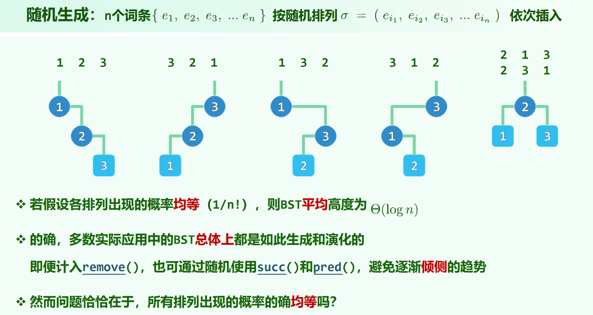
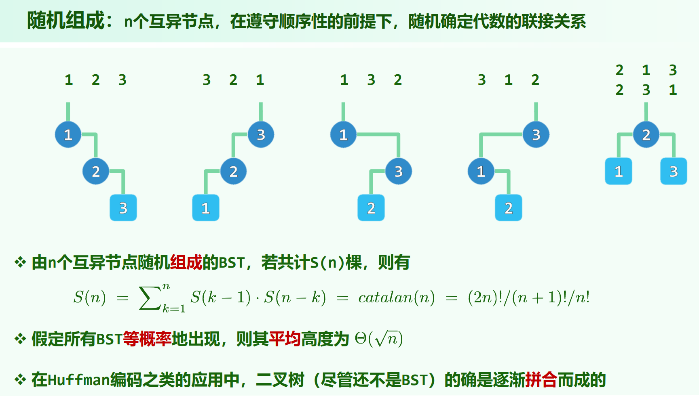
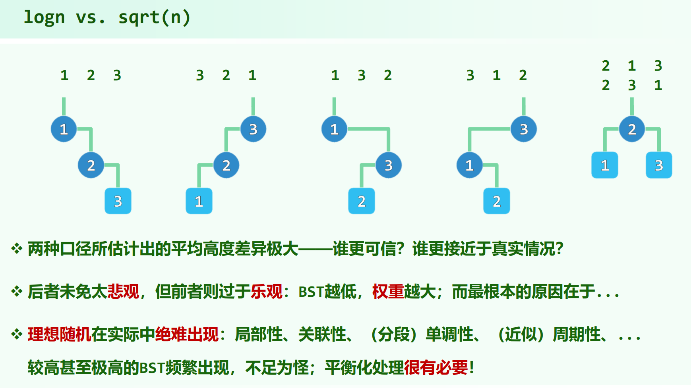

* 06.Binary Search Trees.pdf P6

## 顺序性

任一节点均不小于其左后代，不大于其右后代。

注意不能弱化为“任一节点均不小于其左孩子，不大于其右孩子”，因为这可能发生一个节点的右后代比自己小，例如：

```
3
 \
  11
 /
2  
```

## 二叉搜索树的插入

一定是作为叶节点插入

## 二叉搜索树的删除

* 要删除的节点为单分支：
    
    用另外一个分支替代。(叶子也可以视为单分支，相当于看有一个分支没有)

* 要删除的节点为双分支：
    
    不能考虑直接用子树接替自己，因为例如用左子树接替自己，那么可能左子树的右子树与原本的右子树冲突。

    所以，找到 $x$ 的直接后继 $succ$ ，由于 $x$ 双分支，$succ$ 一定在 $x$ 的右子树中，则 $succ$ 一定无左孩子，否则中序遍历 $x$ 和 $succ$ 中间还有节点，不满足 $succ$ 为直接后继。于是，将 $x$ 和 $succ$ 交换，然后以单分支情况删除 $x$ (会暂时破坏顺序性，但是删除 $x$ 后顺序性会恢复) 。

    （**若一个节点有右子树，则其直接后继一定无左孩子。**）

## 随机生成与随机组成

 (算法导论12.4)

 ([The Average Height of Binary Trees
and Other Simple Trees](https://algo.inria.fr/flajolet/Publications/FlOd82height.pdf))

