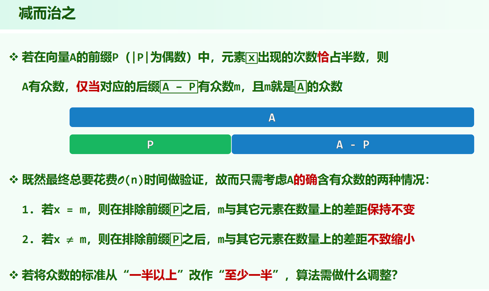
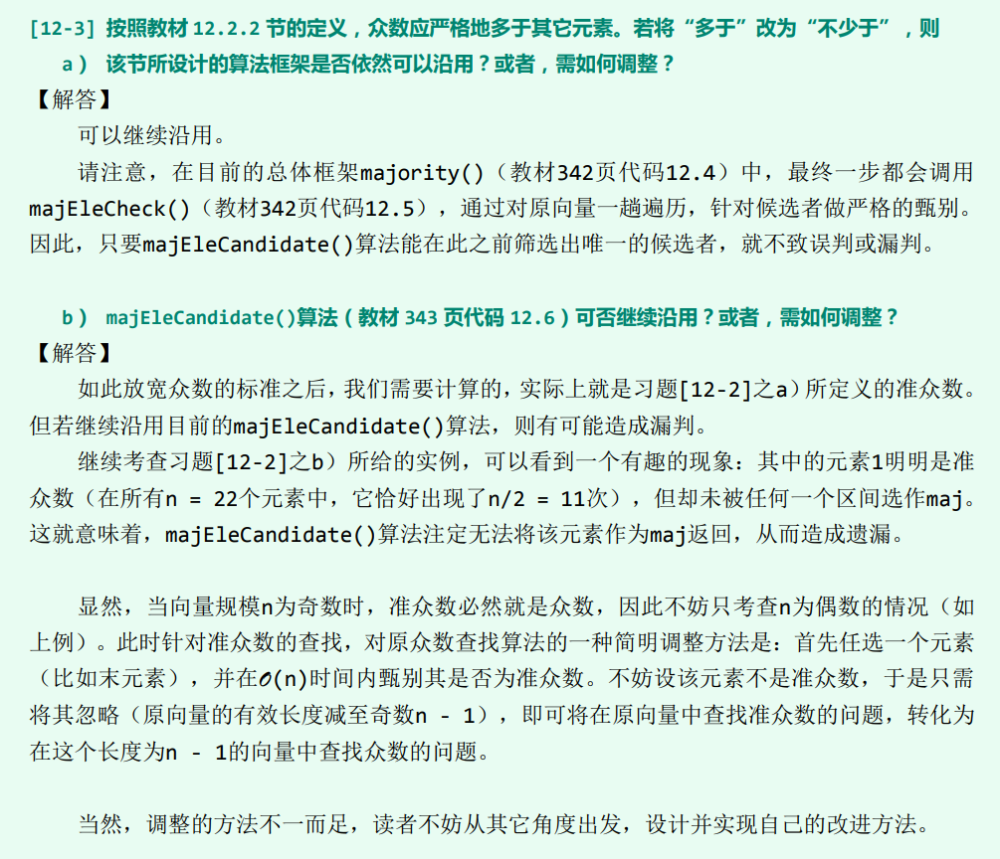

这里的众数的定义是：出现一半以上的元素。（严格大于一半）

由于找到候选者之后要遍历一遍检查是否真的是众数，所以只需考虑 A 真的有众数的情况。

减除前缀，众数 m 与其它元素的数量之差要么不变，要么不减。所以，m 一定是 A - P 里的众数，从而可以减治。

代码见[./majEleCandidate.cpp](./majEleCandidate.cpp)

若将众数的标准从“一半以上”改作“至少一半”，算法需做什么调整？

`majEleCandidate()`可能可以选出候选者，例如`1 1 2 2`，但是也有可能选不出，例如`1 2 3 1`。

当序列长度为奇数时，不存在“刚好一半”的情况，算法不变。

当序列长度为偶数时，先任选一个位置的元素单独判断一轮是否为准众数，然后排除这个元素之后序列长度就变奇数了。

见习题解析[12-3]:

