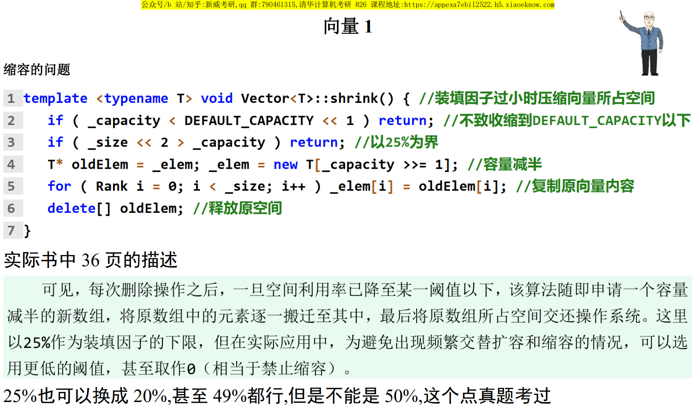

## 向量的均摊复杂度
02.Vector.pdf P19

### 容量递增策略
每次需要扩容时容量增加常数 $I$

在初始容量为 $0$ 的空向量中，连续插入 $n = m * I >> 2$ 个元素：

在第 $1 , I + 1 , 2I + 1 , ... , (m - 1)I + 1$ 次插入时，都需扩容，

不算申请空间操作，复制的开销分别为 $0 , I , 2I , ... , (m - 1)I$ 。总耗时 $O(n^2)$ ，每次操作的分摊成本为 $O(n)$ 。

### 容量加倍策略
每次需要扩容时容量乘 $2$

在初始容量为 $1$ 的满向量中，连续插入 $n = 2^m >> 2$ 个元素：

在第 $1 , 2 , 4, ... , 2^{m - 1} + 1$ 次插入时，都需扩容，

复制的开销分别为 $0 , 1 , 2 , ... , 2^{m - 1}$ ，总开销 $O(2^m) = O(n)$，分摊复杂度为 $O(1)$ 。

或者这样来看：

插入 $n$ 次，扩容的次数为 $logn$ ，每次代价差不多是 $1 , 2 , 4 , ... $ ，这些相加相当于 $n$ 的比特位相加，所以最后的总开销是 $O(n)$ ，分摊下来是 $O(1)$ 。

## 缩容阈值
新威补充ppt：



缩容的阈值必须严格 $< 50\%$ ，不然可能反复扩容缩容，影响时间复杂度。

如果是 $50\%$ ，反复插入删除，扩容缩容的发生距离能为 $1$ 。

选 $49.9\%$ 都没问题，这样要连续删除 $0.1\% * n$ 次才会缩容。

## 有序向量唯一化
相关：[LeetCode26. 删除有序数组中的重复项](https://leetcode.cn/problems/remove-duplicates-from-sorted-array/)

```cpp
写法1：
int uniquify(vector<int> &nums) {
    int l = 1, r = 1; // l 为下一个独特元素该写入的位置
    while (r < nums.size()) {
        if (nums[r - 1] != nums[r]) { // 看 r - 1 与 r
            nums[l++] = nums[r];
        }
        r++;
    }
    return l; // 返回去重后的长度
}

写法2：
int uniquify(vector<int> &nums) {
    int l = 0, r = 1; // l 为最近发现的独特元素
    while (r < nums.size()) {
        if (nums[l] != nums[r]) { // 看 l 与 r
            nums[++l] = nums[r]; // j 是新发现的独特元素，写到 l + 1 位置
        }
        r++;
    }
    return l + 1; // 返回去重后的长度[0, l]
}
```

## 势能分析法

[Steap与Queap 双栈当队与双队当栈](<../Steap与Queap 双栈当队与双队当栈/README.md#双栈当队>)中用到的势能分析法，在这里也用下，分析vector插入的均摊时间复杂度。

不发生扩容，开销为 $O(1)$ ，发生扩容，开销为 $O(n)$ 。当发生扩容时，怎样选择势能函数能使得 $\Phi' - \Phi$ 是个负数，从而让均摊成本 $A$ 为 $O(1)$ ？

扩容后什么东西减小了？

没有直接的，都是在增加，但是 $-capacity$ 减小了。所以设 $\Phi(S) = -capacity$

1. 第n次insert时不发生扩容，$A = T + \Delta \Phi = 1$

2. 第n次insert时发生扩容，$A = T + \Delta \Phi = n + (-2(n - 1)) - (-(n - 1)) = 1$，也是常数

故 $\sum T_i = \sum A_i - (\Phi(S_n) - \Phi(S_0)) = O(n)$，分摊时间复杂度为 $O(1)$ 。

如果想让势能函数为看起来更符合物理意义的正数，可以定义 $\Phi(S) = 2 * size - capacity$ 。

发生扩容时，是认为 $T = n$ 的，若觉得还该有个常系数，例如认为 $T$ 该 $= cn$ 怎么办？那样的话 $\Phi$ 也可以乘 $c$ ，分析出来均摊成本 $A$ 仍然是常数，不影响，所以可以直接认为 $T = n$ 。