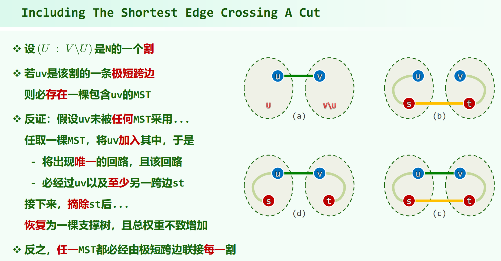
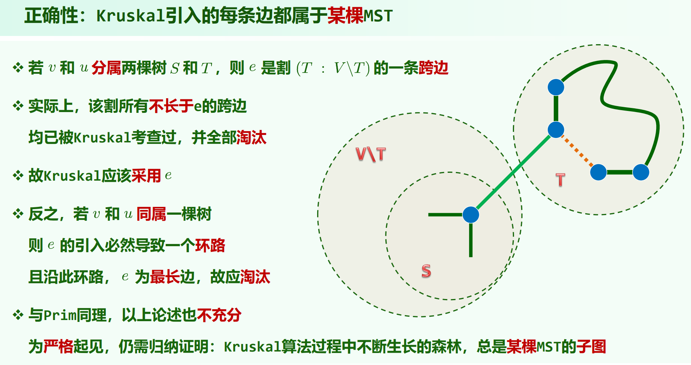

* 10.Graph.pdf

## 一部分基本概念

## bfs

### 无向图的bfs

性质：

无向图的bfs，当 $v$ 出队去查看邻居 $u$ 时，$u$ 可能是：UNDISCOVERED / DISCOVERED / VISITED 状态。

不过对 bfs , 后两者统一归类称为跨边。

无向图的 bfs 只有树边和跨边。

### 有向图的bfs

有向图的bfs，当 $v$ 出队去查看邻居 $u$ 时，$u$ 可能是：UNDISCOVERED / DISCOVERED / VISITED 状态。

不过对 bfs , 后两者统一归类称为跨边。

有向图的 bfs 只有树边和跨边。

## 无向图的dfs

教材P154写了无向图统一把无向边转为两条互逆的有向边，也就是不考虑这种情况？

补充ppt：

但是后面讲的双连通分解又是无向图的 dfs 的情况。

求双连通分量时是无向图的 dfs 的情况，如果把代码写成：例如有边 $(u, v)$ ， dfs(v: node, u: fa) 进入 v 后，通过 fa 判断不回去，这样不用一条无向边访问两次，则 dfs 只有树边和后向边。

## 有向图的dfs

有向图的 dfs 可能出现 树边、前向边、后向边、跨边。

有向图祖先关系的判定：

### 后向边 $\neq$ 环数

dfs发现后向边 iff 存在回路，但是并不能说明回路数。

## 拓扑排序

有向无环图必存在入度为 $0$ 的节点，也必存在出度为 $0$ 的节点。（否则可以一直走，走 $n$ 步，节点一定有重复，一定有环）

有向无环图 $\Leftrightarrow$ 可拓扑排序

### $0$ 入度算法

### dfs各顶点被标记为VISITED的顺序为拓扑排序的逆序（逆序输出 $0$ 出度节点）

---

补充ppt里的一道题：

## 最短路径

### Dijkstra

不能有负权边

生成最短路径树SPT

如果有负权边，无负权环：

（这个具体coding-practice仓有写）

### Floyd-Warshell

能有负权边，不能有负权环

## 最小生成树 MST

### Prim

和Dijkstra非常像，只是松弛邻居时用边(u, v)的权重，而不是 dis(u) + w(u, v)

有负权边也没问题。

Prim算法的大致思路是：分为已经连通的点集 $S$ 和剩余点集 $U - S$ ，第一个起点要和其它节点连通，选极短跨越边，然后起点加入 $S$ ；$S$ 要和 $U - S$ 连通，选 $S$ 和 $U - S$ 的极短跨越边，这样又连通了一个节点进 $S$ ，然后重复这个过程直到 $S$ 包含所有点。

**极短跨越边一定都属于某棵最小生成树。（任一极短跨越边都一定存在某棵包含它的最小生成树）**

**最小生成树的每一边都一定是(某个割的)极短跨越边。**

证明：如果某条边不是，则删除最小生成树里的这条边，树形成两个连通分量，二者的节点集形成图的一个割，由反证假设，删掉的边非此割的极短跨越边，则此割的极短跨越边另有其人且权值更小，则选这个极小跨越边即可生成更优的最小生成树。

或者教材P176：“**最小生成树总是会采用联结每一割的最短跨越边**”

习题解析[6-27]：即使某棵生成树 T 的每一条边都是 G 某一割的极短跨越边，T 也未必是 G 的最小生成树。

这个图里每条边都是极短跨边，但是选AD、DC、CB构成生成树的话却不是最小生成树。

如果MST唯一，则由极短跨边构成的生成树一定是一棵MST了。因为若除了唯一的这棵MST之外若还有其它极短跨边，则以那条极短跨边的端点为起点跑Prim，会得到另外一棵MST，矛盾。所以，**MST唯一的话，极短跨边只有MST的这 $n - 1$ 条边**。或者说**若有 $n$ 条极短跨边，则至少有两棵MST**。

图有多个MST，选 $n - 1$ 条极短跨边组合，未必是MST ；MST唯一，只有那 $n - 1$ 条极短跨边，怎么选都会选成MST。

### Kruskal

用并查集，不断选两端点不在同一集合的最小边。如果当前候选边的两个节点在同一集合（Kruskal中，并查集的每一分量为一棵树），则加这条候选边会导致成环。

有负权边也没问题。

### 最小生成树一定包含最短边和次短边

先说明一点，由于边的权值可能相等，例如 $1_1, 1_2, 1_3, 2_1$ ，所以这里最短边和次短边的含义是 $\{1_1, 1_2, 1_3\}$ 任其二都可以认为是最短边和次短边。

假如MST不包含最短边 $(u, v)$ ，考虑节点 $u$, $v$ 在最小生成树中的情况，选一个点作为根，$u, v$ 在 $lca(u, v)$ 所在的子树中，现在把最短边 $(u, v)$ 加进来，然后必定成环，但是只需删除环上的一条边即可。

MST也一定包含次短边，如果次短边在别的子树，同理操作即可，若还在这棵子树，也总可以操作出来。

但是，再次短者则未必，因为可能无法避免地与最短边和次短边构成环。

简洁一点的结论是：如果图的边权互不相同，则最小生成树一定包含最短边和次短边。（用Kruskal算法的过程很容易看出来）
