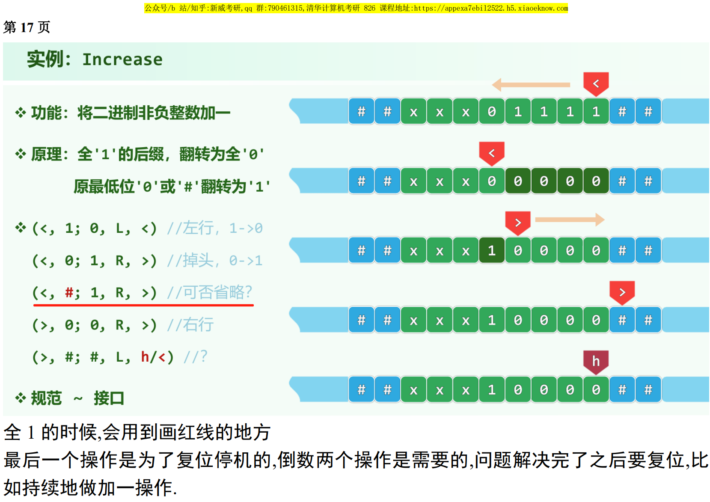
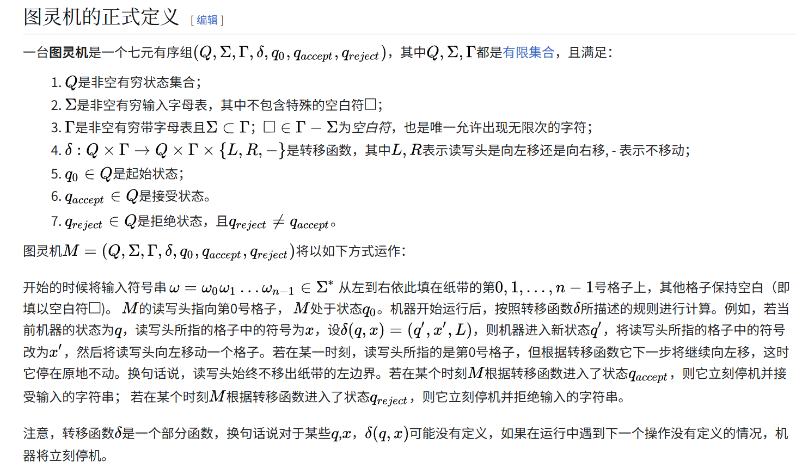

## 01.Introduction.pdf P14

新威考研补充ppt：

## 图灵机的正式定义
[wikipedia](https://zh.wikipedia.org/wiki/%E5%9B%BE%E7%81%B5%E6%9C%BA)

主要是 $\delta$ 这个东西，表达了此周期要做的操作以及下一条指令。

假设有这样一条规则：

(q1, 1) -> (0, R, q2)

意思是：如果在状态 q1 且读到 1，就写成 0，右移，并进入 q2。

现在，如果当前状态是 q1，但读到的是 0，而程序中没有 (q1, 0) 对应的规则，那图灵机就会直接停止。