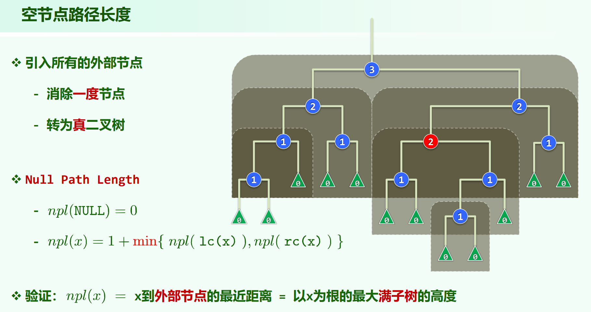
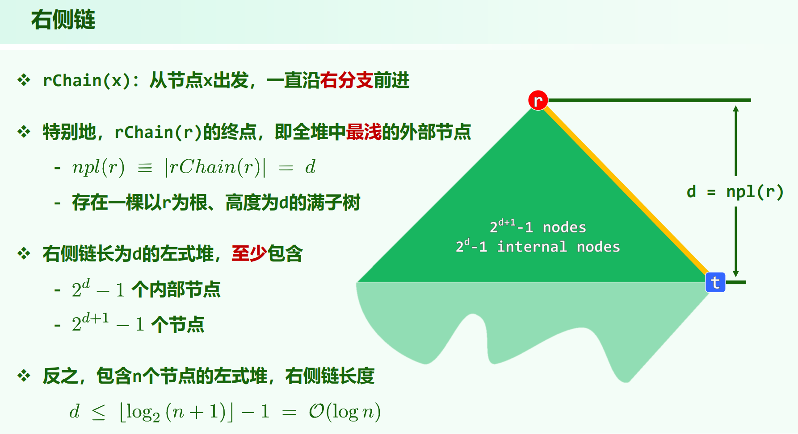

* [leftist-tree](https://oi-wiki.org/ds/leftist-tree/)

## 空节点路径长度

$npl \ (null \ path \ length)$

若 $x$ 为外部节点，则 $npl(x) = 0$

若 $x$ 为内部节点，则 $npl(x) = 1 + min(npl(lc(x)), npl(rc(x)))$

$npl(x)$ = $x$ 到外部节点的最近距离 = 以 $x$ 为根的最大满子树的高度

## 左式堆 = 处处左倾

左偏堆满足：

1. 堆序

2. 对任意内部节点，$npl(lc(x)) \ge npl(rc(x))$

由第二个性质，$npl(x) = 1 + npl(rc)$ ，一个节点的 $npl$ 值只需看最右侧通路。其值为一路向右，到空节点的路径长度，也是除开外部节点，经过的节点数。

左偏左偏堆的子堆也是左偏的。

## 右侧链

左偏堆在右侧链的深度上是满树，若左偏堆的右侧链长度为 $d$ ，有 $n$ 个节点，则有 $2^{d+1} - 1 \ge n$ ，即 $d \le log_2{(n + 1)} - 1 = O(logn)$

这意味着，由于节点的填充要把右侧链长度深度范围内填满，**左偏堆的右侧链长度，总不会太长**，一定在 $O(logn)$ 规模内。

注意，左偏堆只能确定**右侧链长度**短，其余的左右子树的高度、节点规模等一概不确定。

## 思路

左偏堆的关键能力在于 $O(logn)$ 时间的高效合并操作。

左偏堆的右侧链长度是短的，合并要从这个点出发。

如何合并？

merge(Node* a, Node* b) ，若 a, b 之一已经为空，则直接返回另外一个即可。否则，先通过 swap 保证 a 的值更大，然后**让 b 去与 a->rc 合并**，是在右子树上合并，在递归回溯的过程中根据子树的 $npl$ 值交换左右子树。

合并时，递归的basic case为两个左偏堆的右侧链，其一先被消耗完。时间复杂度为: $O(logm + logn) = O(log(max(m, n)))$

此外，由于我们维护了左偏性，树的**右侧链长度**仍然保持为 $O(log(节点规模))$

## 代码

在 coding-practice 仓实现了一下[左偏堆](https://github.com/plerks/coding-practice/blob/main/%E5%85%B8%E5%9E%8B%E9%97%AE%E9%A2%98/%E5%B7%A6%E5%81%8F%E5%A0%86/LeftistHeap.cpp)。