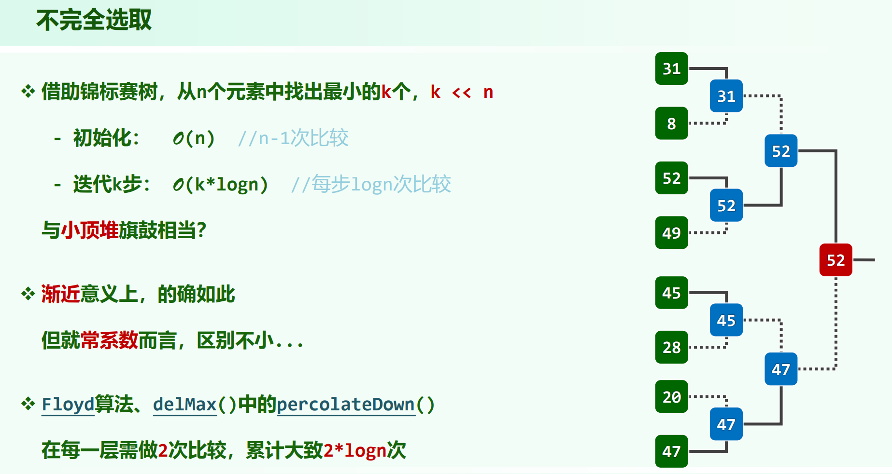
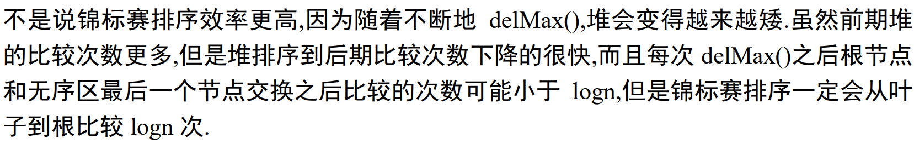
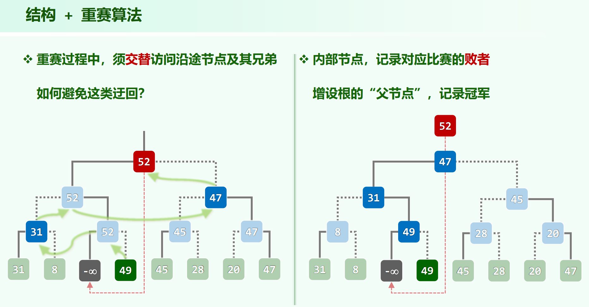

## 锦标赛树：胜者树

树是完全二叉树的形式，元素值全在叶节点，内部节点为比较结果。

树用一个向量存储即可

建树：$O(n)$ ，按层序遍历的逆序填内部 $O(n)$ 个节点即可，也就是倒序遍历向量的顺序。

胜者树，父亲节点存储两个儿子节点比较的胜者

以下以小顶为例

用胜者树来排序，建树之后，min出去 (deleteMin())，根记录了元素的下标，所以能直接找到出去的元素的位置，然后将其变为 INF，往上更新即可。然后重复这个过程。

用胜者树来排序的时间复杂度为 $O(nlogn)$

[oiwiki](https://oi-wiki.org/basic/tournament-sort/)里的代码：

```cpp
int n, a[MAXN], tmp[MAXN << 1];

int winner(int pos1, int pos2) {
  int u = pos1 >= n ? pos1 : tmp[pos1];
  int v = pos2 >= n ? pos2 : tmp[pos2];
  if (tmp[u] <= tmp[v]) return u;
  return v;
}

void creat_tree(int &value) {
  for (int i = 0; i < n; i++) tmp[n + i] = a[i];
  for (int i = 2 * n - 1; i > 1; i -= 2) {
    int k = i / 2;
    int j = i - 1;
    tmp[k] = winner(i, j);
  }
  value = tmp[tmp[1]];
  tmp[tmp[1]] = INF;
}

void recreat(int &value) {
  int i = tmp[1];
  while (i > 1) {
    int j, k = i / 2;
    if (i % 2 == 0)
      j = i + 1;
    else
      j = i - 1;
    tmp[k] = winner(i, j);
    i = k;
  }
  value = tmp[tmp[1]];
  tmp[tmp[1]] = INF;
}

void tournament_sort() {
  int value;
  creat_tree(value);
  for (int i = 0; i < n; i++) {
    a[i] = value;
    recreat(value);
  }
}
```

原数组 a 专门留着了，然后另开了个 tmp 放树

总共有 n 个叶子（放在 tmp[n] ... tmp[2n-1]）

上面一层（tmp[1] ... [n-1]）是内部节点

tmp[1] 就是树根（冠军下标）

完全二叉树可能有个度为 1 的节点，当作其右儿子存在，反正会越界，比较的时候有判断逻辑。所以叶子 n 个，内部节点 n - 1 个。

tmp叶子放的值(`tmp[n + i] = a[i];`)，中间放的下标 (`winner(i, j)`)

### 胜者树的优势

不完全选取时，常数较小



补充ppt:



## 锦标赛树：败者树

比较之后败者记录在父节点上，胜者用变量记着。用根上面的一个节点(tree[0])放全局的胜者。

这样可以避免看兄弟，只用往上看。

