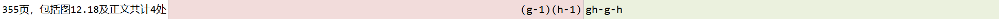

## Frobenius coin problem

如果 $g$ 和 $h$ 互素 ($gcd(g, h) = 1$)，那么不能用非负整数线性组合 $ag + bh \ (a, b \ge 0)$ 表示的最大整数为：

$$(g - 1)\cdot(h - 1) - 1 = gh - g - h$$

这里和[裴蜀定理](https://oi-wiki.org/math/number-theory/bezouts/)不一样，线性组合的系数要是自然数。

## g-有序与h-排序

习题解析[12-12]和[12-13]：

**已经g-有序的向量，再经h-排序之后，依然保持g-有序**

也就是说，此时该向量既是g-有序的，也是h-有序的，称作(g, h)-有序。

$\textcolor{magenta}{勘误：}$ 这页的 $(g - 1)(h - 1)$ 都多了个 $1$ ：

## 希尔排序

每轮内部用的是插入排序。

## 几个序列

### Shell's Sequence

### Papernov-Stasevic序列，PS序列

其中相邻各项互素 (书上有写这句)。证明：设 $a = 2^k - 1, b = 2^{k+1} - 1$，$b - 2a = 1$，所以任意公约数 $d$ 整除 $a$ 与 $b$ 时也整除 $b - 2a = 1$，因此 $d = 1$，即 $gcd(a, b) = 1$ 。这个思路也可以证明任意两个相邻整数一定互素，即 $gcd(n, n+1) = 1$。

上面写的外循环 $O(logn)$ 次是因为假如待排序序列长度为 $n$ ，希尔排序要用序列中 $< n$ 的部分一轮轮排。而PS序列 $< n$ 的数字有 $O(logn)$ 个。

采用 $H_{ps}$ 序列的希尔排序算法，在最坏情况下的运行时间不超过 $O(n^{3/2})$ 。

### Pratt序列

看[习题解析[12-14]]()

采用 $H_{pratt}$ 序列，希尔排序算法至多运行 $O(nlog^{2}n)$ 时间。

### Sedgewick序列

尽管Pratt序列的效率较高，但因其中各项的间距太小，会导致迭代趟数过多。

最坏时间复杂度 $O(n^{4/3})$，平均时间复杂度 $O(n^{7/6})$ 。