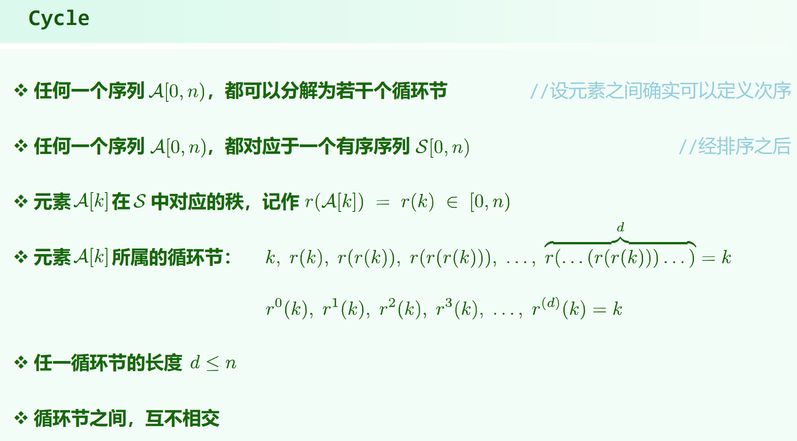

03.List.pdf P39

习题解析[3-14]

# 循环节

不断地找一个元素在已排序序列中的应有位置，或者说不断找占据自己位置的元素，直到找到环。

最终一定会找出一个或多个环。

由于是环，所以例如 [3 1 2] ， 以 3 为起点和以 2 为起点找都是一样的。

# 循环节性质

### 已经就位的元素自成一个循环节

### 交换两个位置的元素，若二者原属于不同循环节，则循环节数 $-1$，若二者原属于同一循环节，循环节数 $+1$
证明：

若二者原属于不同循环节：

$x_1 ... x_i ... x_n → x_1$

$y_1 ... y_j ... y_m → y_1$

交换 $x_i$ 与 $y_j$

会变为：

$x_1 ... y_j ... y_m ... y_1 ... x_i ... x_n → x_1$

也就是说两个环会连成一个环。

若二者原属于同一循环节：

$x_1 ... x_i ... x_j ... x_n → x_1$

交换 $x_i$ 与 $x_j$ 后，循环节会变成：

$x_1 ... x_{i-1} \ x_j \ x_{j+1} ... x_n → x_1$ 和 $x_i \ x_{i+1} ... x_{j-1} → x_i$

也就是说一个环会拆成两个环。

只要发生了两个不同值的元素的交换，循环节个数一定变化。

如果是列表的平移操作，则不一定，例如 [3 2 1] 平移变成 [2 1 3] ，循环节个数不变。