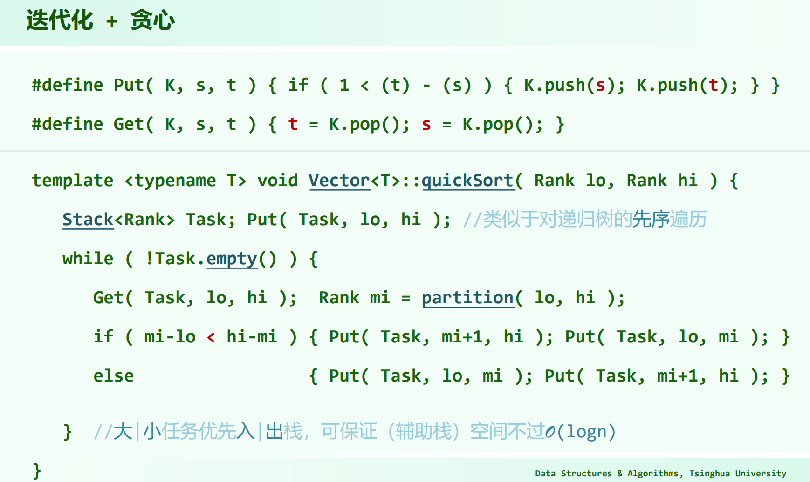
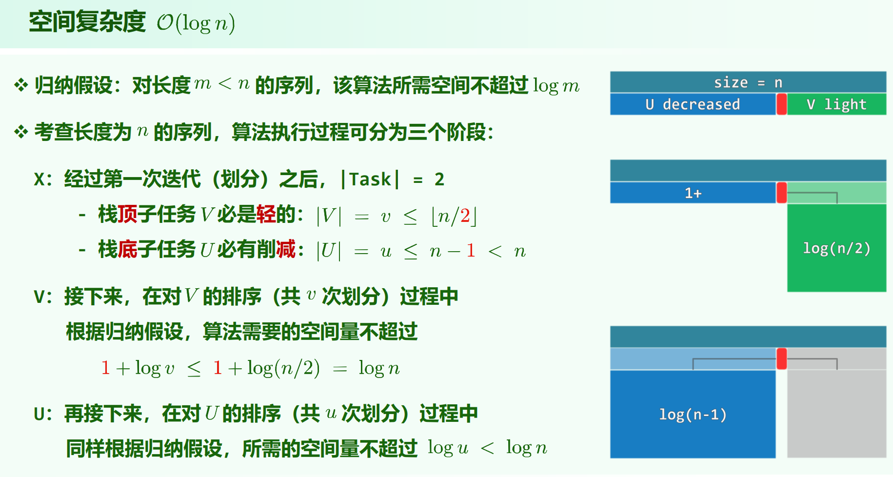
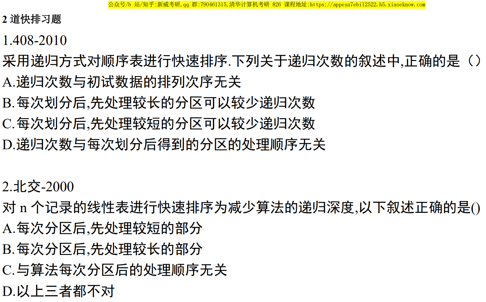
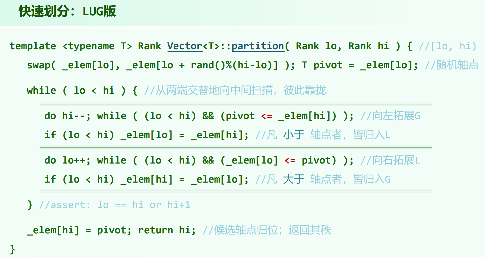
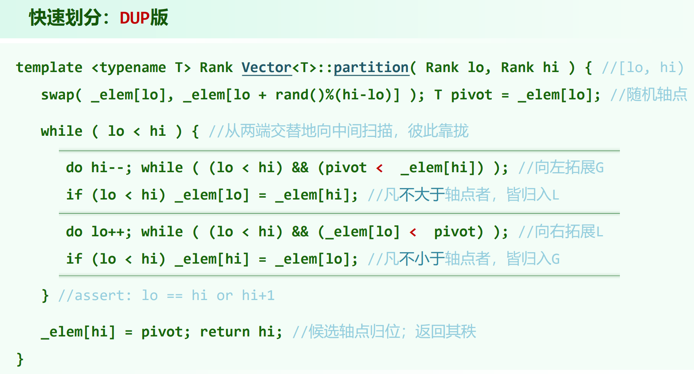
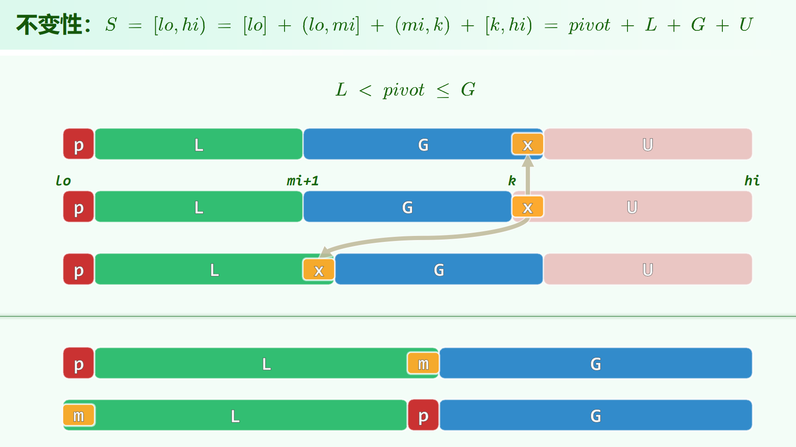

* 14.Sorting + Selection.pdf

## 迭代版快排的空间复杂度



迭代版的代码，partition把左右分成两段，如果先处理小的，再处理大的(大的先入栈，小的后入栈)，则**空间复杂度为 $O(logn)$** 。

归纳证明:



迭代版快排与递归版的关键区别在于，当父问题分裂为两个子问题时，其自己会先出栈(`Get(Task, lo, hi);`)，然后两个子问题进栈。迭代版父问题不会压在栈中，而递归版父问题的帧会在栈中，这是根本区别。

考虑迭代版的调用树，这意味着计算空间复杂度时，任意节点往上的节点都不会在那时占有空间。于是，迭代版的空间复杂度取决于，从某个调用实例开始往下(上面的实例此时不会占有栈空间)，到叶节点的路径的节点个数。不过，调用到了叶节点(“递归”基)时，栈中的其实不是这些节点，而是这些节点的兄弟。

由于每次都运行小的（问题规模每次至少减半），对任意节点，其走到叶子经过的节点数一定为 $O(logn)$ 。最长的路径也不过是根节点的路径。

假设每次都是左边的问题规模大，则不均匀分/均匀分会形成以下两种调用树结构：

```
      o
     / \
    o   o
   / \
  o   o
 / \
o   o
...

     o
   /   \
  o     o
 / \   / \
o   o o   o
...
```

那么，轮到任意一个节点时，**上面的节点都不会在栈中**（这是与递归版的本质区别）。在每次都是左边大的假设下，任意一个节点从开始到计算完成的整个栈空间其实是从左上到右下的斜切`\`所切到的节点数，这些节点的兄弟在栈中等待计算。实际上若partition不均匀，占用空间反而小。

所以:

**如果迭代版快排先处理小的再处理大的，最坏情况下的空间复杂度为 $O(logn)$**。

**如果迭代版快排先处理大的再处理小的，最坏情况下的空间复杂度为 $O(n)$**。

而对于递归版快排，由于上面的节点在调用栈中，所以占用的空间要往上看直到根，空间复杂度为树高。**递归版快排，无论采取什么大小/左右处理顺序，都不会有改变，最坏情况下的空间复杂度都为 $O(n)$ 。**

对于时间复杂度，无论是迭代版还是递归版，所有实例节点都要算，只是计算顺序的区别而已。**时间复杂度没有任何区别。**

两道题（选DC）：



## 快排的平均时间复杂度

### 方法一：递推

$$
\begin{align*}

T(n) 

=&\ n - 1 + \frac{1}{n}\sum_{k=0}^{n-1}(T(k) + T(n - 1 - k)) \\

=&\ n - 1 + \frac{2}{n}\sum_{k=0}^{n-1}T(k) \\

n \cdot T(n) =&\ n(n - 1) + 2\sum_{k=0}^{n-1}T(k) \tag{1}\\

(n - 1) \cdot T(n - 1) =&\ (n - 1)(n - 2) + 2\sum_{k=0}^{n-2}T(k) \tag{2} \\

(1) - (2) \text{消除求和}:&\ \\

n \cdot T(n) - (n - 1) \cdot T(n - 1) =&\ 2(n - 1) + 2 \cdot T(n - 1) \\

n \cdot T(n) - (n + 1) \cdot T(n - 1) =&\ 2(n - 1) \\

\frac{T(n)}{n + 1} - \frac{T(n-1)}{n} =&\ \frac{4}{n+1} - \frac{2}{n} \\

\therefore \frac{T(n)}{n + 1} - \frac{T(1)}{2} =&\ 4 \cdot \sum_{k=2}^{n}\frac{1}{k + 1} - 2 \cdot \sum_{k=2}^{n}\frac{1}{k} = 2\cdot \sum_{k=1}^{n}\frac{1}{k} + \frac{4}{n+1} - 4 \\

\approx&\ 2ln2 = (2ln2) \cdot nlogn \approx 1.386 \cdot nlogn
\end{align*}
$$

### 方法二：看比较次数

算法导论7.4.2：快排的整个过程，$z_i$ 与 $z_j$ 发生比较的概率为 $$\frac{2}{j-i+1}$$

所以，快排的期望时间复杂度即为比较的期望次数：

$$
T(n) = \sum_{j=1}^{n-1}\sum_{i=0}^{j-1}P(i, j) = \sum_{j=1}^{n-1}\sum_{d=1}^{j}\frac{2}{d+1} \approx \sum_{j=1}^{n-1}2 \cdot lnj \le 2 \cdot n \cdot lnn
$$

## 快排partition的几个版本

### LUG

勤于拓展、懒于交换



### DUP (Dutch National Flag Problem)

懒于拓展、勤于交换。最好用这种，元素全部相同时会均分。



### LGU

把后面U里的元素往前面的L和G里面放，最后再把哨兵换到位置。

