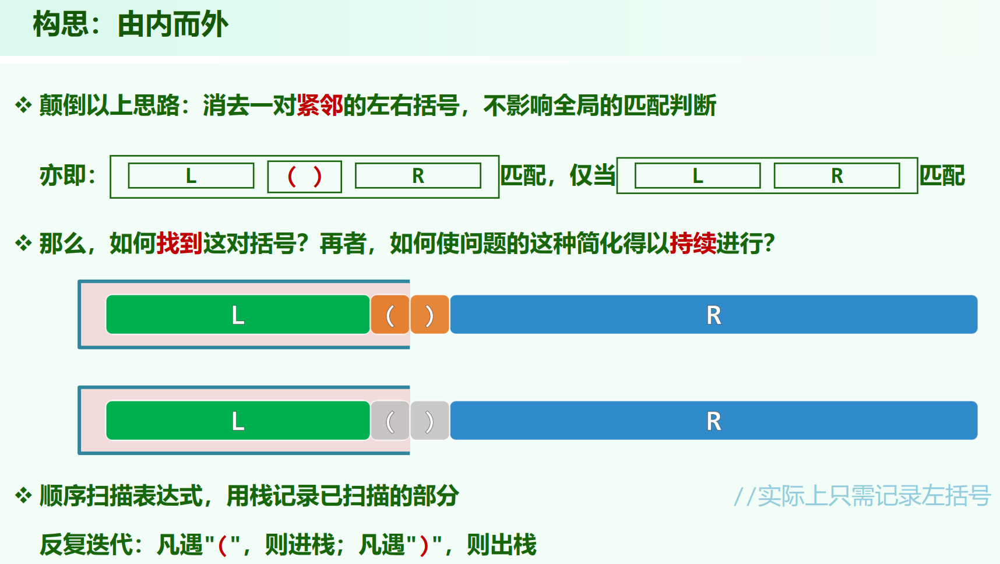

> 04.Stack + Queue.pdf P28

## 相关题目

[LeetCode20. 有效的括号](https://leetcode.cn/problems/valid-parentheses/) (处理多种括号)

[LeetCode32. 最长有效括号](https://leetcode.cn/problems/longest-valid-parentheses/) (两个解法有点像 最大子数组和 的dp解法和单纯一次循环的解法)