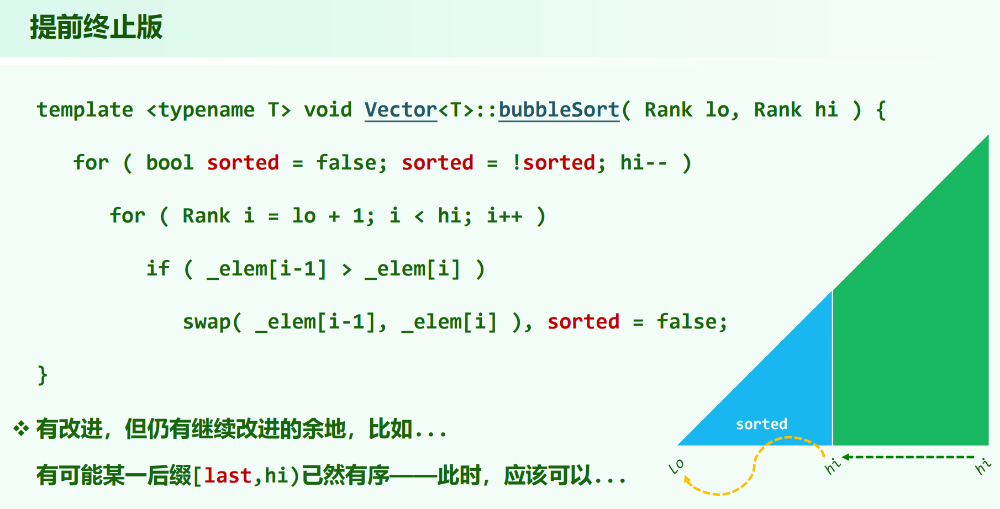
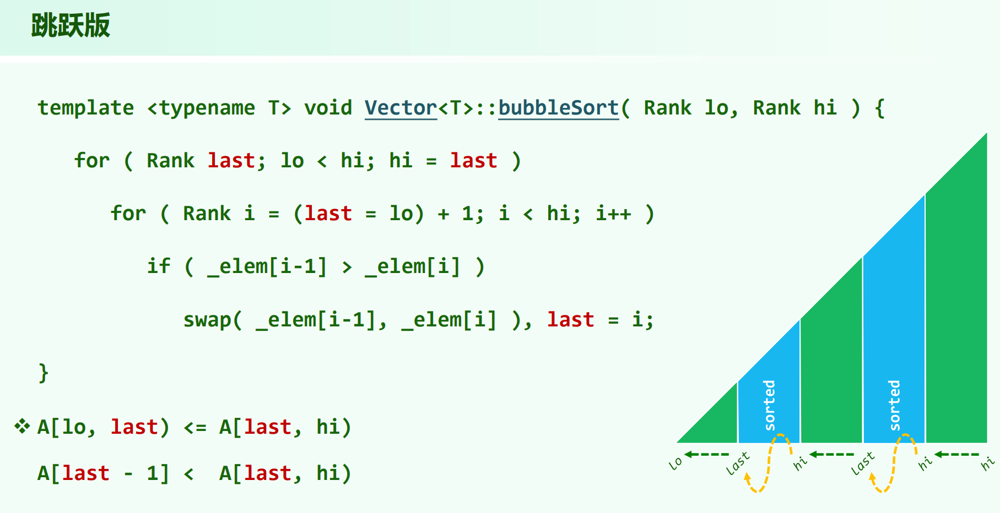
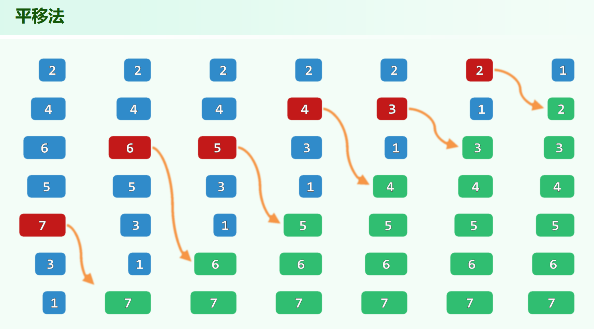

02.Vector.pdf P75

# 冒泡排序

## 提前终止版

## 跳跃版

解释下这个跳跃版相对于提前终止版的优化思路：

冒牌排序每次把最大的交换到后面，然后后缀可以剪掉，内层循环的循环次数变少。提前终止版每次只剪掉 $1$ 的长度。

但是一轮遍历，能得到的信息其实是更多的。如果一轮冒泡发现 $[x, hi)$ 这个后缀的相邻元素一直没发生交换，则这个后缀是有序的，且前面没有比这个后缀更大的元素（否则会发生交换）。可以把 $[x, hi)$ 直接剪掉，这样每轮就能剪掉更长的后缀。

例如：

7 3 2 1 4 5 6

->

3 2 1 4 5 6 | 7

->

2 1 | 3 4 5 6 7

由于处理 [3 2 1 4 5 6] 时发现后面 [3 4 5 6] 没交换过，这部分是极大且有序的，下一步只需处理 [2 1] 即可，一下就剪了很长的后缀。

总结一句话就是：**没发生交换的后缀都可以剪掉**。

## 时间复杂度

提前终止版，如果某轮没发生过交换，则整个向量有序，提前退出。跳跃版也能实现这个优化，看起来后者全面更优。

跳跃版冒泡排序不能优化最坏情况的时间复杂度。序列原本是逆序，则两个版本执行过程是一样的。

# 列表冒泡排序
03.List.pdf P33

列表的冒泡排序，不需要不断相邻交换，选好位置后移到目标位置即可，开销 $O(1)$ (平移法)。不过时间复杂度不变，因为找位置就需 $O(i)$ 。

列表的选择排序也使用平移法，中间元素不需要像向量一样移动。

### 对于Bubblesort算法而言，交换操作的次数恰等于输入序列所含逆序对的总数

同写在[逆序对](../../逆序对/逆序对.md#03listpdf-p57)中的结论。