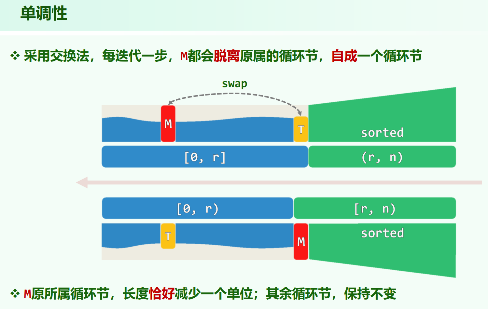
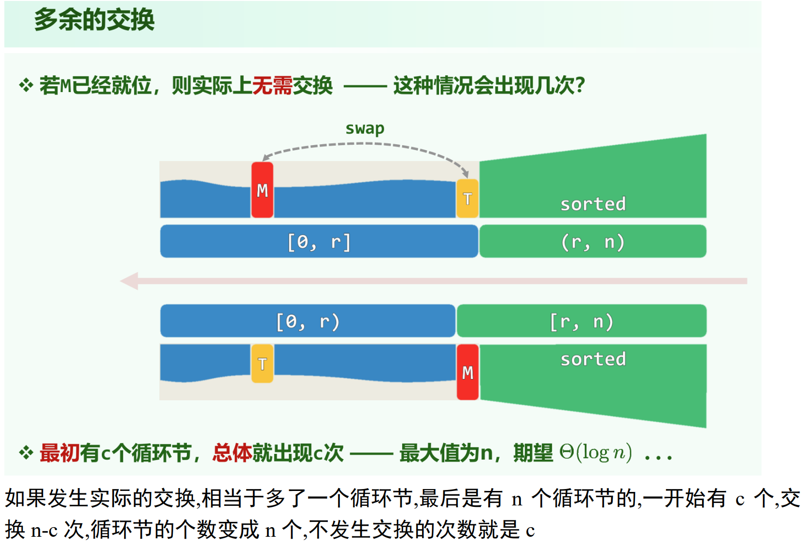

### 选择排序实际交换元素的次数
* 习题解析[3-14]
* 03.List.pdf P41

选择排序的每一轮，若此轮最大值就在 unsorted 部分的末尾，没有发生实际的交换（或者说是自己和自己换），此时一轮循环节数不变。 若此轮最大值不在末尾（假定向量元素各不相同），则由于 max 的就位位置为 末尾，则 max 与 末尾元素 在同一个循环节中，交换过后 max 自成一个循环节，循环节个数加1。

因此，**选择排序一轮，循环节数要么不变，要么加1。**

**需要实际交换的轮数为 $n - c$**，c为最开始的循环节数：

实际不需要发生交换的轮次数的期望为 $\Theta(logn)$ (每个元素概率均等作为最大值)，相比 $n$ 轮的循环次数可以忽略不计，见习题解析[3-14]b。