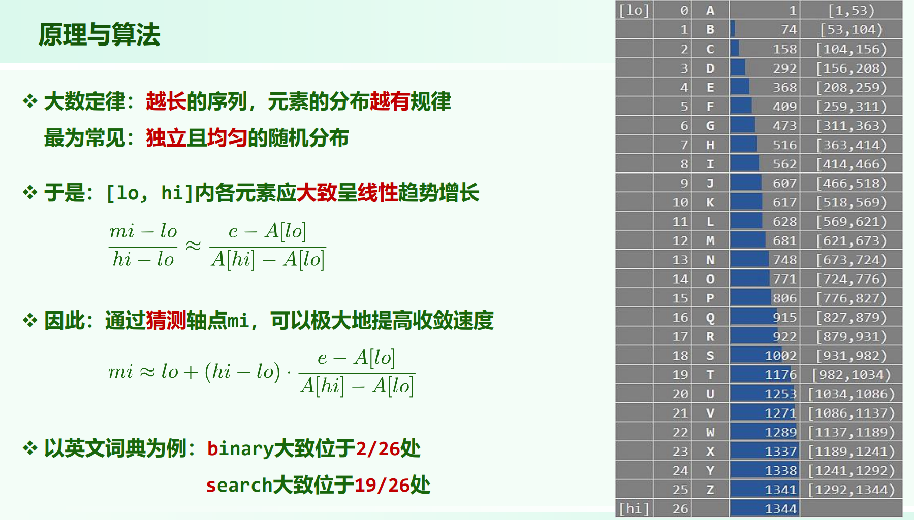
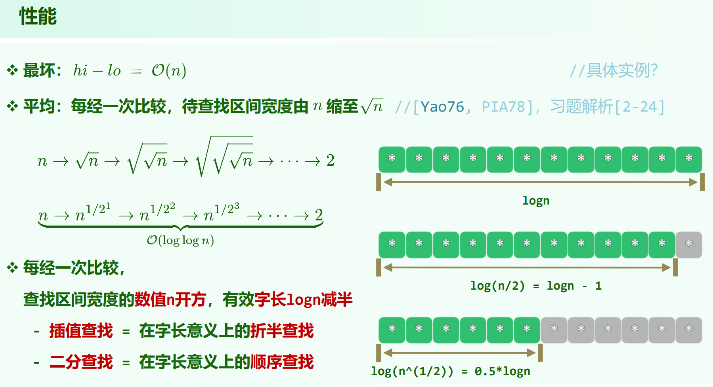

02.Vector.pdf P66

# 插值查找

序列不止单调，还可能是线性增长的。那么，可以预估要查找的 $target$ 的大致位置，从而启发式地选择 $mid$ （而非每次选中间位置）。

拟合的直线斜率为 $\frac{A[hi] - A[lo]}{hi - lo}$ ，拟合直线为 $y - A[lo] = \frac{A[hi] - A[lo]}{hi - lo} (x - lo)$ 。 所以尝试的 $mi$ 会是 $mi = lo + \frac{1}{k}(e - A[lo])$

## 时间复杂度

最坏情况下会是 $O(n)$，例子见补充ppt:

1 1 1 1 1 2 INT_MAX

由于 $A[hi]$ 的值极端，拟合直线的 $k$ 过大，直线远高于实际数据。于是每次 $mi$ 会选的特别靠前，每次向量长度缩减 $1$ ，时间复杂度 $O(n)$。（和快速排序的问题很像，快速排序是划分不均匀，但是两个子问题都要算；插值查找是极端用例每次剪枝就剪 $1$ ）

平均时间复杂度是 $O(loglogn)$ :

**[TODO]**: 习题解析[2-24]，一个复杂的概率论推导。能得出: **插值查找，区间长度以平方根的速度衰减**。

考虑向量长度的变化：

$n (n > 1)$ 不停开根号永远 $> 1$，所以考虑其到达 $2$。

$n^{\frac{1}{2^k}} = 2$，则 $\frac{1}{2^k} = log_n{2}$，则 $2^k = \frac{lnn}{ln2}$ ，则 $k = O(loglogn)$ 。

或者习题解析[2-24] d): 

$T(n) = T(\sqrt{n}) + 1$，然后令 $n = 2^m$ 解。