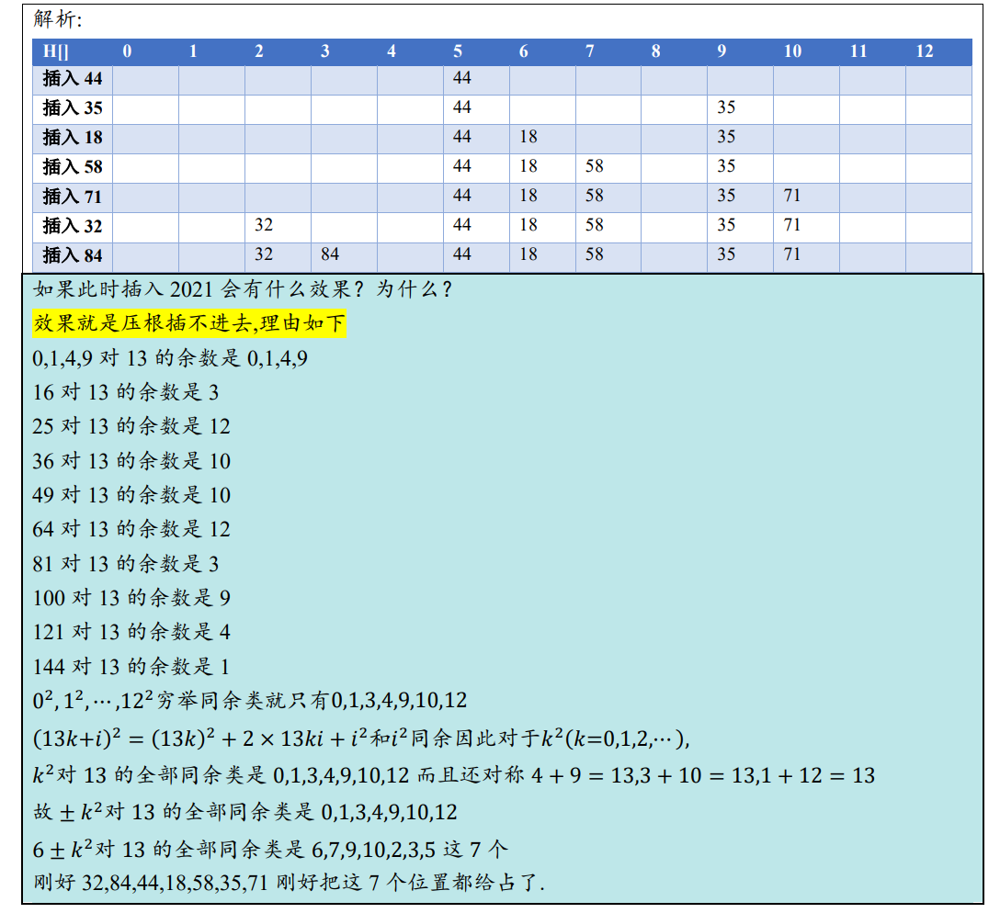

* 09.Dictionary.pdf P22

## 除余法

这里我理解选 $M$ 为素数，还有个理由是，如果 $M$ 为合数，$hash = key \% M$，则 $hash$ 一定是 $gcd(key, M)$ 的倍数。因为：

$$
N = kM + r，N = ng，M = mg，then: \\

\frac{r}{g} = n - km \\

右边是整数，则左边也是整数
$$

既然 $r$ 一定为 $g$ 的倍数，说明不是每个值都能 $\%$ 出来，不如让 $M$ 为素数，则 $g = 1$。

## 几个算法导论中的结论

算法导论P154定理11.6：

这个结论是个上界，证明过程中放大了。

另外几个结论：

## 重散列 (Rehashing)

装填因子要算上懒惰删除（和教材上代码不一样）

## 平方探测

以上图中假定了 $M > 2$ ，如果 $M = 2$ 的话会发现不符合。

现在来证明这个结论：

**若 $M$ 为奇素数，则 $k^2 \ \% \ M$ 恰有 $\lceil M / 2 \rceil$ 种取值，且由试探链的前 $\lceil M / 2 \rceil$ 项取遍。**

$\% M$ 的结果有 $\{0, 1, 2, ... , M - 1\}$ 共 $M$ 种，探测时是计算 $hash(key) + k^2 \ \% \ M$ ，$hash(key)$ 不变，只需考虑 $k^2 \% M$ 的结果就行了，这个映射为：

$$
\{0^2, 1^2, 2^2, ...\} \rightarrow \{0, 1, 2, ... , M - 1\}
$$

这不一定是个满射，所以要考虑其像。由取模的性质 $k * k \ mod \ M = (k \ mod \ M) * (k \ mod \ M) \ mod \ M$ ，所以只需考虑一个长为 $M$ 的周期的像就行了，即：

$$
\{0^2, 1^2, 2^2, ... , (M - 1)^2\} \overset{\% M}\rightarrow \{0, 1, 2, ... , M - 1\}
$$

后面的一定算出来的是和前面重复的位置。

若有两个不同位置 $a$ 和 $b$ $(0 \le a, b \le p - 1)$ 使得 $a^2 \equiv b^2 \ (mod \ p)$ ，则 $(a + b)(a - b) \equiv 0 \ (mod \ p)$ ，由于 $p$ 是素数，只能 $(a + b) \equiv p$ 或者 $(a - b) \equiv p$ ，后者不可能，只能 $a + b \equiv p$ 。

也就是说

$$
\{0^2, 1^2, 2^2, ... , (M - 1)^2\} \overset{\% M}\rightarrow \{0, 1, 2, ... , M - 1\}
$$

这个映射的特点是，当且仅当 $a + b = M$ 时，映射到同一个数。除了 $0$ 没有对称点，其它数都有对称点。所以，$0$ 、$\{1, M - 1\}$ 、$\{2, M - 2\}$ ... 分别映射到一个数。

($M$ 为奇数) $\{0^2, 1^2, 2^2, ... , (\frac{M-1}{2})^2\}$ 就取遍了所有映射结果，共 $\lceil \frac{M}{2} \rceil$ 个像值。

$\{k^2\}$ 这个序列在$[0, \frac{M-1}{2}]$就不重复地取遍了所有二次剩余，后面就都是在重复了。

**结论**：对于一个奇素数 $p$ ，模 $p$ 的非零二次剩余个数为 $\frac{p - 1}{2}$ ，二次剩余个数为 $\frac{p + 1}{2}$ ，非二次剩余个数为 $\frac{p - 1}{2}$ 。 ( $0$ 一定为二次剩余，因为 $0^2 \equiv 0 \ (mod \ p)$ )

解释：

二次剩余的“剩余”原文是 residue ，含义上感觉更像“二次余数”。表示模 $p$ 的余数 $\{0, 1, ... , p - 1\}$ 中，哪些余数是完全平方数，即可以找到一个 $k^2$ 映射到它。

但是，按概念来说，$4^2 \equiv 2 \ (mod \ 7)$，那么也有 $4^2 \equiv 2 + 7k \ (mod \ 7)$，$2 + 7k$ 都是“模 $p$ 意义下的完全平方数”。

所以，这里的“模 $p$ 的二次剩余个数”更确切地说是指“**二次剩余类**”的个数，或者说特指 $[0, p - 1]$ 范围内的“二次余数”。

## 费马二平方和定理

参考：

* [费马平方和定理](https://zh.wikipedia.org/wiki/%E8%B4%B9%E9%A9%AC%E5%B9%B3%E6%96%B9%E5%92%8C%E5%AE%9A%E7%90%86)

**一个奇素数 $p$ 可以表示为两个整数的平方和，即 $p = a^2 + b^2$ (其中a, b为整数)，当且仅当这个素数满足 $p \equiv 1 \ (mod \ 4)$**

偶素数只有 $2$ 一个，其也可以，$2 = 1^2 + 1^2$ 。

注意前提是 $p$ 为素数，然后：$p$ 可以写成二平方和 $\iff$ 其是 $4k + 1$ 形式。

$2021$ 是 $4k + 1$ 的形式，但是其为合数 $2021 = 43 * 47$ ，写代码试下就会发现其不能写成二平方和。$2025$ 也是 $4k + 1$ 形式的合数，但是 $2025 = 0^2 + 45^2 = 27^2 + 36^2$

不过如果是 $4k + 3$ 的形式，无论是质数还是合数，其都不能写成二平方和。如果可以，即有 $4k+3 = a^2 + b^2$ 的话，两边 $mod \ 4$，左边一定为 $3$ ；右边，一个数模 $4$ 的可能为 $0,1,2,3$，然后平方后是 $0,1$，然后两个这样的相加，可能为 $0,1,2$，不可能为 $3$ 。

### 更一般的结论

参考：

* deepseek的回答

* [LeetCode633. 平方数之和](https://leetcode.cn/problems/sum-of-square-numbers/solutions/747079/ping-fang-shu-zhi-he-by-leetcode-solutio-8ydl/)

* [二次剩余](https://oi-wiki.org/math/number-theory/quad-residue/)

**一个大于 1 的正整数 $n$ 可以表示为两个整数的平方和，当且仅当 $n$ 的所有形如 $4k + 3$ 的质因子的幂均为偶数。**

这个定理说明了，任意一个数（不一定为素数了）如果想要能表示成二平方和，要看其素因子，$4k + 1$ 形式的素因子没干扰，剩下的素因子只有 $4k + 3$ 的形式，每个这类素因子的指数都得是偶数。

($4k$ 不会是素因子，$4k + 2$ 为素因子只能是其为 $2$ 的时候，后面会看到由于 $2$ 能写成二平方和 $1^2 + 1^2$，不会影响结论)

证明：

先证**必要性**：如果 $n$ 可表示为二平方和，则所有 $4k+3$ 型素因数的指数为偶数。

---

先证一个引理：$n$ 为一个二平方和素数，即 $n$ 可写为 $a^2 + b^2$ ，$p$ 为一个 $4k + 3$ 型素数且 $p \mid n$ (即 $p$ 为 $n$ 的任一个 $4k + 3$ 型素因子)，则：$p \mid a$ 且 $p \mid b$ 。

证明：

由于 $p \mid n$，则 $a^2 + b^2 \equiv 0 \ (mod \ p)$ ，如果 $p \nmid a$，由[费马小定理](https://oi-wiki.org/math/number-theory/fermat/)可知 $b$ 的逆元 $b^{-1} = b^{p - 2}$ ，两边乘这个逆元，得到 $(a \cdot b^{-1})^2 + 1 \equiv 0 \ (mod \ p)$ ，即 $(a \cdot b^{-1})^2 \equiv -1 \ (mod \ p)$。这说明在模 $p$ 意义下，$-1$ 是[二次剩余](https://oi-wiki.org/math/number-theory/quad-residue/)。

$a$ 为 模数 $p$ 的二次剩余的含义是：$a$ 可由某个数 $x$ 的平方得到，即存在 $x$ 使得 $x^2 \equiv a \ (mod \ p)$

而由[欧拉判别法](https://oi-wiki.org/math/number-theory/quad-residue/#euler-%E5%88%A4%E5%88%AB%E6%B3%95)：$(-1)^\frac{p-1}{2} = (-1)^\frac{4k+3-1}{2} = (-1)^{2k+1} \equiv -1 \ (mod \ p)$

$-1$ 经欧拉判别法算出来的结果为 $-1$ ，说明 $-1$ 不是 $p$ 的二次剩余。矛盾，说明 $p \mid a$。同理可得 $p \mid b$ 。

引理证明完毕。

---

由引理，$n$ 的素因子 $p$ 满足 $p \mid a$ 且 $p \mid b$ ，所以 $p^2 \mid a^2$ 且 $p^2 \mid b^2$ ，从而 $p^2 \mid (a^2 + b^2)$，这意味着：

若 $n$ 可表示为二平方和，$p$ 为 $n$ 的一个 $4k + 3$ 型素因子，则 $n$ 一定可以整除掉 $p^2$ ，质因子 $p$ 的指数一定 $\ge 2$。

而 $a = p \cdot a_1, b = p \cdot b_1$ ，则 $n / p^2 = a_1^2 + a_2^2$，仍然是一个二平方数，且 $n / p^2$ 的质因数分解中 $p$ 的指数减 $2$ 了，如果 $p$ 的指数还有剩，则一定 $\ge 2$，重复这个过程即可知：$p$ 的指数一开始必定为偶数，必要性成立。

再证**充分性**：如果所有 $4k + 3$ 型素因数的指数为偶数，则 $n$ 可表示为二平方和。

考虑 $n$ 的素因子，要么是 $2$ ，要么是 $4k + 1$ 型，要么是 $4k + 3$ 型。如果是 $2$ ，$2 = 1^2 + 1^2$ ，可以写为二平方和 ； 如果是 $4k + 1$ 型，由费马二平方和定理，其一定可以写为二平方和。由[Brahmagupta–Fibonacci identity](https://en.wikipedia.org/wiki/Brahmagupta%E2%80%93Fibonacci_identity)：$(a^2 + b^2)(c^2 + d^2) = (ac - bd)^2 + (ad + bc)^2 = (ac + bd)^2 + (ad - bc)^2$ 。这个婆罗摩笈多－斐波那契恒等式意味着**二平方和相乘可以化为二平方和**。用这个等式处理，所有 $2$ 和 $4k + 1$ 型素因子的部分可以化为**单个**二平方和。

对于剩下的 $4k + 3$ 型素因子，由于其指数一定全为偶数，则利用 $p^2 \cdot (a^2 + b^2) = (pa)^2 + (pb)^2$ ，也可以化为二平方和。

于是，$n$ 可以化为二平方和，充分性成立。

## 双平方探测

参考：

* 习题解析[9-17]

* deepseek的回答

习题解析[9-17]的结论：双平方探测的查找链 $\{0, 1^2, -1^2, 2^2, -2^2, 3^2, -3^2, ... \}$，当散列表长取 $4k + 3$ 型素数时，一定有：任一关键码所对应的查找链，前 $M$ 个桶必然互异（也即恰好遍取整个散列表）。

由[上面](#平方探测)的结论：

$\{0^2, 1^2, 2^2, ... , (\frac{M-1}{2})^2\} \ mod \ M$ 的结果各不相同。同理，$\{0^2, -1^2, -2^2, ... , -(\frac{M-1}{2})^2\} \ mod \ M$ 的结果也各不相同。

二者有一个 $0$ 是相同的，现在证明：

$\{1^2, 2^2, ... , (\frac{M-1}{2})^2\} \ mod \ M$ 和 $\{-1^2, -2^2, ... , -(\frac{M-1}{2})^2\} \ mod \ M$ 的结果也互不相同。

假设存在 $a^2 \equiv -b^2 \ (mod \ M)$，(a, b分属两类)，则：

$a^2 + b^2 \equiv 0 \ (mod \ M)$，记 $n = a^2 + b^2$ ($n > 0$)，$n$ 为 $M$ 的倍数，说明 $M$ 为 $n$ 的素因子，而既然 $n$ 可写为二平方和，由[上面](#更一般的结论)的结论，$M$ 这个 $4k + 3$ 型素因子的指数必须得是偶数，则 $\ge 2$。

则有 $n \ge M^2$ ，但是 $n$ 最大为 $(\frac{M-1}{2})^2 + (\frac{M-1}{2})^2$，不可能。

更二级结论的做法是：

若有 $a^2 + b^2 \equiv 0 \ (mod \ M)$，$b$ 不会是 $M$ 的倍数，同样，由费马小定理得 $b$ 的逆元 $b^{-1} = b^{M - 2}$，乘 $b^{-1}$，则 $(a \cdot b^{-1})^2 \equiv -1 \ (mod \ M)$ ，这说明 $-1$ 是 $M$ 的二次剩余。

但由欧拉判别法，$(-1)^\frac{M-1}{2} = (-1)^\frac{4k+3-1}{2} = (-1)^{2k+1} \equiv -1 \ (mod \ M)$，$-1$ 又不是 $M$ 的二次剩余。矛盾，所以 $a^2 + b^2 \equiv 0 \ (mod \ M)$ 不存在。

[上面](#平方探测)的结论不是说二次剩余(类)恰有 $\frac{M + 1}{2}$ 个吗？为什么这里能探查 $M$ 个桶？

实际上，这里的本质是 $\{k^2, k \ge 0\}$ 映射到了二次剩余(类)，$\{-k^2, k > 0\}$ 映射到了非二次剩余(类)。由于 $M = 4k + 3$ 时 $-1$ 不是二次剩余，则 $\{-k^2, k > 0\}$ 也不是二次剩余，否则若有 $-k^2 \equiv a \ (mod \ M)$，两边乘 $-a^{-1}$，$-1$ 变二次剩余了。所以这里能探到的桶个数为：0 + 非零二次剩余 + 非二次剩余 = $1 + \frac{M - 1}{2} + \frac{M - 1}{2} = M$ 。

$二次剩余 × 二次剩余 = 二次剩余$

$二次剩余 × 非二次剩余 = 非二次剩余$

$非二次剩余 × 非二次剩余 = 二次剩余$ （用欧拉判别法证）

---

双平方探测，散列表长 $M$ 为 $4k + 1$ 型素数会怎么样？

结论：$\{1^2, 2^2, ... , (\frac{M-1}{2})^2\} \ mod \ M$ 和 $\{-1^2, -2^2, ... , -(\frac{M-1}{2})^2\} \ mod \ M$ 探测到的位置是重复的。记两个序列的探查位置分别为 $S$ 和 $S'$，其内部各自不重复。现证这两个集合相等。

因为 $M = 4k + 1$ 时，$(-1)^\frac{M-1}{2} = 1$ ，$-1$ 是二次剩余。存在 $t$ 使得 $t^2 \equiv -1 \ (mod \ M)$

则 $-k^2 \equiv t^2 k^2 \equiv (tk)^2 \ (mod \ M)$，则 $-k^2$ 也是二次剩余（或者用 二次剩余 × 二次剩余 = 二次剩余 的结论）。$S$ 和 $S'$ 内部各自不重复，$S$ 为二次剩余集合，而 $S'$ 也是二次剩余集合。$M = 4k + 1$ 时取负运算把二次剩余集合映到自身上（是一个置换），这种情况取负是封闭的。

例如 $M = 13$，0 1² 2² 3² 4² 5² 6² 模13分别为 0 1 4 9 3 12 10，-1² -2² -3² -4² -5² -6² 模13分别为 12 9 4 10 1 3 。

## 题目

$M = 4k + 1$ 情况下的双平方探测，上面有结论，威哥的解答是不依赖背景的解答。

[水木清研OJ](https://www.smqyoj.com/p/QUIZ82602?tid=68b29eef09f2ddcb4bbb48d0)

[BV1ZdaVzPEQZ](https://www.bilibili.com/video/BV1ZdaVzPEQZ?t=1988.2)

$a_0$ 和 $b_0$ 是公共的，但是这里 $2021 = 43 * 47$ 不是质数，上面的一些结论用不了。只能用[这个](#更一般的结论)，考虑 $a_i = b_j$ ，如果 $j = 0$ ，则对应的 $a_j = b_j = 0$ ，就是 $a_0$ 和 $b_0$ 的情况 ；否则 $a_j = b_j = 2021 - a_j$ ，$a_i + a_j = 2021$ ，$2021$ 的两个素因子都是 $4k + 3$ 型，但是指数为奇数，所以一定不能写成二平方和。只有 $a_0$ 和 $b_0$ 是公共的，答案为 $1$ 。
