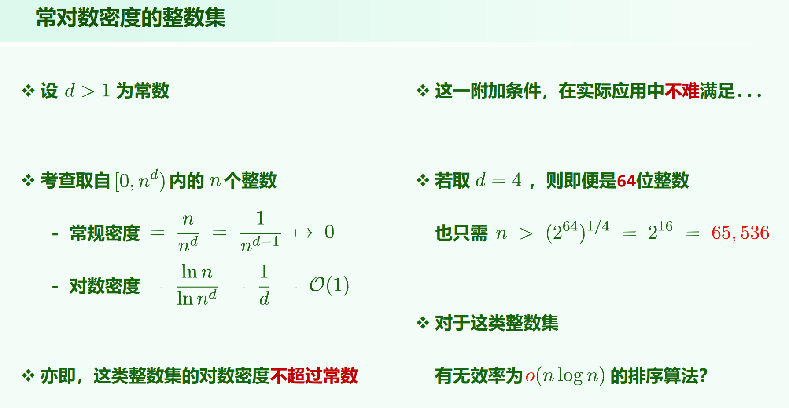
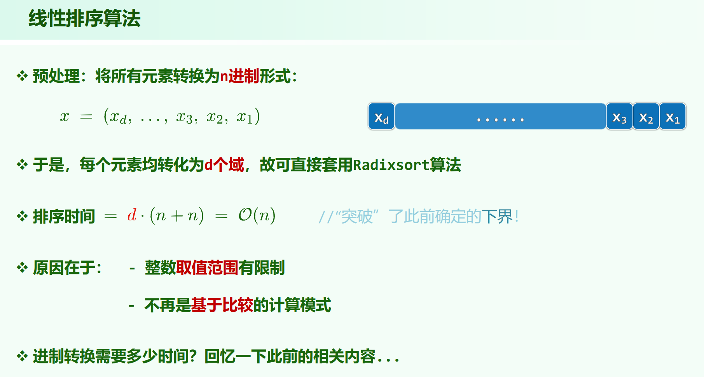

## 桶排序

MaxGap问题

用桶把 $n$ 个数分为大约 $n$ 个段

题目：[LeetCode164. 最大间距](https://leetcode.cn/problems/maximum-gap/)

还有道用桶的：[LeetCode220. 存在重复元素 III](https://leetcode.cn/problems/contains-duplicate-iii/)

时间复杂度：$O(n + M)$ ，$n$ 为数字个数，$M$ 为值域范围。

## 基数排序

数字个数为 $n$ ，$M$ 为值域范围

时间复杂度为：$O(log_{10}M \cdot (n + 10))$

$log_{10}M$ 代表位数，如果 $M$ 不能视为常数，例如是 $\Theta(n)$ 规模的，则总时间复杂度不能视为常数。

09.Dictionary.pdf P75 弄了这样一个优化：

把元素转换为 $n$ 进制，转换后的数字的位长为 $log_nM$ ，每位的数字范围为 $0 \sim n - 1$。一个元素的进制转化时间为 $O(log_nM)$ ，总的进制转化时间为 $O(nlog_nM)$

则时间复杂度为 $O(nlog_nM + log_nM \cdot (n + n))$

在何种约束下是线性的？

$log_nM$ 为常数时，即 $M = O(n^d)$ 时，$d$ 为某个常数。这也就是ppt上说的对数密度 $\frac{lnn}{lnM} = \frac{1}{d} = O(1)$ 。

使用转成 $n$ 进制的方法，只要 $M$ 还在 $n$ 的多项式范围内，就可以认为基数排序的时间复杂度为线性的。

如果 $M$ 更大例如 $M = n^n$ 之类的，那么时间复杂度就不是线性的了。

（但是实际这样做应该没什么用，看似无代价地把大数 $n$ 放到了底数位置，但 $n$ 真的够大的话，转成 $n$ 进制后的每一位的长度就不能视为 $O(1)$ 了，而是 $log_2{n}$。整体还该有个 $log_2{n}$ 的倍数，$log_nM \cdot (n + n) \cdot log_{10}n = log_{10}M \cdot (n + n)$ ，没什么变化）

## 计数排序

记值的出现频率，求频率的前缀和，然后**从右到左遍历输入序列**，根据频率的前缀和确定每个元素的排序后位置。

**从右到左遍历输入序列**是为了排序稳定性，从左到右的话大小顺序能对，但是不稳定。