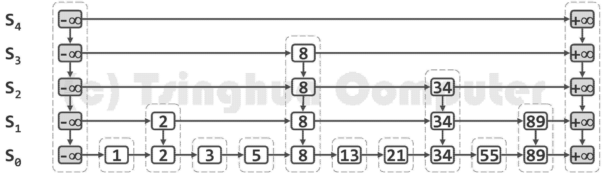
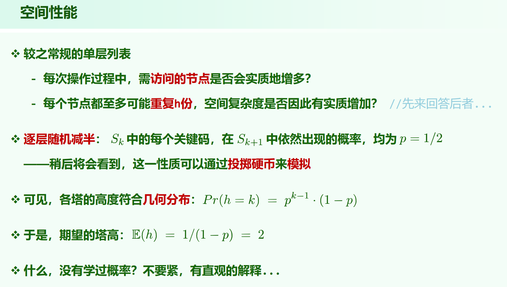
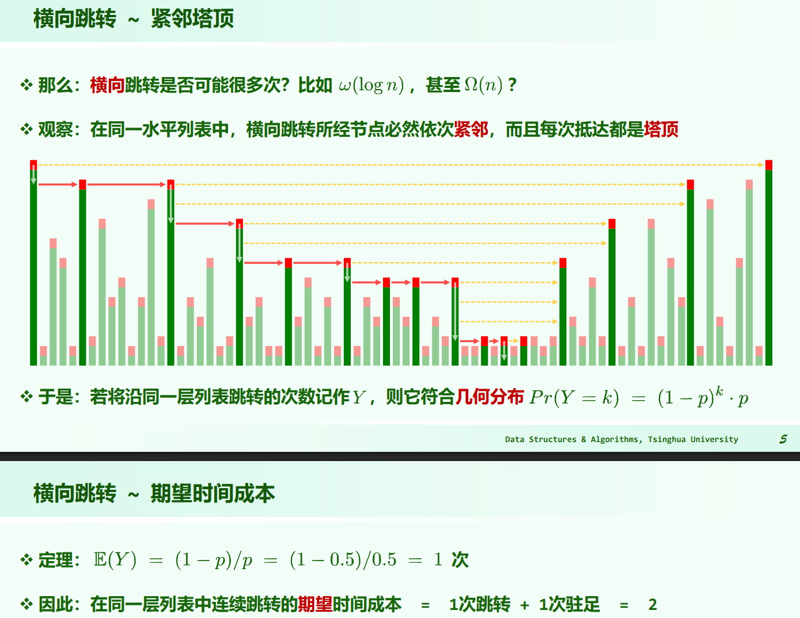

* 09.Dictionary.pdf P96

高层列表总是低层列表的子集，其中特别地，$S_0$ 包含词典中的所有词条，而 $S_h$ 除头、尾哨兵外不含任何实质的词条。

## 单个塔高

**单个塔的期望高度为 $O(1)$ ，具体期望为 $2$ 。**

## 跳转表高

**跳转表的期望高度为 $O(logn)$ 。**

跳转表高取决于最高的塔，要严格求的话得求 $E(max{X1, X2, ...})$ ，但是有个简单点的估计。

单独一座塔的高度 $\ge k$ 的概率为 $(1/2)^k + (1/2)^{k + 1} + ... = (1/2)^{k - 1}$，则一座塔的高度 $< k$ 的概率为 $1 - (1/2)^{k - 1}$ 。

跳表第k层 $S_k$ 非空 (跳表高 $\ge k$) 的概率为 $1 - (1 - (1/2)^{k - 1})^n$ ，取 $k = 2logn + 1$ ，则这个概率为 

$$
1 - (1 - (\frac{1}{2})^{2logn})^n = 1 - (1 - \frac{1}{n^2})^{n^2 \cdot \frac{1}{n}} = 1 - (\frac{1}{e})^\frac{1}{n} \rightarrow 0
$$

说明当 $k$ 为 $2logn$ 规模时， $S_k$ 就极大概率为空。

这样很不严谨，但是跳转表的期望高度为 $O(logn)$

于是：**查找过程中，纵向跳转的期望次数为 $O(logn)$**

## 横向跳转次数

**在同一水平列表中，横向跳转所经节点必然依次紧邻，而且每次抵达都是塔顶。**

会站上去的点都是塔顶，但是要不要横向跳下一步要向右看(驻足)，如果看了向右不行，大于要查找的值，则往下走。

对单独的某层，横向跳转的次数为 $k$ ，则对应 $k$ 次塔顶 + 最后一步看了眼发现不该跳过去，非塔顶。$P(Y = k) = (1 - p)^k \cdot p$

（严格来说某一层最后驻足看的那个位置也可以是塔顶，例如 1 ~ 7 ∪ 9 ~ 10 的高度全都相等为 3 ， 8 的高度为 2 ，找 8 ，则第 3 层的横向跳转，最后驻足看的位置是个塔顶。

这个证明方式感觉说不清的怪。）

总之，**单独一层横向跳转的期望次数为 $O(1)$ ，总横向跳转的期望次数为 $O(1 \times h) = O(logn)$**

## 跳表的时空复杂度

### 时间复杂度：

查找：$expected-O(logn)$

插入：$expected-O(logn)$

删除：$expected-O(logn)$

### 空间复杂度：

$expected-O(n)$

每座塔高的期望为常数，再乘 $n$ 还是 $O(n)$

时空复杂度和 BBST 一样的。