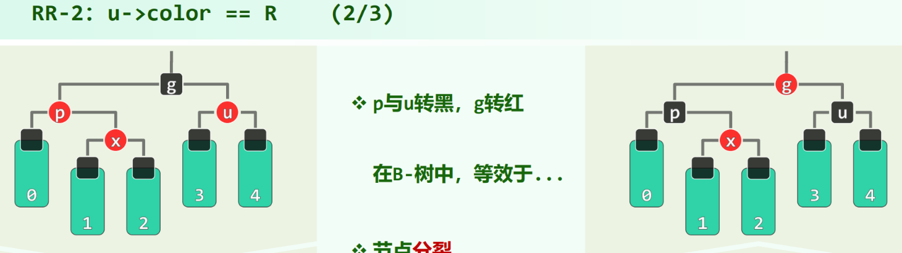

习题解析[8-14]：红黑树的重平衡操作，染色次数的分摊复杂度为 $O(1)$

群里有人问到这题，只以插入操作为例分析了一下，删除的情况太多没去想

势能分析法，染色成本记为 $T$，定义均摊成本 $A$：

$$
A_i = T_i + \Delta\Phi
$$

$i$ 表示第 $i$ 次插入，其分为多次调整，用 $j$ 来标号，即

$$
A_{ij} = T_{ij} + \Delta\Phi
$$

此次调整若为 $RR-1$，则 $A_{ij} = O(1)$，这只会有一次，调整后立即结束

此次调整若为 $RR-2$，则 $A_{ij} =  1 + \Phi' - \Phi$，现在我们来观察上面的图，操作后（右边）比操作前（左边）多 $1$ 个 $BBB$ 节点，但少 $1$ 个 $BRR$ 节点，关键在于势能函数的定义 $BRR$ 前面乘了个 $2$，所以 $A_{ij} = 1 + \Phi' - \Phi = 1 + (1 - 2) = 0$

所以，

$$
A_i = \sum_{j}A_{ij} = O(1)
$$

所以 $\sum A_i = O(n)$，而又有 $\sum \Delta\Phi = O(n)$，故 $\sum T_i = O(n)$，故红黑树插入的染色操作，分摊成本为 $O(1)$