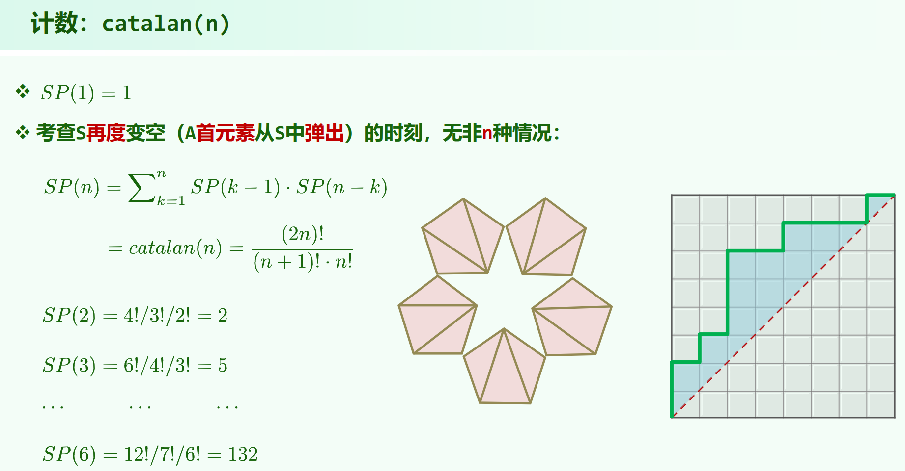
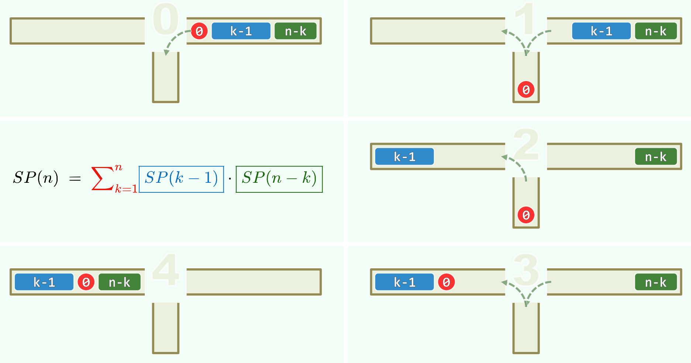
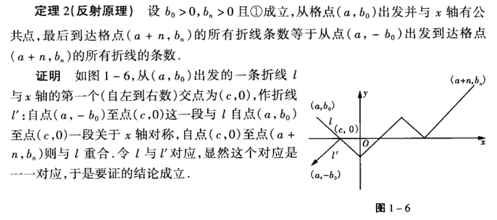
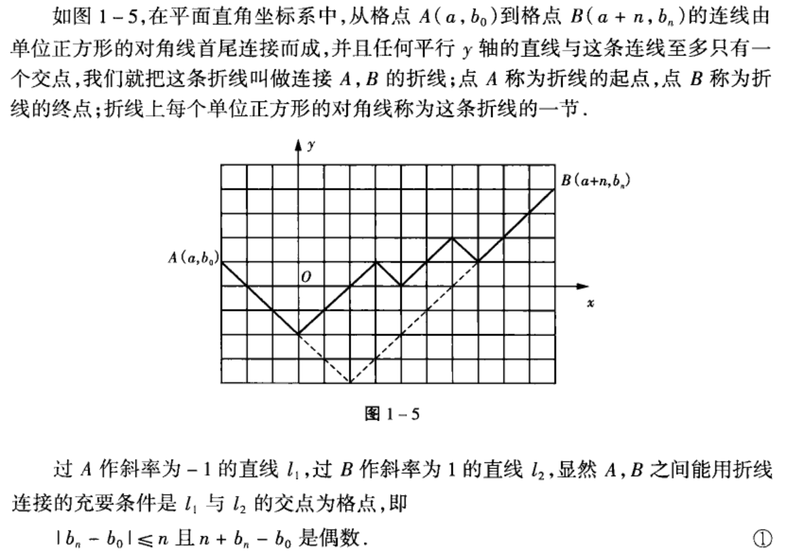

> 04.Stack + Queue.pdf P67

## 栈混洗

$n$ 个元素的栈混洗。

考虑第一个元素入栈后到出栈的这段时间，中间经过了一段元素的栈混洗，长度从 $0$ 到 $n - 1$，也就是说，可以将原序列分为长为 $1, k - 1, n - k$ 的三段。被第一个元素的出栈分隔为了两部分独立的子栈混洗问题。所以:

$ SP(n) = \sum \limits_{k = 1}^{n} SP(k - 1) \cdot SP(n - k) $

这个递推式为 $catalan数$ ，通式为：

$ catalan(n) = \binom{2n}{n} - \binom{2n}{n-1} = \frac{1}{n + 1}\ C_{2n}^{n} $

## 禁形
> 习题解析[4-3]

原序列的 i ... j ... k 不可能经栈混洗后变成 k ... i ... j 的形式，这种形式称为禁形。

禁形 和 序列为非法栈混洗 是充要的，见[习题解析[4-3]]()。

不过习题解析其实并没有证明：“没有禁形，序列一定合法” 这一点，只是口头说了下没有禁形那个代码一定不会有问题。这里证明下：

从原序列第一个元素的出栈入手，把原序列分为长为 $1, k - 1, n - k$ 的三段。由于整体没有禁形，则 $[k - 1]$段 和 $[n - k]$段 在输出序列中各自也没有禁形，二者由归纳假设可以栈混洗，再考虑第一个元素，由于 $ 1, [k - 1], [n - k] $ 在输出序列中也必不是禁形的形式，所以第一个元素能正常出入栈，并将两段分割成独立的子问题。证明完毕。

相关题目: [LeetCode946. 验证栈序列](https://leetcode.cn/problems/validate-stack-sequences/)

## catalan数的多种形式

1. $n$ 个元素的栈混洗

2. $n$ 个左括号 和 $n$ 个右括号组成的合法匹配的方案数
    
    **注意**是 $n$ **对**匹配的括号，一共有 $2n$ 个字符

3. $n + 1$ 个数字连乘，不同的计算顺序个数

    相当于加入 $n$ 对合法括号

4. $n$ 个节点的二叉树可能的形态数

    $f(n) = f(0)f(n-1) + f(1)f(n-2) + ... + f(n-1)f(0)$

5. 有 $n$ 个非叶节点的真二叉树的可能形态数

    选一个节点为根，左侧有 $i$ 个非叶节点，右侧有 $n - 1 - i$ 个非叶节点。
    
    相当于 4 的情况给每个节点补成有2个孩子（如果需要补的话）

6. $n$ 个节点的二叉搜索树的形态数 ($n$ 个节点互异的二叉搜索树的种类)

    只是形态，和 4 是一样的。然后知道形态后，数字放进去的结尾是确定的，也可以直接哪个数字做根，然后写递推式。

7. $n$ 个叶节点的真二叉树的形态数是 $catalan(n - 1)$

    对任意二叉树，$n_0 = n_2 + 1$ ，再用 5

8. 边长度为 $n \times n$ 的格点，不走到右下区域(可以在对角线上)，从左下走到右上的种数

    任意时刻向上的步数 >= 向右的步数，这和栈混洗栈总要有东西才能出栈是一样的。

9. $2n$ 个数，其中有 $n$ 个 $1$ 和 $n$ 个 $-1$ ，从左到右扫描，$1$ 的累计个数总是不小于 $-1$ 的累计个数的排列数

    $1$ 和 $-1$ 与栈混洗的入栈出栈是对应的，$1$ 的累计个数 >= $-1$ 的累计个数，对应栈混洗总要有东西才能出栈。

10. 将一个 $n + 2$ 条边的凸多边形分割为三角形的方案数 (多边形三角剖分数)

    选一条固定边作为基础，然后考虑另外一个点的位置

    $f(n + 2) = \sum \limits_{k = 2}^{n + 1} f(k) \cdot f(n + 3 - k)，f(3) = 1，f(2) = 0$

    令 $g(n) = f(n + 2)$，则 $g(n) = \sum \limits_{k = 2}^{n + 1} g(k - 2) \cdot g(n - k + 1) = \sum \limits_{k = 1}^{n} g(k - 1) \cdot g(n - k)，g(1) = 1，g(0) = 0$。所以 $g(n) = catalan(n)$，$f(n + 2) = catalan(n)$

11. 在圆上有 $2n$ 个点，连接这些点形成 $n$ 条不相交弦的方案数 (不相交弦问题)

    由于要把所有点连成不相交弦，所以划分时左右都是偶数个点，$2k$ 个点的方案数记为 $f(k)$ ，然后写递推式。

    这两条来自[链接](https://blog.csdn.net/ysa051030/article/details/148864720)。

## 递推式到通式的证明

### 法一：反射定理

用形式9，$n$ 个 $1$ 和 $n$ 个 $-1$，总排列方案数为 $C_{2n}^{n}$，再排除非法方案。

这里先说明一下形式9的等价定义，最开始位于 $(0, 0)$，每步要么移动 $(1, 1)$ (对应 $1$)，要么移动 $(1, -1)$ (对应 $-1$)。由于 $1$ 和 $-1$ 的个数都为 $n$，最后会到达 $(2n, 0)$。$catalan(n)$ 为这种定义下，过程中 $y$ 始终 $\ge0$ 的方案数。

对于非法方案，其至少存在一个位置 $k$，使得此处 $-1$ 的个数比 $1$ 多 $1$。由于 $1$ 和 $-1$ 都是 $n$ 个，所以右侧还有 $x + 1$ 个 $1$ 和 $x - 1$ 个 $-1$。把右侧的 $1$ 和 $-1$ 反转，序列变成了 $n + 1$ 个 $-1$ 和 $n - 1$ 个 $1$ 的排列。反过来，一个$n + 1$ 个 $-1$ 和 $n - 1$ 个 $1$ 的排列，其最终会到达 $(2n, -2)$ ，用介值定理，一定有一个点是 $(x, -1)$，此时 $-1$ 恰比 $1$ 多一个，将右侧的 $1$ 和 $-1$ 反转，排列变成了一种 $n$ 个 $1$ 和 $n$ 个 $-1$ 的非法方案。

所以，“$n + 1$ 个 $-1$ 和 $n - 1$ 个 $1$ 的排列” 和 “$n$ 个 $1$ 和 $n$ 个 $-1$ 的所有非法方案” 是一一对应的。

所以，非法方案总数为 $C_{2n}^{n-1}$。

$ catalan(n) = C_{2n}^{n} - C_{2n}^{n-1} = \frac{1}{n + 1}\ C_{2n}^{n} $

#### 扩展问题

> [折线法计数、反射原理](https://blog.csdn.net/nameofcsdn/article/details/53144666)

上面的链接里给出了更一般的结论：

$b_0 > 0, b_n > 0$ 且 $(a, b_0)$ 与 $(a + n, b_n)$ 确实可以用斜率为 $+1 / -1$ 的折线到达，则：

1. 连接格点 $(a, b_0)$ 与 $(a + n, b_n)$ 且与x轴有公共点的折线条数为 $C_{n}^{\frac{1}{2}(n + b_n + b_0)}$

    问题是等价于 $n$ 步 $+1 / -1$ ， 从 $(a, -b_0)$ 到 $(a + n, b_n)$ 的方案数。

    

2. 连接格点 $(a, b_0)$ 与 $(a + n, b_n)$ 且与x轴没有公共点的折线条数为 $C_{n}^{\frac{1}{2}(n + b_n - b_0)} - C_{n}^{\frac{1}{2}(n + b_n + b_0)}$

    总方案数 - 非法方案数

(注意以上的 2 是严格 $ > 0 $。)

此外，只要问题输入没问题，那么一定有 $\frac{1}{2}(n + b_n + b_0)$ 为偶数，因为：

现在用这个更一般的结论来求 $catalan(n)$：

$catalan(n)$ 相当于从 $(0, 0)$ 走到 $(2n, 0)$，$y$ 始终 $> -1$，相当于从 $(0, 1)$ 走到 $(2n, 1)$，$y$ 始终 $> 0$，带进上面的结论2，结果就是 $C_{2n}^{n} - C_{2n}^{n + 1}$

还有个比较有意思的数学代换是：由于最开始和末尾都有 $y = 0$ ，要始终 $y \ge 0$ ，那么第一步肯定是 $+1$ ，最后一步肯定是 $-1$ 。问题相当于 $(1, 1)$ 走到 $(2n - 1, 1)$，$y$ 始终 $> -1$，带进上面的结论2，结果是 $C_{2n - 2}^{n - 1} - C_{2n - 2}^{n + 1}$，看起来和 $C_{2n}^{n} - C_{2n}^{n + 1}$ 不像，但是代换之后实际是相等的。$C_{2n - 2}^{n - 1} - C_{2n - 2}^{n + 1} = (2n - 2)! \frac{2(2n - 1)}{(n + 1)! (n - 1)!} = \frac{(2n)!}{(n + 1)!n!} = catalan(n)$

为什么 $C_{2n - 2}^{n - 1} - C_{2n - 2}^{n + 1} = C_{2n}^{n} - C_{2n}^{n + 1}$ ？

首先，$C_{n}^{m} = C_{n - 1}^{m} + C_{n - 1}^{m - 1}$ (证明: n个球里选m个，分第一个球选/不选即可)

利用这个公式把2n往2n-2靠，右 = $C_{2n - 1}^{n} + C_{2n - 1}^{n - 1} - (C_{2n - 1}^{n + 1} + C_{2n - 1}^{n}) = C_{2n - 1}^{n - 1} - C_{2n - 1}^{n + 1}$

再做一步这个，然后结合 $C_{2n - 2}^{n - 2} = C_{2n - 2}^{n}$ 就可以得到上面的式子了。

### 生成函数法

> [卡特兰数（Catalan）公式、证明、代码、典例](https://blog.csdn.net/sherry_yue/article/details/88364746)

> https://oi-wiki.org/math/poly/ogf/

> https://oi-wiki.org/math/combinatorics/catalan/#%E5%B0%81%E9%97%AD%E5%BD%A2%E5%BC%8F

用 $h_n$ 记 $catalan(n)$

令生成函数 $g(x) = h_0 + h_1x + h_2x^2 + h_3x^3 + ... + h_nx^n + ...$ ，即把要求的通项作为一个幂级数的系数

(注意 $h_0$ 是等于 $1$ 的。 ([OEIS](https://oeis.org/A000108)))

然后把 $g(x)$ 平方，得到 $g(x)^2 = h_0^2 + (h_0h_1 + h_1h_0)x + (h_0h_2 + h_1h_1 + h_2h_0)x^2 + ... + (h_0h_n + h_1h_{n-1} + h_2h_{n-2} + ... + h_nh_0)x^n + ... = \sum \limits_{n = 0}^{\infty}(\sum \limits_{i = 0}^{n}h_ih_{n-i})x^n$。

(平方系数会出现卷积，这是[柯西乘积(Cauchy product)](https://zh.wikipedia.org/wiki/%E6%9F%AF%E8%A5%BF%E4%B9%98%E7%A7%AF))

$ SP(n) = \sum \limits_{k = 1}^{n} SP(k - 1) \cdot SP(n - k) $，即 $ h_n = \sum \limits_{k = 1}^{n} h_{k-1} \cdot h_{n - k} $，那么 $h_{n+1} = \sum \limits_{k = 1}^{n + 1} h_{k-1} \cdot h_{n + 1 - k} = \sum \limits_{k = 0}^{n} h_{k} \cdot h_{n - k}$

所以，$g(x)^2 = h_1 + h_2x + h_3x^2 + ...$，所以，$xg(x)^2 = g(x) - 1$，解得 $g(x) = \frac{1 - \sqrt{1 - 4x}}{2x}$ (取减号的那个解，因为将其分子有理化后符合 $h_0 = 1$)，

然后，$(1 + x)^\alpha = \sum \limits_{k = 0}^{\infty} \binom{\alpha}{k}x^k$ ，现在先证:

对于 $k \ge 1$ ，

$$\binom{\frac{1}{2}}{k}(-4)^k = -\frac{\binom{2k}{k}}{2k - 1}$$

$\binom{\frac{1}{2}}{k} = \frac{(1/2)(1/2 - 1)...(1/2 - k + 1)}{k!} = (-1)^{k-1}\frac{(2k - 3)!!}{2^kk!}$

所以 $\binom{\frac{1}{2}}{k}(-4)^k = -\frac{2^k(2k - 3)!!}{k!} = -\frac{2^k(2k-3)!}{k!(2k-4)(2k-6)...2}$

而 $(2k-4)(2k-6)...2 = 2^{k-2}(k-2)!$，故

$= -\frac{2^k(2k-3)!}{k!2^{k-2}(k-2)!} = -\frac{4(2k-3)!}{k!(k-2)!} = -\frac{4(2k)!}{k!(2k)(2k-1)(2k-2)(k-2)!} = -\frac{(2k)!}{k!k(2k-1)(k-1)(k-2)!} = -\frac{1}{2k-1}\frac{(2k)!}{k!k!} = -\frac{\binom{2k}{k}}{2k - 1}$ ，得证。

故 $\sqrt{1-4x} = 1 + \sum \limits_{k = 1}^{\infty}-\frac{\binom{2k}{k}}{2k - 1}x^k$

故 $$ g(x) = \sum \limits_{k = 1}^{\infty}\frac{\binom{2k}{k}}{2(2k-1)}x^k = \sum \limits_{k = 0}^{\infty}\frac{\binom{2k + 2}{k + 1}}{2(2k + 1)}x^k $$

所以 $$ h_k = \frac{\binom{2k + 2}{k + 1}}{2(2k + 1)} = \frac{\binom{2k}{k}}{n+1} $$

这样就用生成函数法得到了 $catalan(n)$ 的通项公式。

为什么一开始把 $g(x)$ 平方？

级数乘法规则导致**卷积**，而 $catalan数$ 的递推式就是**卷积**的形式，这是 $catalan数$ 的特质。

## 生成函数法求 $fib$ 数列通项公式

> https://oi-wiki.org/math/poly/ogf/#%E6%96%90%E6%B3%A2%E9%82%A3%E5%A5%91%E6%95%B0%E5%88%97%E7%9A%84%E7%94%9F%E6%88%90%E5%87%BD%E6%95%B0

求 $fib$ 数列通项公式一般用解差分方程的办法就好了，例如[链接](https://zhuanlan.zhihu.com/p/26679684)。这里只是示范生成函数法。

记生成函数 $g(x) = f_0 + f_1x + f_2x^2 + ...$ ，这里 $f_i$ 为 $fib$ 数列第 $i$ 项。

$g(x) = f_0 + f_1x + \sum \limits_{n = 2}^{\infty}f_nx^n = f_0 + f_1x + \sum \limits_{n = 2}^{\infty}(f_{n-2} + f_{n-1})x^n = f_0 + f_1x + x^2\sum \limits_{n=0}^{\infty}f_nx^n + x(0 + \sum \limits_{n=1}^{\infty}f_nx^n) = x + x^2g(x) + xg(x)$，所以，

$$ g(x) = \frac{x}{1 - x - x^2} $$

右边拆有理分式，由于想把其展开为幂级数，所以这里不用 $\frac{A}{x - a} + \frac{B}{x - b}$ 的形式，而是用 $\frac{A}{1 - \alpha x} + \frac{B}{1 - \beta x}$ 的形式，$1 - x - x^2 = (1 - \alpha x)(1 - \beta x)$，$\alpha, \beta$ 为 $x^2 - x - 1 = 0$ 的俩根，解得 $\alpha, \beta = \frac{1 \pm \sqrt{5}}{2}$，待定系数法求出来

$$ g(x) = \frac{\frac{1}{\sqrt{5}}}{1 - \alpha x} - \frac{\frac{1}{\sqrt{5}}}{1 - \beta x} = \frac{1}{\sqrt{5}}(\frac{1}{1 - \alpha x} - \frac{1}{1 - \beta x}) = \frac{1}{\sqrt{5}} \sum \limits_{n = 0}^{\infty}(\alpha^n - \beta^n) x^n $$

故 $$ f_n = \frac{1}{\sqrt{5}}(\alpha^n - \beta^n)，其中\ \alpha, \beta = \frac{1 \pm \sqrt{5}}{2} $$

## 总结生成函数法

要求数列 $a_n$ 的通项公式，设生成函数：

$$ g(x) = \sum \limits_{n = 0}^{\infty}a_n x^n $$

然后另找一条路，利用 $a_n$ 本身的特性（递推公式），将 $g(x)$ 这个幂级数给求出来，然后反过来就知道系数 $a_n$ 的形式了。