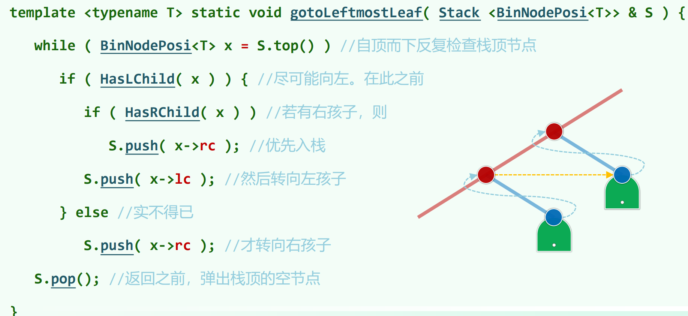
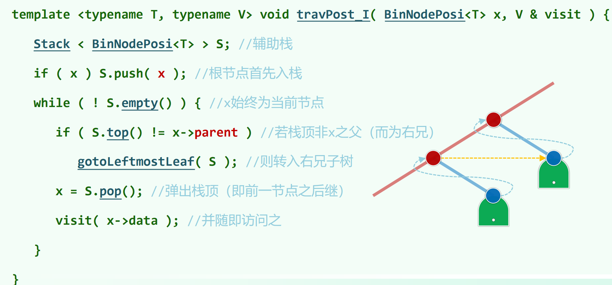

> 05.Binary Trees.pdf P33

## 二叉树的迭代版遍历

* [LeetCode144. 二叉树的前序遍历](https://leetcode.cn/problems/binary-tree-preorder-traversal/)

* [LeetCode94. 二叉树的中序遍历](https://leetcode.cn/problems/binary-tree-inorder-traversal/)

* [LeetCode145. 二叉树的后序遍历](https://leetcode.cn/problems/binary-tree-postorder-traversal/)

* [LeetCode589. N 叉树的前序遍历](https://leetcode.cn/problems/n-ary-tree-preorder-traversal/)

* [LeetCode590. N 叉树的后序遍历](https://leetcode.cn/problems/n-ary-tree-postorder-traversal/)

### 先序遍历

```cpp
// 写法一
vector<int> preorderTraversal(TreeNode* root) {
    vector<int> ans;
    stack<TreeNode*> st;
    TreeNode *node = root;
    while (true) {
        while (node != nullptr) {
            ans.push_back(node->val);
            st.push(node);
            node = node->left;
        }
        if (st.empty()) break;
        node = st.top(); st.pop();
        node = node->right; // 转入右子树
    }
    return ans;
}

// 写法二
vector<int> preorderTraversal(TreeNode* root) {
    vector<int> ans;
    stack<TreeNode*> st;
    if (root != nullptr) st.push(root);
    while (!st.empty()) {
        TreeNode *node = st.top(); st.pop();
        ans.push_back(node->val);
        if (node->right != nullptr) st.push(node->right);
        if (node->left != nullptr) st.push(node->left); // 先推右后推左，先出栈访问的才是左子树
    }
    return ans;
}
```

### 中序遍历

```cpp
vector<int> inorderTraversal(TreeNode* root) {
    vector<int> ans;
    stack<TreeNode *> st;
    TreeNode *node = root;
    while (true) {
        while (node != nullptr) {
            st.push(node);
            node = node->left;
        }
        if (st.empty()) break;
        node = st.top();
        ans.push_back(node->val);
        st.pop();
        node = node->right;
    }
    return ans;
}
```

### 后序遍历

```cpp
vector<int> postorderTraversal(TreeNode* root) {
    vector<int> ans;
    stack<TreeNode *> st;
    TreeNode *node = root;
    TreeNode *prev = nullptr; // 记录刚访问完的子树
    while (true) {
        while (node != nullptr) {
            st.push(node);
            node = node->left;
        }
        if (st.empty()) break;
        node = st.top();
        if (node->right == nullptr || node->right == prev) { // node没有右子树或者右子树已经访问完了，则可以访问node了
            ans.push_back(node->val);
            prev = node;
            st.pop(); // node访问完了，出栈
            node = nullptr; // 将node变为null，然后下一轮循环会自动回溯，取栈peek，往右子树递归
        }
        else {
            node = node->right;
        }
    }
    return ans;
}

// 后序遍历还有一种将后序遍历反向视为 根 - 右 - 左 来进行遍历，最后 reverse 一下的简洁写法，但是最后要 reverse 一下。见 coding-practice 仓的相关题目代码

```

05.Binary Trees.pdf P60 中的迭代版后续遍历实现是这样：





需要节点有parent指针。不过这里`if (S.top() != x->parent)`可以改成`if (S.top()->lc != x && S.top()->rc != x)`。

这里`x`表示最新访问完的节点(初始时刻不符合这个性质，不过不会有问题)，`if (S.top() != x->parent)`表示`S.top()`是之前作为右孩子被暂存入栈中等待访问的某棵右子树，其还未递归访问过。