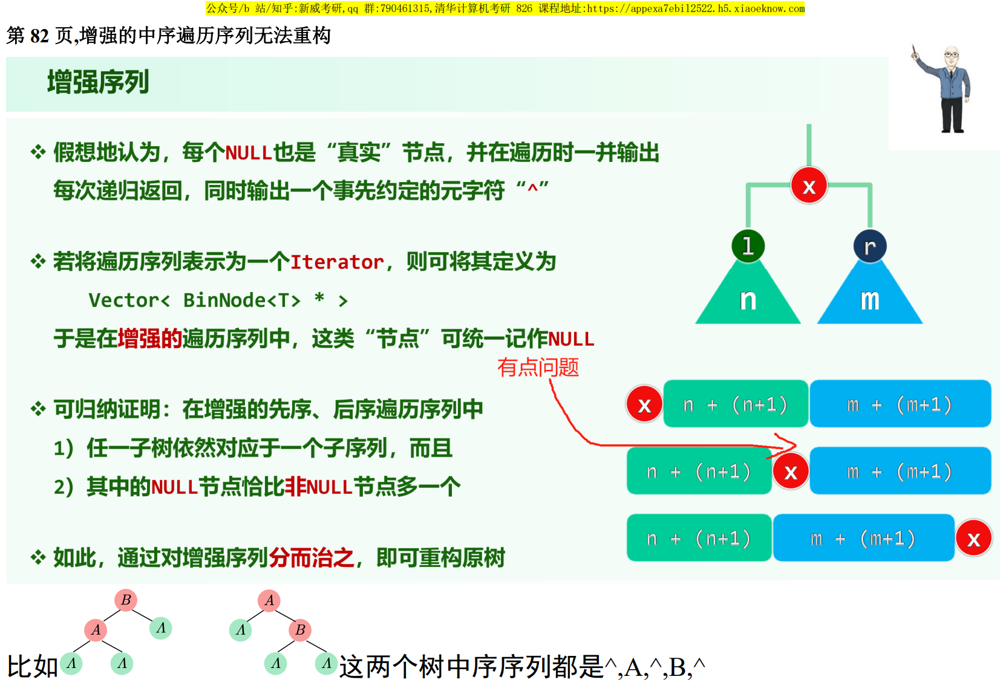
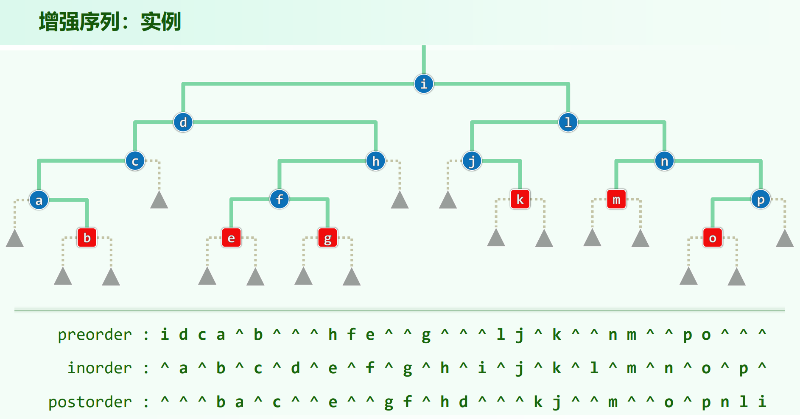
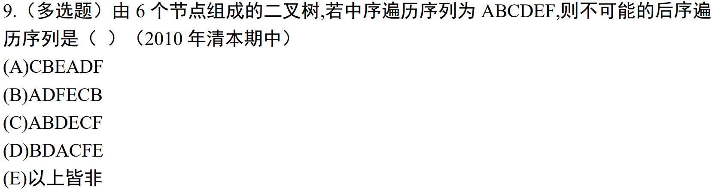

* 05.Binary Trees.pdf P76

## 树的重建

给定树的遍历序列，把树给重建出来。

以下假设为二叉树，且树节点值各不相同。

[先序 $\vert$ 后序 $\vert$ 层序] + 中序，可以重建树✅，通过前者先**确定根**，然后通过后者划分左右子树，从而递归子问题。

相关题目:

* [LeetCode105. 从前序与中序遍历序列构造二叉树](https://leetcode.cn/problems/construct-binary-tree-from-preorder-and-inorder-traversal/)

* [LeetCode106. 从中序与后序遍历序列构造二叉树](https://leetcode.cn/problems/construct-binary-tree-from-inorder-and-postorder-traversal/)

$C_4^2$ 种组合，能重建树的只有：

* 先序 + 中序 ✅

* 后序 + 中序 ✅

* 层序 + 中序 ✅

$3$ 种（中序 + 任意另外一个），都是先确定根，然后划分左右子树，然后递归子问题。

## 树的定序列

有些组合，虽然不能重建树，但是对于可能的多种形态，其某种遍历结果却可能确定。

以下假设为二叉树，且树节点值各不相同。

相关题目:

* [LeetCode889. 根据前序和后序遍历构造二叉树](https://leetcode.cn/problems/construct-binary-tree-from-preorder-and-postorder-traversal/)

以这个先序 + 后序的组合为例，如果树是**真二叉树**，则确实可以重建树。但是一旦一个节点只有一棵子树，则
```
  1    1
 /  和  \
2        2
```
的先序、后序相同，树的结构就不确定了。对于子树的构建：

1. 若 preorder[1] != postorder[n - 2] ，则根节点二叉，且 preorder[1] 为左子树根，postorder[n - 2] 为右子树根。没有不确定性。

2. 若 preorder[1] == postorder[n - 2] ，则根节点单叉，但无法确定 preorder[1] 为左子树根还是右子树根。树的结构不确定。根本原因在于 根左空 + 左空根 和 根空右 + 空右根 ，在结果上看是一样的。

但是，虽然树的结构不确定，但是层序都是一样的。先序 + 后序能确定层序。

先 中 后 层 的组合方案结论：

* 先序 + 中序 推出一切 ✅

* 后序 + 中序 推出一切 ✅

* 层序 + 中序 推出一切 ✅

* 先序 + 后序 $\Rightarrow$ 层序 ✅

    具体证明见上方

* 先序 + 后序 $\Rightarrow$ 中序 ❌

    ```
      1    1
     /      \
    2        2
    ```
* 先序 + 层序 $\Rightarrow$ 中序 ❌

    反例同上

* 先序 + 层序 $\Rightarrow$ 后序 ❌

    ```
      1     1        1
     /       \      /  \
    2   or    2    2    3
    |         |
    3         3    
    ```

* 后序 + 层序 $\Rightarrow$ 先序 ✅

    若 postorder[n - 2] != levelorder[1] ，则根双分支，可以明确地划分为左右子树问题；
    
    若 postorder[n - 2] == levelorder[1] ，则根单分支，子树可以左右摆动，但是虽然单分支左右摆动不改变后序和层序，先序也同样不会变（中序会变）；

    综上，后序 + 层序可以确定先序。

    此问题是上一问题换了一下，但是结论不一样。上一问题能构造出反例是因为其无法确定根节点是单分支还是双分支。如果把层序的定义改一下，改成同层从右向左遍历，其它遍历定义不变，则这两个问题的结论会反一次。

* 后序 + 层序 $\Rightarrow$ 中序 ❌

    ```
      1    1
     /      \
    2        2
    ```

## 增强序列

* 05.Binary Trees.pdf P82





将一棵树的所有空指针视为外部节点`^`，由此只需增强先序遍历序列即可重建原树，增强后序遍历序列即可重建原树。

以增强先序遍历序列为例，重建方式为：走最左侧通路进行构建，遇到序列中的`^`即可知道要转向右子树了，然后再考虑如何回溯（可能会和迭代版后序遍历有点像）。这个应该递归比较好写，dfs过程中有个全局的index指向序列当前位置，递归建子树，若要重建的子树是`^`直接返回，返回之后根节点接上左右子树。

注意增强中序遍历序列不能重建树，因为无法确定根。

## 中序遍历序列是 $1 \sim n$ 的二叉树的全部的后序遍历序列

> [中序遍历序列是1~n的二叉树的全部的后序遍历序列有多少种？](https://zhuanlan.zhihu.com/p/689913816)

在中序序列中选根 $r$ ，然后分左右子树 $[1,r)$ 与 $[r + 1, n)$ ，则后序遍历序列为 $P[1,r) \ P[r + 1, n) \ r$ ，其中 $P()$ 代表栈混洗。$P[1,r) \ P[r + 1, n) \ r$ 这个形式为：考虑最后出栈的元素为原序列中哪个位置的元素，这个定义与[栈混洗.md](../栈混洗/栈混洗.md)中的有点区别，不过也是栈混洗。

所以，中序序列为 $1 \sim n$，所有合法的后序序列为：**$1 \sim n$ 的栈混洗**。

这个结论可以结合[$j + 1 ... i ... j$禁形](../栈混洗/栈混洗.md#禁形)用来做这题，判断是否为禁形就行了 (答案为AD)：



注意中序遍历序列是 $1 \sim n$ 的二叉树的全部的先序遍历序列是不满足为栈混洗的，先序序列不一定是 $1 \sim n$ 的栈混洗，但是总方案数也是 $catalan(n)$ ，因为满足卡塔兰数的递推关系。

层序遍历的总方案数也是 $catalan(n)$ ，因为中序确定 + $catalan(n)$ 种后序，可以确定 $catalan(n)$ 棵树，这些树的层序一定互不相同，否则中序 + 层序都相同，是同一棵树了。或者说由于中序已经确定了，现在有 $catalan(n)$ 棵树，而中序 + 层序可以重建树，则层序一定有 $catalan(n)$ 个。
