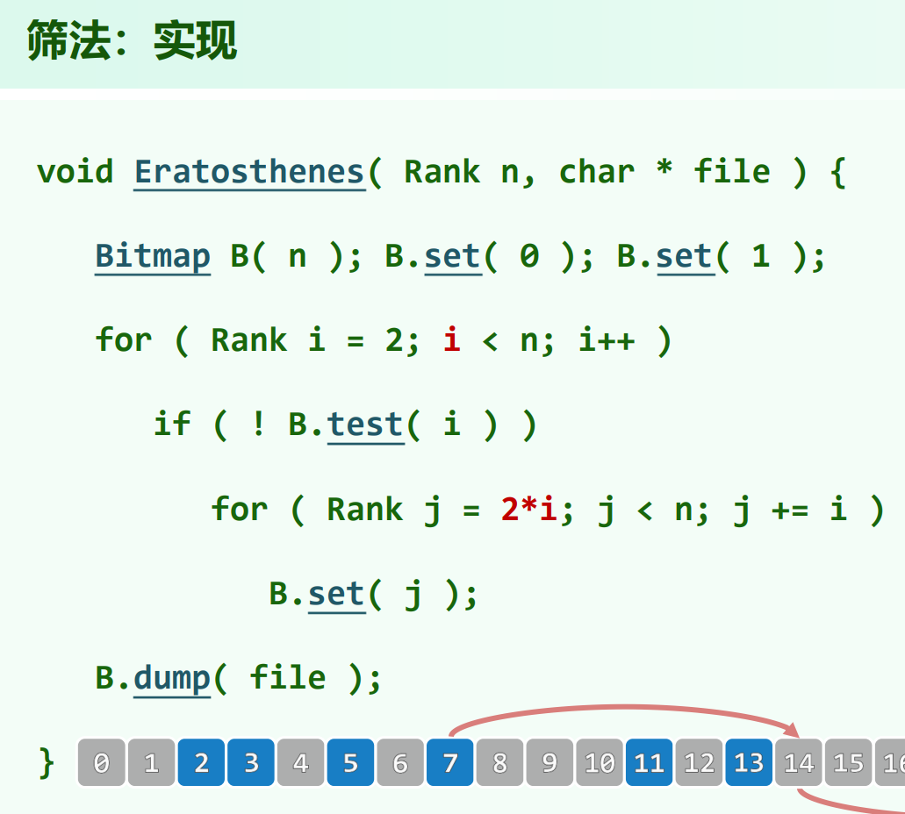
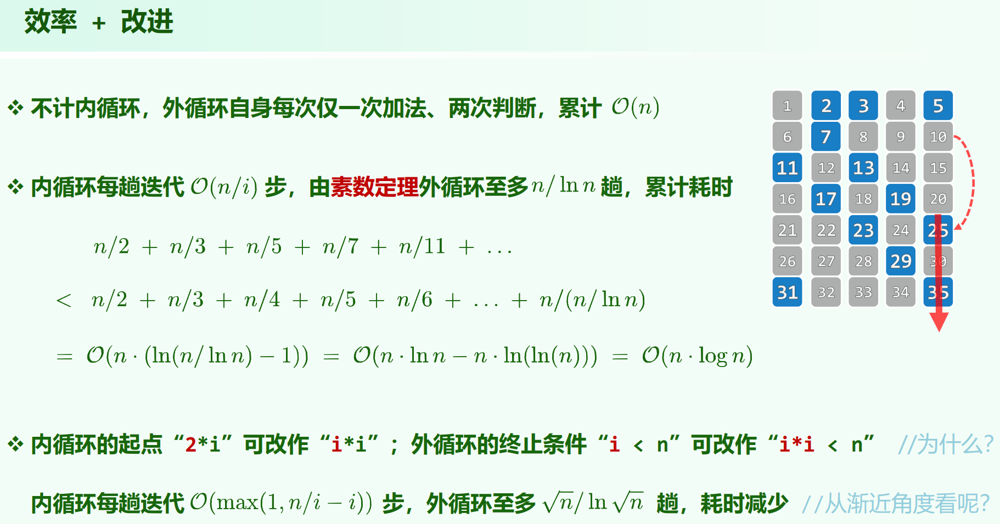

02.Vector.pdf P97

# 埃式筛





## 时间复杂度

由[素数定理](https://zh.wikipedia.org/wiki/%E8%B3%AA%E6%95%B8%E5%AE%9A%E7%90%86):

> 定义 $\pi(x)$ 为素数计数函数，亦即不大于 $x$ 的素数个数，则 $\pi(x) \approx \frac{x}{lnx}$ 。

外循环真正需要跑内循环的次数为素数个数，有 $\frac{n}{lnn}$ 趟。一次内循环开销为 $\frac{n}{p_k}$ ，其中 $p_k$ 为第 $k$ 个素数。

把内循环开销放大成每次 $+1$ 。

时间复杂度为：

$\sum \limits_{i = 2}^{\frac{n}{lnn}} \frac{n}{i} = O(nln(\frac{n}{lnn})) = O(nlogn) $

内循环可以直接从 $i * i$ 开始筛，如果不需要把筛出来的素数放到一个vector里，外循环不需要跑满，改成 $i * i < n$ 就可以把 Bitmap 标记完。

时间复杂度为：

$\sum \limits_{i = 2}^{\frac{\sqrt{n}}{ln\sqrt{n}}} \frac{n - i^2}{i} = O(nln(\frac{\sqrt{n}}{ln\sqrt{n}}) - (\frac{\sqrt{n}}{ln\sqrt{n}})^2) = O(nlogn) $

不影响时间复杂度

## 时间复杂度的更紧分析

参考[oiwiki](https://oi-wiki.org/math/number-theory/sieve/#%E5%9F%83%E6%8B%89%E6%89%98%E6%96%AF%E7%89%B9%E5%B0%BC%E7%AD%9B%E6%B3%95):

```cpp
vector<int> prime;
bool is_prime[N];

void Eratosthenes(int n) {
  is_prime[0] = is_prime[1] = false;
  for (int i = 2; i <= n; ++i) is_prime[i] = true;
  for (int i = 2; i <= n; ++i) {
    if (is_prime[i]) {
      prime.push_back(i);
      if ((long long)i * i > n) continue;
      for (int j = i * i; j <= n; j += i)
        // 因为从 2 到 i - 1 的倍数我们之前筛过了，这里直接从 i
        // 的倍数开始，提高了运行速度
        is_prime[j] = false;  // 是 i 的倍数的均不是素数
    }
  }
}
```

时间复杂度为：

$\sum \limits_{k = 1}^{\pi(n)} \frac{n}{p_k}$，$p_k$ 为第 $k$ 个素数。

可以直接根据 [Mertens](https://zh.wikipedia.org/wiki/%E6%A2%85%E6%BB%95%E6%96%AF%E5%AE%9A%E7%90%86) 第二定理，存在常数 $B_1$ 使得：

$$
\sum_{k=1}^{\pi(n)}{\frac{1}{p_k}}=\log\log n+B_1+O\left(\frac{1}{\log n}\right)
$$

于是**埃筛的时间复杂度为 $O(nloglogn)$**。

也可以直接去证明：

$$\sum_{k=1}^{\pi(n)}{\frac{1}{p_k}} = O(loglogn)$$

过程：

根据 $\pi(n)=\Theta(n/\log n)$，可知第 $n$ 个素数的大小为 $\Theta(n\log n)$。（当 $x = nlogn$ 时，素数个数就够 $n$ 个了）

于是：

$\sum \limits_{k=1}^{\pi(n)}{\frac{1}{p_k}}$

$\approx \sum \limits_{k=2}^{\pi(n)}{\frac{1}{klogk}}$

$\approx \int_{2}^{\pi(n)}{\frac{1}{xlogx}dx}$

$\approx loglog(\pi(n)) \approx loglogn$