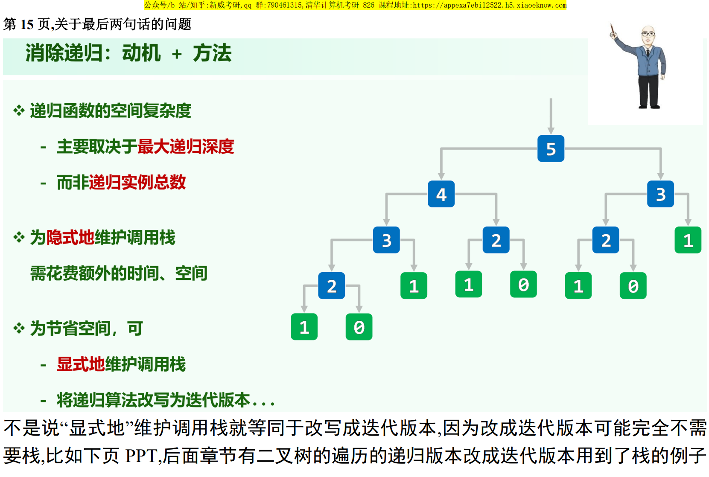

> 04.Stack + Queue.pdf P15

## 递归的空间复杂度

递归的空间复杂度取决于递归深度而非递归实例总数

## 递归改写为非递归

- 将递归算法改写为迭代版本

- 显式地维护调用栈

如果递归是线性递归（或者更特别地，为尾递归），改写为迭代版本一般是比较容易的。用递归参数控制循环，然后自底而上地计算即可。

如果递归不是线性递归，例如调用关系为一棵树，例如先序遍历的迭代版本，则可以考虑模拟调用栈（用一个栈暂存调用参数）。

不过像计算 $fib(n)$ 这样的树状递归，也能直接不用栈改写为迭代。原因在于，暴力递归计算 $fib(n)$ ，走了整棵调用树，而迭代版的代码，只通过最左侧通路就走到了根节点 $fib(n)$ 。