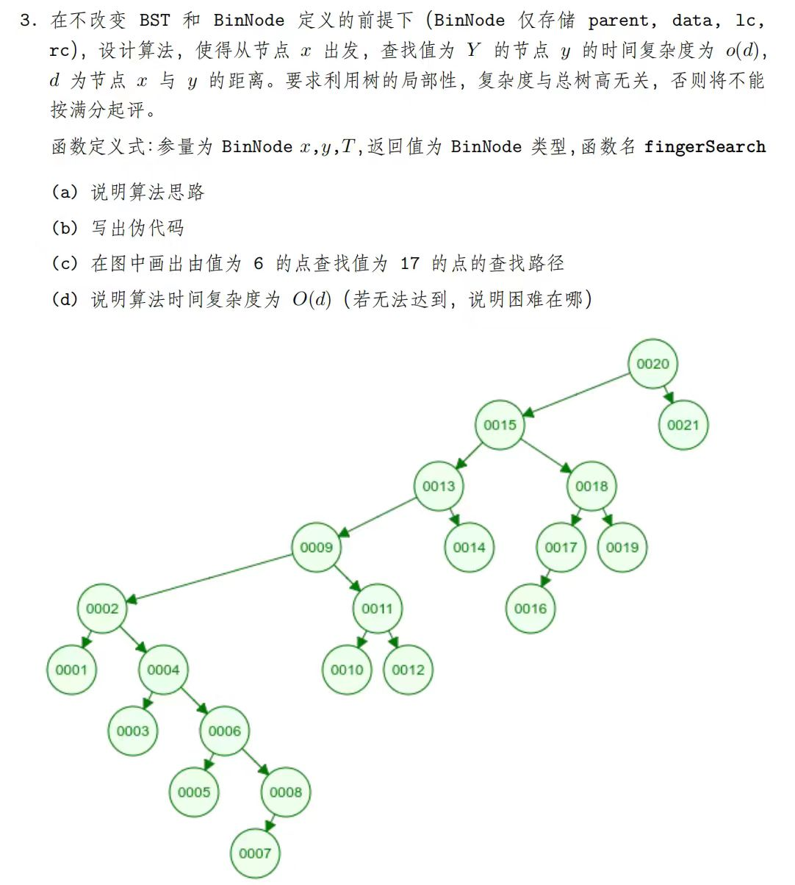
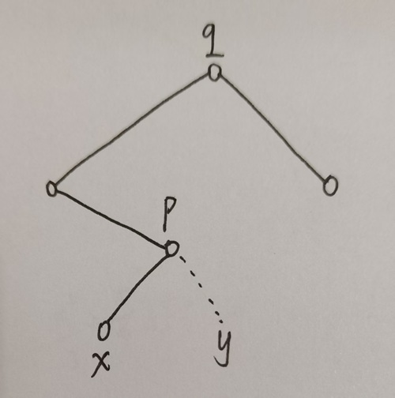

思路：

从 $x$ 往上和往下都要搜索，为了让时间复杂度是 $O(d)$ ，需要让往上和往下交替进行。

往下找就是普通的 bst 搜索逻辑，

往上的话要分一分情况，记当前节点为 c ，父节点为 p ，

1. 若 c 是 p 的左孩子，视 p 与 y 的大小决定：p 就是目标节点 / 进 p 的右子树 / 递归祖父 g

2. 若 c 是 p 的右孩子，递归祖父 g

这里 "进 p 的右子树 / 递归祖父 g" 无法确认是哪一种？又得分双线？

例如这个图：

**我们是无法精准找到 $lca(x, y)$ 的**，向上走到 p 时，y 可能在 p 的右子树，也可能在 q 的右子树。

难道向上找还要分出多个过程？

不用。我们到 p 后，如果 p < y，那么搜索 x 的右子树就是没有价值的。让其过来对 p 位置执行 BST::search(p)，然后另一方面继续往上物色 $lca$ 。

最终思路：

如果发现左父亲，path1 继续往上；

如果发现右父亲（记为 p），若其值 <= y，那么一定可以把原先向下的 path2 取消，改成让 path2 从 p 开始往下找（充分利用 <= y 的这个信息），然后 path1 继续往上；若其值 > y，path1 也可以结束了，其一定比 $lca(x,y)$ 高，上面没有更多需要靠 path1 搜索的节点了

仍然让 path1 和 path2 交替执行。

这样做，让原本在下面搜索的 path2 及时换一个点搜索，任意时刻都只需有 1份path1过程 和 1份path2过程，时间复杂度是 $O(2d) = O(d)$

也就是说：**path1负责往上为path2物色起点，path2负责具体的BST::search**

[代码](./algorithm.cpp)